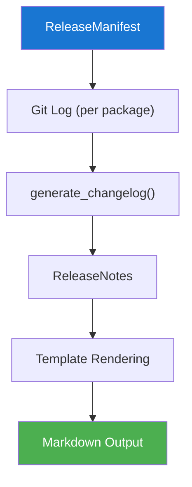

# Release Notes

Release notes combine per-package changelogs into a single document
suitable for GitHub Releases.

## Data Flow



## Generation Pipeline

```
┌────────────────────────────────────────────────────────────────┐
│ generate_release_notes(manifest, vcs, tag_format)              │
│                                                                │
│  For each bumped package in manifest:                          │
│    1. Find last tag: format_tag(tag_format, name, old_version) │
│    2. Get commits: vcs.log(since=tag, paths=[pkg.path])        │
│    3. Generate changelog: generate_changelog(...)              │
│    4. Create PackageSummary(name, old, new, changelog)         │
│                                                                │
│  Combine into ReleaseNotes:                                    │
│    - version: manifest.version                                 │
│    - title: "Release v{version}"                               │
│    - summaries: list[PackageSummary]                           │
│    - date: today's date                                        │
│    - preamble: optional intro text                             │
└────────────────────────────────────────────────────────────────┘
```

## Template System

Release notes use Python `string.Template` for rendering (no external
dependencies):

### Default Template

```
# $title

$preamble

## Packages

$package_sections
```

### Per-Package Template

```
### $name ($old_version → $new_version)

$changelog
```

### Custom Templates

```python
from string import Template

custom = Template("""
# Release $version - $title

Released on $date.

$package_sections

---
Full changelog: [compare]($compare_url)
""")

notes = render_release_notes(notes, template=custom)
```

## Output Example

```markdown
# Release v0.6.0

## Packages

### genkit (0.5.0 → 0.6.0)

#### Features

* **core**: Add streaming support (#456)

#### Bug Fixes

* Handle edge case in version calculation (#102)

### genkit-plugin-google-genai (0.5.0 → 0.5.1)

#### Bug Fixes

* Fix null pointer in response parser (#101)
```

## Data Types

```python
@dataclass
class PackageSummary:
    name: str
    old_version: str
    new_version: str
    changelog: Changelog

@dataclass
class ReleaseNotes:
    version: str
    title: str = ''
    summaries: list[PackageSummary] = field(default_factory=list)
    date: str = ''
    preamble: str = ''
```

## Integration

Release notes are consumed by:

1. **`release.py`** — Passed as the body of the GitHub Release
2. **`tags.py`** — Included in the tag annotation message
3. **`prepare.py`** — Embedded in the Release PR body
