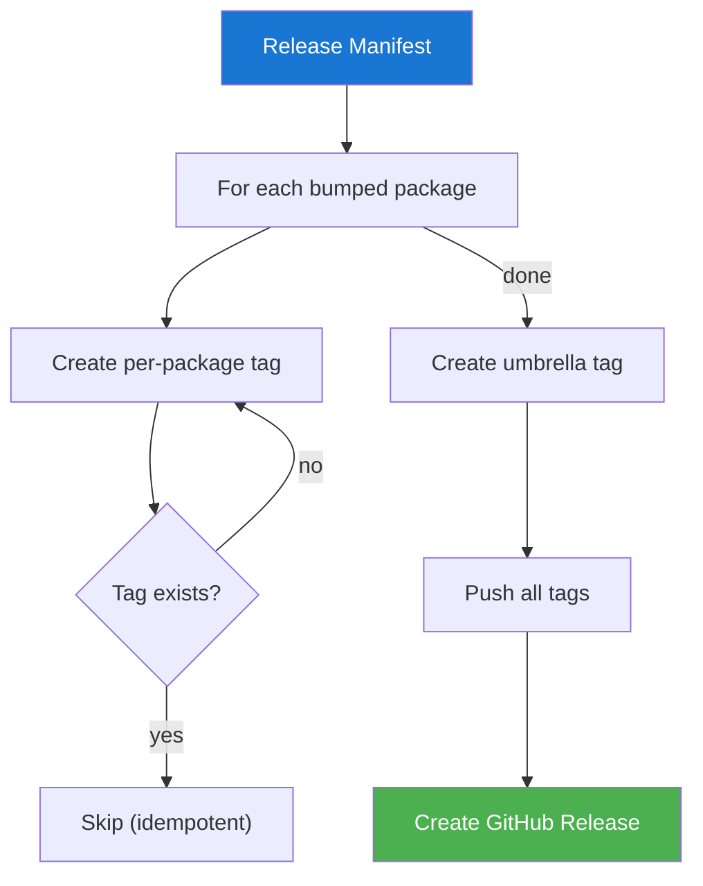
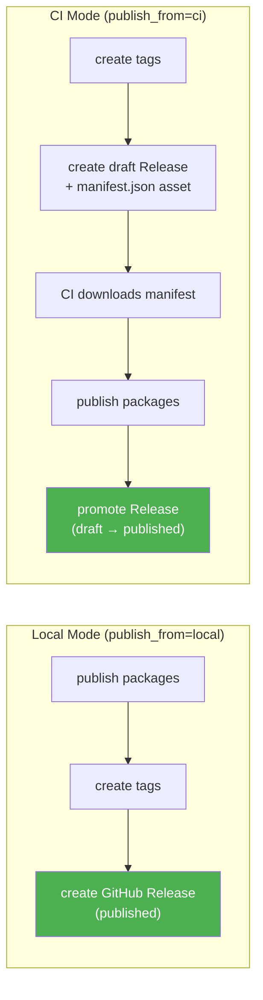
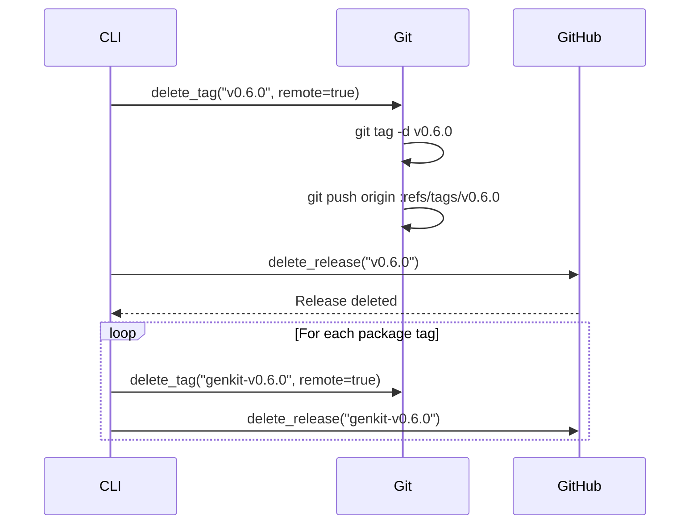
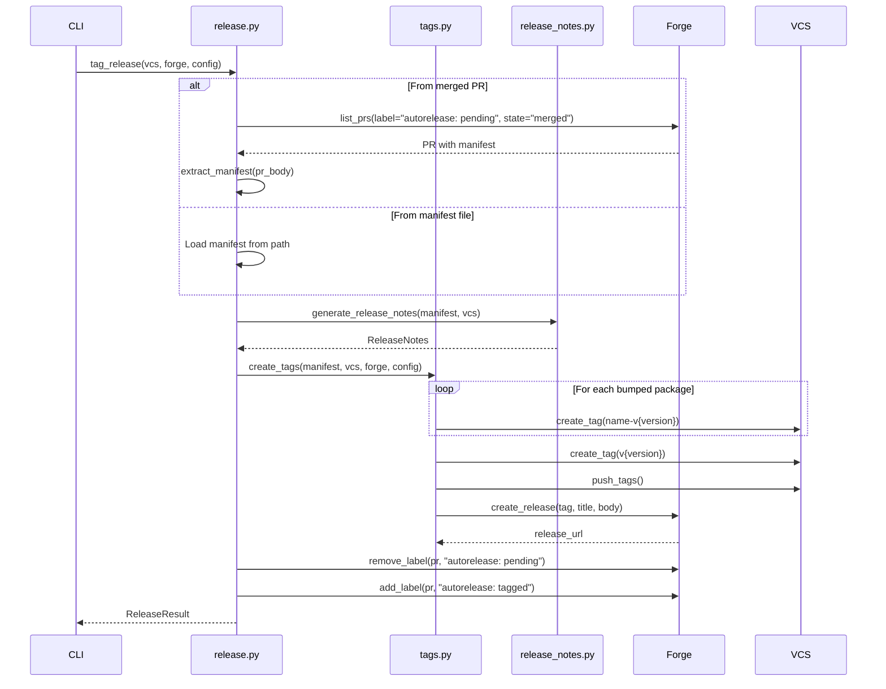

# Tags & Releases

After publishing, ReleaseKit creates git tags and GitHub Releases for
each bumped package.

## Tag Types

```
┌─────────────────┬──────────────────┬──────────────────────────────┐
│ Tag Type        │ Format           │ Example                      │
├─────────────────┼──────────────────┼──────────────────────────────┤
│ Per-package     │ {name}-v{version}│ genkit-v0.6.0                │
│ Umbrella        │ v{version}       │ v0.6.0                       │
└─────────────────┴──────────────────┴──────────────────────────────┘
```

## Tag Creation Flow



## Local vs CI Mode

ReleaseKit supports two publishing modes:



### CI Mode Details

In CI mode, the tag step creates a **draft** GitHub Release with the
release manifest attached as an asset. A downstream CI workflow then:

1. Downloads the manifest from the draft release
2. Publishes packages based on the manifest
3. Promotes the release from draft to published

This decouples version tagging from package publishing.

## Forge Compatibility

| Feature | GitHub | GitLab | Bitbucket |
|---------|--------|--------|-----------|
| Per-package tags | ✅ | ✅ | ✅ |
| Umbrella tag | ✅ | ✅ | ✅ |
| Releases | ✅ (draft → published) | ✅ (no draft) | ❌ (tags only) |
| Release assets | ✅ | ✅ | ❌ |
| Labels | ✅ | ✅ (on MRs) | ❌ (no-op) |

## Rollback

Delete tags and releases for a given manifest:

```bash
releasekit rollback --tag v0.6.0
```



## Sequence Diagram: Full Release



## Data Types

```python
@dataclass
class TagResult:
    created: list[str]           # Tags created
    skipped: list[str]           # Tags that already existed
    failed: dict[str, str]       # Tag name → error
    pushed: bool = False         # Whether tags were pushed
    release_url: str = ''        # GitHub Release URL

    def ok(self) -> bool:
        return len(self.failed) == 0

@dataclass
class ReleaseResult:
    manifest: ReleaseManifest | None
    tag_result: TagResult | None
    pr_number: int = 0
    release_url: str = ''
    errors: dict[str, str] = field(default_factory=dict)
```
