# Versioning Engine

The versioning engine reads git history, parses Conventional Commits,
scopes each commit to the package(s) it touches, and computes semver
bumps.

## Algorithm Overview


## Conventional Commit Parsing

Each commit message is parsed against this regex:

```
^(?P<type>\w+)(?:\((?P<scope>[^)]*)\))?(?P<breaking>!)?\:\s*(?P<description>.+)$
```

### Bump Type Mapping

```
┌─────────────────────────────┬───────────┬─────────────────────────────┐
│ Commit Pattern              │ Bump Type │ Example                     │
├─────────────────────────────┼───────────┼─────────────────────────────┤
│ BREAKING CHANGE or "!"      │ major     │ feat!: redesign API         │
│ feat:                       │ minor     │ feat(auth): add OAuth       │
│ fix:, perf:                 │ patch     │ fix: null pointer           │
│ docs:, chore:, ci:, etc.    │ none      │ docs: update README         │
└─────────────────────────────┴───────────┴─────────────────────────────┘
```

### Bump Precedence

When multiple commits affect the same package, the **strongest** bump wins:

```
major > minor > patch > prerelease > none
```


## Path-Based Scoping

Commits are scoped to packages by their **file paths**, not commit
message scopes. This ensures accurate attribution even when commit
messages don't specify a scope:

```
Commit: fix: handle edge case
Files changed:
  plugins/google-genai/src/model.py   → genkit-plugin-google-genai
  plugins/google-genai/tests/test.py  → genkit-plugin-google-genai
  packages/genkit/src/core.py         → genkit
```

This commit produces a `patch` bump for both `genkit-plugin-google-genai`
and `genkit`.

## Transitive Propagation

When `synchronize = true`, bumps propagate transitively through the
dependency graph:


With `synchronize = true`, the highest bump (minor) is applied to
**all** packages, ensuring version lockstep.

## Version Application

The `_apply_bump()` function applies semver rules:

```
┌───────────┬─────────┬────────────┬──────────────────────────────┐
│ Current   │ Bump    │ New        │ Notes                        │
├───────────┼─────────┼────────────┼──────────────────────────────┤
│ 1.2.3     │ major   │ 2.0.0      │ Reset minor + patch          │
│ 1.2.3     │ minor   │ 1.3.0      │ Reset patch                  │
│ 1.2.3     │ patch   │ 1.2.4      │                              │
│ 0.5.0     │ major   │ 0.6.0      │ 0.x default (major_on_zero=false) │
│ 0.5.0     │ major   │ 1.0.0      │ 0.x with major_on_zero=true  │
│ 1.2.3     │ pre     │ 1.2.4-rc.1 │ Prerelease on next patch     │
│ 1.2.3-rc.1│ pre     │ 1.2.3-rc.2 │ Increment prerelease counter │
└───────────┴─────────┴────────────┴──────────────────────────────┘
```

!!! note "0.x semver"
    By default (`major_on_zero = false`), packages with `0.x` versions
    treat `major` bumps as `minor` bumps — breaking changes during
    initial development don't jump to `1.0.0`. Set `major_on_zero = true`
    in `releasekit.toml` to allow `0.x → 1.0.0`.

## Per-Package Versioning Schemes

`compute_bumps()` accepts a `package_configs` dictionary
that allows each package to use a different versioning scheme. The
per-package scheme is resolved via `resolve_package_config()`:


### Scheme-Aware Version Application

The `_apply_bump()` function formats pre-release versions differently
based on the scheme:

```
┌───────────┬─────────┬──────────────┬──────────────────────────────┐
│ Scheme    │ Bump    │ New          │ Format Rule                  │
├───────────┼─────────┼──────────────┼──────────────────────────────┤
│ semver    │ pre-rc  │ 1.2.4-rc.1   │ hyphen + dot separator       │
│ pep440    │ pre-rc  │ 1.2.4rc1     │ no separator (PEP 440)       │
│ semver    │ pre-alpha│ 1.2.4-alpha.1│ hyphen + dot separator      │
│ pep440    │ pre-alpha│ 1.2.4a1     │ "a" suffix (PEP 440)         │
│ semver    │ pre-beta│ 1.2.4-beta.1 │ hyphen + dot separator       │
│ pep440    │ pre-beta│ 1.2.4b1      │ "b" suffix (PEP 440)         │
│ pep440    │ pre-dev │ 1.2.4.dev1   │ dot-dev (PEP 440)            │
│ pep440    │ post    │ 1.2.3.post1  │ dot-post (PEP 440 only)      │
└───────────┴─────────┴──────────────┴──────────────────────────────┘
```

### Config Resolution Flow


## Data Types

### `ConventionalCommit`

```python
@dataclass
class ConventionalCommit:
    sha: str           # Full commit SHA
    type: str          # "feat", "fix", "docs", etc.
    description: str   # Commit description
    scope: str = ''    # Optional scope
    breaking: bool = False
    bump: BumpType = BumpType.NONE
    raw: str = ''      # Original message
```

### `BumpType`

```python
class BumpType(StrEnum):
    MAJOR = 'major'
    MINOR = 'minor'
    PATCH = 'patch'
    PRERELEASE = 'prerelease'
    NONE = 'none'
```

## Sequence Diagram

```mermaid
sequenceDiagram
    participant CLI
    participant VER as versioning.py
    participant VCS as VCS Backend
    participant GRAPH as DependencyGraph

    CLI->>VER: compute_bumps(packages, vcs, graph)

    loop For each package
        VER->>VCS: Find last tag for package
        VCS-->>VER: tag or None
        VER->>VCS: log(since=tag, paths=[pkg.path])
        VCS-->>VER: list[Commit]
        VER->>VER: parse_conventional_commit() for each
        VER->>VER: max_bump across all commits
        VER->>VER: _apply_bump(current_version, bump)
    end

    alt synchronize = true
        VER->>VER: Find max bump across ALL packages
        VER->>VER: Apply max bump to ALL packages
    end

    VER-->>CLI: list[PackageVersion]
```


