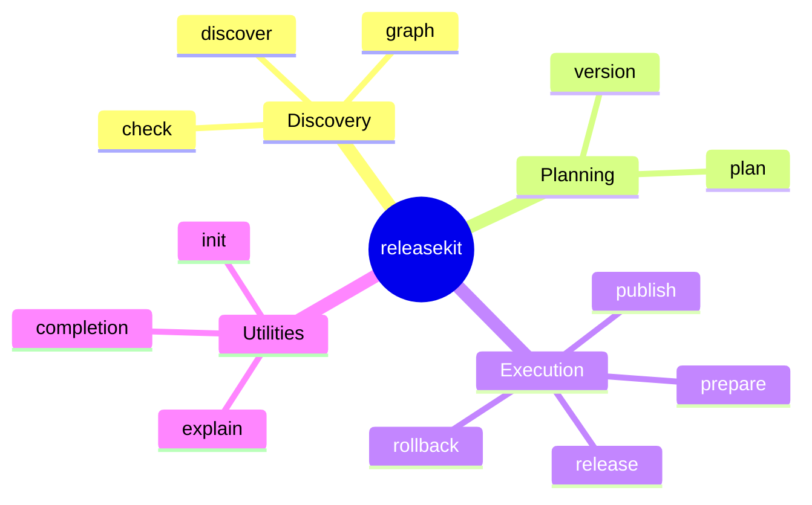
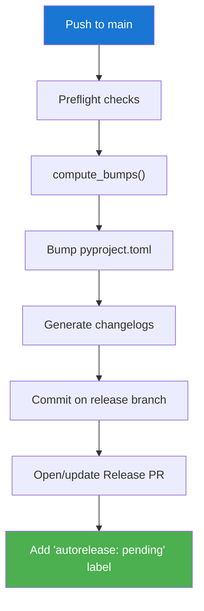

# CLI Commands

```
releasekit <command> [options]
```

## Command Overview



## `discover` — List Workspace Packages

```bash
releasekit discover [--format table|json] [--ecosystem python|js|go]
```

| Flag | Default | Description |
|------|---------|-------------|
| `--format` | `table` | Output format |
| `--ecosystem` | (all) | Filter by ecosystem |

## `graph` — Show Dependency Graph

```bash
releasekit graph [--format FORMAT] [--ecosystem python|js|go]
```

| Flag | Default | Description |
|------|---------|-------------|
| `--format` | `ascii` | One of: `ascii`, `mermaid`, `dot`, `d2`, `json`, `csv`, `table`, `levels` |
| `--ecosystem` | (all) | Filter by ecosystem |

## `plan` — Preview Version Bumps

```bash
releasekit plan [--format table|json|csv|ascii|full] [--group GROUP]
```

Shows what `publish` would do without making changes.

| Flag | Default | Description |
|------|---------|-------------|
| `--format` | `table` | One of: `table`, `json`, `csv`, `ascii`, `full` |
| `--force-unchanged` | `false` | Include packages with no changes |
| `--group` | (all) | Only packages in named group |

## `check` — Run Health Checks

```bash
releasekit check [--fix] [--ecosystem python|js|go]
```

Runs all workspace validation checks. Returns exit code 1 if any check fails.

| Flag | Default | Description |
|------|---------|-------------|
| `--fix` | `false` | Auto-fix issues that can be fixed (e.g. `Private :: Do Not Upload` classifiers) |

**Checks performed:**

```
┌──────────────────────────────────────────────────────────────────┐
│                        check pipeline                            │
├──────────────────────────┬──────────┬────────────────────────────┤
│ Check                    │ Severity │ What it validates          │
├──────────────────────────┼──────────┼────────────────────────────┤
│ dependency_cycles        │ error    │ No circular deps           │
│ lockfile_staleness       │ error    │ uv.lock up to date         │
│ type_markers             │ warning  │ py.typed markers           │
│ version_consistency      │ warning  │ Plugin versions match core │
│ naming_convention        │ warning  │ Dir name ≡ package name    │
│ metadata_completeness    │ warning  │ pyproject.toml fields      │
│ python_version_consistency│ warning │ Same requires-python       │
│ python_classifiers       │ warning  │ PyPI classifiers present   │
│ namespace_init           │ warning  │ No __init__.py in ns dirs  │
│ oss_files                │ warning  │ README, LICENSE, CHANGELOG │
│ publish_classifier       │ warning  │ Private classifier sync    │
│ dependency_resolution    │ error    │ pip check passes           │
└──────────────────────────┴──────────┴────────────────────────────┘
```

## `publish` — Build & Publish

```bash
releasekit publish [options]
```

| Flag | Default | Description |
|------|---------|-------------|
| `--dry-run` | `false` | Preview mode (no uploads) |
| `--force` | `false` | Skip preflight checks |
| `--group` | (all) | Only packages in named group |
| `--concurrency` | `5` | Max parallel publishes |
| `--max-retries` | `0` | Retry count with backoff |
| `--check-url` | `""` | URL for `uv publish --check-url` |
| `--index-url` | `""` | Custom registry URL |
| `--forge-backend` | `cli` | `cli` or `api` |

**Publish pipeline per package:**

```
┌──────┐   ┌──────┐   ┌─────────┐   ┌──────┐   ┌────────┐   ┌─────────┐
│ pin  │──▶│build │──▶│ publish │──▶│ poll │──▶│ verify │──▶│ restore │
└──────┘   └──────┘   └─────────┘   └──────┘   └────────┘   └─────────┘
```

## `prepare` — Bump Versions & Open Release PR

```bash
releasekit prepare [--dry-run] [--force] [--forge-backend cli|api]
```

**Prepare flow:**



## `release` — Tag & Create GitHub Release

```bash
releasekit release [--dry-run] [--manifest PATH]
```

| Flag | Default | Description |
|------|---------|-------------|
| `--dry-run` | `false` | Preview mode |
| `--manifest` | (from PR) | Path to manifest JSON (instead of extracting from PR) |

## `rollback` — Delete Tags & Release

```bash
releasekit rollback --tag TAG [--no-remote]
```

| Flag | Default | Description |
|------|---------|-------------|
| `--tag` | (required) | Tag to delete |
| `--no-remote` | `false` | Only delete local tag |

## `init` — Scaffold Configuration

```bash
releasekit init [--ecosystem python|js|go]
```

Auto-detects ecosystems and generates `releasekit.toml`.

## `version` — Show Version Bumps

```bash
releasekit version [--group GROUP]
```

Shows computed bumps without building a full plan.

## `explain` — Look Up Error Codes

```bash
releasekit explain RK-GRAPH-CYCLE-DETECTED
```

## `completion` — Shell Completions

```bash
# Generate and install completions
eval "$(releasekit completion bash)"
eval "$(releasekit completion zsh)"
releasekit completion fish | source
```

## Global Options

All commands accept:

| Flag | Description |
|------|-------------|
| `--verbose` / `-v` | Increase log verbosity |
| `--quiet` / `-q` | Suppress output |
| `--no-color` | Disable colored output |
