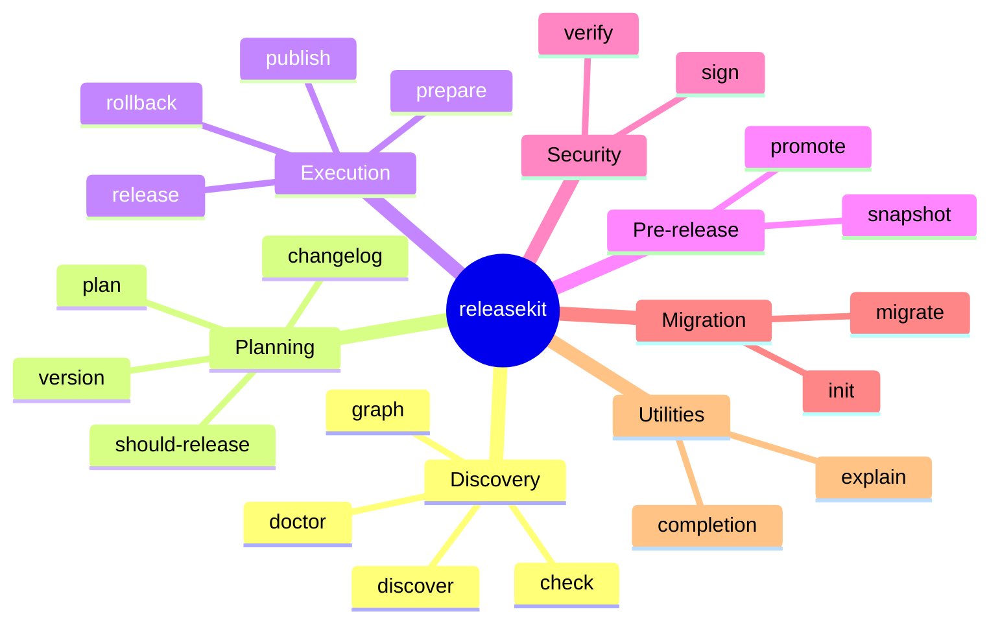
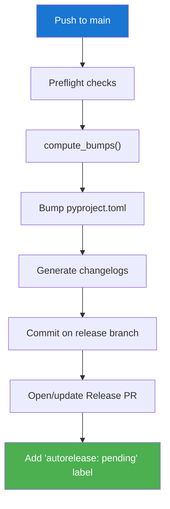

# CLI Commands

```
releasekit <command> [options]
```

## Command Overview



## `discover` — List Workspace Packages

```bash
releasekit discover [--format FORMAT] [--ecosystem ECO] [--group GROUP]
```

| Flag | Default | Description |
|------|---------|-------------|
| `--format` | `table` | One of: `ascii`, `csv`, `d2`, `dot`, `json`, `levels`, `mermaid`, `table` |
| `--ecosystem` | (all) | Filter by ecosystem |
| `--group` | (all) | Only packages in named group |

## `graph` — Show Dependency Graph

```bash
releasekit graph [--format FORMAT] [--ecosystem python|js|go]
```

| Flag | Default | Description |
|------|---------|-------------|
| `--format` | `ascii` | One of: `ascii`, `mermaid`, `dot`, `d2`, `json`, `csv`, `table`, `levels` |
| `--ecosystem` | (all) | Filter by ecosystem |

## `plan` — Preview Version Bumps

```bash
releasekit plan [--format table|json|csv|ascii|full] [--group GROUP]
```

Shows what `publish` would do without making changes.

| Flag | Default | Description |
|------|---------|-------------|
| `--format` | `table` | One of: `table`, `json`, `csv`, `ascii`, `full` |
| `--force-unchanged` | `false` | Include packages with no changes |
| `--group` | (all) | Only packages in named group |

## `check` — Run Health Checks

```bash
releasekit check [--fix] [--ecosystem python|js|go]
```

Runs all workspace validation checks. Returns exit code 1 if any check fails.

| Flag | Default | Description |
|------|---------|-------------|
| `--fix` | `false` | Auto-fix issues that can be fixed (e.g. `Private :: Do Not Upload` classifiers) |

Runs 33 checks (8 universal + 25 language-specific via `CheckBackend`
protocol). With `--fix`, auto-fixes 17 issues. See the
[Health Checks](../guides/health-checks.md) guide for the full list.

## `publish` — Build & Publish

```bash
releasekit publish [options]
```

| Flag | Default | Description |
|------|---------|-------------|
| `--dry-run` | `false` | Preview mode (no uploads) |
| `--force` | `false` | Skip preflight checks |
| `--group` | (all) | Only packages in named group |
| `--concurrency` | `5` | Max parallel publishes |
| `--max-retries` | `0` | Retry count with backoff |
| `--check-url` | `""` | URL for `uv publish --check-url` |
| `--index-url` | `""` | Custom registry URL |
| `--dist-tag` | `""` | npm dist-tag (`latest`, `next`) — JS only |
| `--sign` | `false` | Sign published artifacts with Sigstore |
| `--slsa-provenance` | auto | Generate SLSA Provenance v1 (auto-enabled in CI) |
| `--sign-provenance` | auto | Sign provenance with Sigstore (auto-enabled in CI + OIDC) |
| `--force-unchanged` | `false` | Force PATCH bump for unchanged packages |
| `--ignore-unknown-tags` | `false` | Fall back to full history on bad tags |
| `--forge-backend` | `cli` | `cli` or `api` |

**Publish pipeline per package:**

```
┌──────┐   ┌──────┐   ┌─────────┐   ┌──────┐   ┌────────┐   ┌─────────┐
│ pin  │──▶│build │──▶│ publish │──▶│ poll │──▶│ verify │──▶│ restore │
└──────┘   └──────┘   └─────────┘   └──────┘   └────────┘   └─────────┘
```

## `prepare` — Bump Versions & Open Release PR

```bash
releasekit prepare [--dry-run] [--force] [--forge-backend cli|api]
```

**Prepare flow:**



## `release` — Tag & Create GitHub Release

```bash
releasekit release [--dry-run] [--manifest PATH]
```

| Flag | Default | Description |
|------|---------|-------------|
| `--dry-run` | `false` | Preview mode |
| `--manifest` | (from PR) | Path to manifest JSON (instead of extracting from PR) |

## `rollback` — Delete Tags & Release

```bash
releasekit rollback TAG [--all-tags] [--yank] [--dry-run] [--workspace LABEL]
```

| Flag | Default | Description |
|------|---------|-------------|
| `TAG` | (required) | Tag (or umbrella tag) to delete |
| `--all-tags` | `false` | Delete ALL per-package tags from the release |
| `--yank` | `false` | Also yank published versions from registries |
| `--yank-reason` | `""` | Human-readable reason for the yank |
| `--dry-run` | `false` | Preview what would be deleted |
| `--workspace` | (auto) | Target a specific workspace label |

## `init` — Scaffold Configuration

```bash
releasekit init [--ecosystem python|js|go]
```

Auto-detects ecosystems and generates `releasekit.toml`.

## `version` — Show Version Bumps

```bash
releasekit version [--group GROUP]
```

Shows computed bumps without building a full plan.

## `changelog` — Generate Changelogs

```bash
releasekit changelog [--group GROUP] [--dry-run]
```

Generates per-package `CHANGELOG.md` files from Conventional Commits
since the last tag.

| Flag | Default | Description |
|------|---------|-------------|
| `--group` | (all) | Only packages in named group |
| `--dry-run` | `false` | Preview without writing files |

## `doctor` — Deep Workspace Diagnostics

```bash
releasekit doctor [--workspace LABEL]
```

Runs a comprehensive diagnostic report beyond `check`. Validates
VCS state, forge connectivity, config consistency, and ecosystem
health. Returns pass/warn/fail for each diagnostic.

```
✅ vcs_reachable: Git repository is accessible
✅ forge_auth: GitHub API token is valid
⚠️  shallow_clone: Repository is a shallow clone
   → Run 'git fetch --unshallow' for accurate version computation
✅ config_valid: releasekit.toml passes all validation
❌ lockfile_stale: uv.lock is out of date
   → Run 'uv lock' to update

4 passed, 1 warnings, 1 failures
```

## `should-release` — Check If Release Is Needed

```bash
releasekit should-release [--workspace LABEL]
```

Exits with code 0 if there are releasable changes, code 1 if not.
Designed for CI `if:` conditions and cron-triggered workflows.

```yaml
# GitHub Actions usage
- name: Check if release needed
  id: check
  run: |
    if uv run releasekit should-release; then
      echo "needed=true" >> "$GITHUB_OUTPUT"
    fi
```

## `snapshot` — Compute Snapshot Versions

```bash
releasekit snapshot [--identifier ID] [--pr NUMBER] [--timestamp] [--format table|json]
```

Computes snapshot (dev/nightly) versions using the current git SHA
or a timestamp. Useful for CI preview builds.

| Flag | Default | Description |
|------|---------|-------------|
| `--identifier` | (git SHA) | Custom snapshot identifier |
| `--pr` | `""` | PR number to include in version |
| `--timestamp` | `false` | Use timestamp instead of SHA |
| `--format` | `table` | Output format: `table` or `json` |

```
  Snapshot version: 0.6.0.dev20260215+g1a2b3c4

  📦 genkit: 0.5.0 → 0.6.0.dev20260215+g1a2b3c4
  📦 genkit-plugin-foo: 0.5.0 → 0.5.1.dev20260215+g1a2b3c4
```

## `promote` — Promote Pre-Release to Stable

```bash
releasekit promote [--workspace LABEL]
```

Strips pre-release suffixes from all packages that have them,
promoting `1.2.0rc1` → `1.2.0` or `1.2.0-rc.1` → `1.2.0`.

## `migrate` — Migrate from Another Tool

```bash
releasekit migrate --from TOOL [--dry-run] [--force]
```

Reads configuration from another release tool and generates
`releasekit.toml`. Supported sources:

| Source | Config Files Read |
|--------|------------------|
| `release-please` | `.release-please-manifest.json`, `release-please-config.json` |
| `semantic-release` | `.releaserc`, `release.config.js` |
| `changesets` | `.changeset/config.json` |
| `lerna` | `lerna.json` |

| Flag | Default | Description |
|------|---------|-------------|
| `--from` | (required) | Source tool name |
| `--dry-run` | `false` | Preview without writing files |
| `--force` | `false` | Overwrite existing `releasekit.toml` |

## `sign` — Sign Artifacts (Sigstore)

```bash
releasekit sign ARTIFACTS... [--output-dir DIR] [--identity-token TOKEN] [--dry-run]
```

Signs release artifacts using **Sigstore keyless signing** (OIDC).
Produces `.sigstore.json` bundles alongside each artifact.

| Flag | Default | Description |
|------|---------|-------------|
| `ARTIFACTS` | (required) | File paths or directories containing `.tar.gz`/`.whl` |
| `--output-dir` | (same dir) | Directory for `.sigstore.json` bundles |
| `--identity-token` | (OIDC) | Explicit identity token (CI environments) |
| `--dry-run` | `false` | Preview without signing |

## `verify` — Verify Signatures & Provenance

```bash
releasekit verify ARTIFACTS... [--cert-identity ID] [--cert-oidc-issuer URL] [--provenance FILE]
```

Verifies Sigstore bundles and/or SLSA provenance for release artifacts.

| Flag | Default | Description |
|------|---------|-------------|
| `ARTIFACTS` | (required) | File paths or directories |
| `--cert-identity` | `""` | Expected certificate identity |
| `--cert-oidc-issuer` | `""` | Expected OIDC issuer URL |
| `--provenance` | `""` | Verify artifacts against a SLSA provenance file (`.intoto.jsonl`) |

## `explain` — Look Up Error Codes

```bash
releasekit explain RK-GRAPH-CYCLE-DETECTED
```

## `compliance` — OSPS Baseline Report

```bash
releasekit compliance [--format table|json]
```

Evaluates your repository against the [OpenSSF OSPS Baseline](https://best.openssf.org/Concise-Guide-for-Evaluating-Open-Source-Software)
framework (L1–L3) across all detected ecosystems.

| Flag | Default | Description |
|------|---------|-------------|
| `--format` | `table` | Output format: `table` or `json` |

## `validate` — Validate Release Artifacts

```bash
releasekit validate [ARTIFACTS...] [--format table|json]
```

Runs validators against generated release artifacts. Auto-detects
provenance (`.intoto.jsonl`), attestations (`.publish.attestation`),
SBOMs (`sbom*.json`/`sbom*.xml`), and `SECURITY-INSIGHTS.yml` files.

| Flag | Default | Description |
|------|---------|-------------|
| `ARTIFACTS` | (auto-detect) | File paths or directories to validate |
| `--format` | `table` | Output format: `table` or `json` |

## `bump` — Bump Package Versions

```bash
releasekit bump [--group GROUP] [--type major|minor|patch] [--dry-run]
```

Bump version for one or all packages without running the full publish
pipeline.

| Flag | Default | Description |
|------|---------|-------------|
| `--group` | (all) | Only bump packages in named group |
| `--type` | (auto) | Force a specific bump type |
| `--dry-run` | `false` | Preview without writing files |

## `completion` — Shell Completions

```bash
# Generate and install completions
eval "$(releasekit completion bash)"
eval "$(releasekit completion zsh)"
releasekit completion fish | source
```

## Global Options

All commands accept:

| Flag | Description |
|------|-------------|
| `--verbose` / `-v` | Increase log verbosity |
| `--quiet` / `-q` | Suppress output |
| `--no-color` | Disable colored output |
| `--workspace` / `-w` | Target a specific workspace label |
