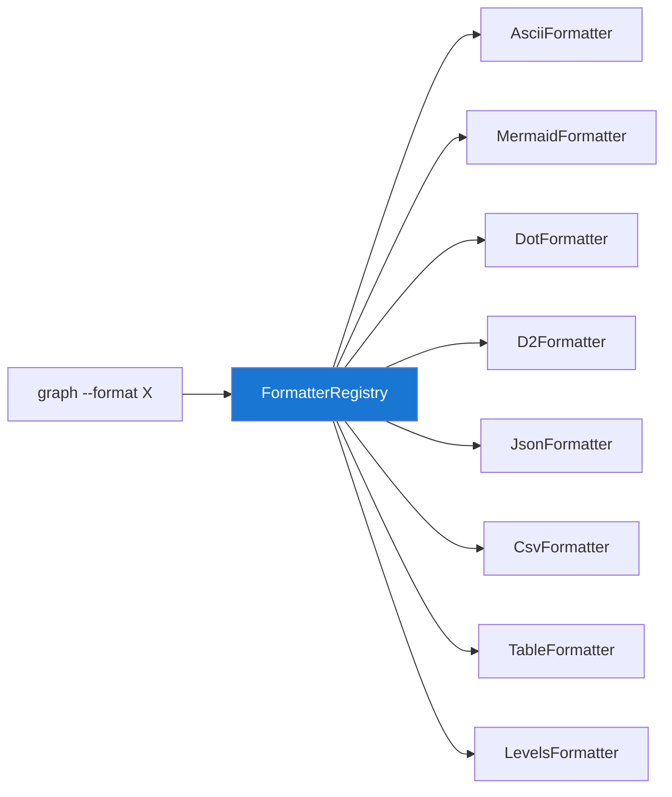
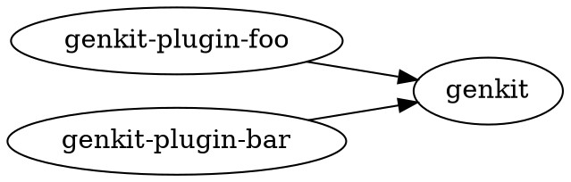

# Graph Formatters

`releasekit graph --format <fmt>` supports 8 output formats via a
pluggable formatter registry.

## Formatter Registry Architecture



## Formats

### `ascii` — Box-Drawing Art

```bash
releasekit graph --format ascii
```

Best for terminal viewing. Uses Unicode box-drawing characters.

```
┌─────────────────────────────────────────────┐
│ Level 0                                     │
│ ┌─────────┐                                 │
│ │ genkit  │                                 │
│ └────┬────┘                                 │
├──────┼──────────────────────────────────────┤
│ Level 1                                     │
│ ┌────┴────────┐  ┌─────────────────┐        │
│ │ plugin-foo  │  │ plugin-bar      │        │
│ └─────────────┘  └─────────────────┘        │
└─────────────────────────────────────────────┘
```

### `mermaid` — Mermaid Diagrams

```bash
releasekit graph --format mermaid
```

Embeddable in Markdown documentation and GitHub PRs.

```
graph LR
    genkit-plugin-foo --> genkit
    genkit-plugin-bar --> genkit
    sample-app --> genkit-plugin-foo
```

### `dot` — Graphviz DOT

```bash
releasekit graph --format dot | dot -Tpng -o graph.png
```

Professional graph visualization via Graphviz.



### `d2` — Terrastruct D2

```bash
releasekit graph --format d2 | d2 - graph.svg
```

Modern diagramming language with automatic layout.

### `json` — Structured JSON

```bash
releasekit graph --format json | jq .
```

```json
{
  "nodes": ["genkit", "genkit-plugin-foo", "genkit-plugin-bar"],
  "edges": [
    {"from": "genkit-plugin-foo", "to": "genkit"},
    {"from": "genkit-plugin-bar", "to": "genkit"}
  ],
  "levels": [
    ["genkit"],
    ["genkit-plugin-foo", "genkit-plugin-bar"]
  ]
}
```

### `csv` — RFC 4180 CSV

```bash
releasekit graph --format csv > deps.csv
```

Opens directly in Excel and Google Sheets. Includes UTF-8 BOM.

### `table` — Rich Terminal Table

```bash
releasekit graph --format table
```

Formatted with the Rich library for readable terminal output.

### `levels` — Level List

```bash
releasekit graph --format levels
```

Quick overview of topological levels without full graph detail.

```
Level 0: genkit
Level 1: genkit-plugin-foo, genkit-plugin-bar, genkit-plugin-baz
Level 2: sample-app
```

## Adding a Custom Formatter

Implement the formatter protocol and register it:

```python
# my_formatter.py
from releasekit.formatters.registry import register_formatter
from releasekit.graph import DependencyGraph

def format_my_way(graph: DependencyGraph, levels: list) -> str:
    return "custom output"

register_formatter("myformat", format_my_way)
```

```bash
releasekit graph --format myformat
```
