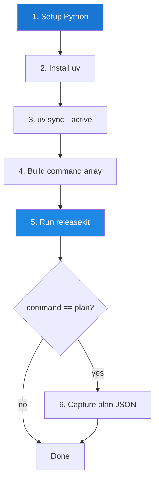

# GitHub Action

ReleaseKit ships as a **composite GitHub Action** that installs Python,
uv, and the workspace, then runs any releasekit subcommand.

## Usage

```yaml
- uses: ./py/tools/releasekit
  with:
    command: publish
    working-directory: py
```

## Execution Flow



## Inputs

| Input | Required | Default | Description |
|-------|----------|---------|-------------|
| `command` | ✅ | `plan` | Subcommand to run |
| `group` | ❌ | `""` | Release group name |
| `dry-run` | ❌ | `"false"` | Preview mode |
| `force` | ❌ | `"false"` | Skip confirmations |
| `forge-backend` | ❌ | `"api"` | `cli` or `api` |
| `check-url` | ❌ | `""` | Registry check URL |
| `index-url` | ❌ | `""` | Custom registry URL |
| `concurrency` | ❌ | `"5"` | Max parallel publishes |
| `max-retries` | ❌ | `"2"` | Retry count |
| `python-version` | ❌ | `"3.12"` | Python version |
| `uv-version` | ❌ | `"latest"` | uv version |
| `working-directory` | ❌ | `"."` | Workspace root |
| `extra-args` | ❌ | `""` | Additional CLI args |

## Outputs

| Output | Description |
|--------|-------------|
| `exit-code` | Exit code from releasekit |
| `plan-json` | JSON plan output (only for `command=plan`) |

## Security

The action uses `GITHUB_TOKEN` from the workflow context. For publish
operations, configure **OIDC trusted publishing** on PyPI:

```yaml
permissions:
  contents: write       # For tags and releases
  pull-requests: write  # For Release PRs
  id-token: write       # For OIDC trusted publishing + SLSA L3 provenance
```

!!! success "SLSA L3 by default on hosted runners"
    With `id-token: write` on GitHub-hosted runners, ReleaseKit
    **automatically** achieves SLSA Build L3 — signed provenance with
    hardened, isolated builds. No extra flags needed.
    See the [SLSA Provenance guide](../guides/slsa-provenance.md) for details.

!!! warning "Command injection prevention"
    The action builds the command as a **bash array** to prevent
    injection from free-form inputs like `extra-args`.

## Example Workflows

### Nightly Check

```yaml
name: Workspace Health
on:
  schedule:
    - cron: '0 6 * * *'

jobs:
  check:
    runs-on: ubuntu-latest
    steps:
      - uses: actions/checkout@v4
      - uses: ./py/tools/releasekit
        with:
          command: check
          working-directory: py
```

### Release Group

```yaml
- uses: ./py/tools/releasekit
  with:
    command: publish
    group: plugins
    working-directory: py
```

### Test PyPI

```yaml
- uses: ./py/tools/releasekit
  with:
    command: publish
    index-url: https://test.pypi.org/simple/
    check-url: https://test.pypi.org/simple/
    working-directory: py
```
