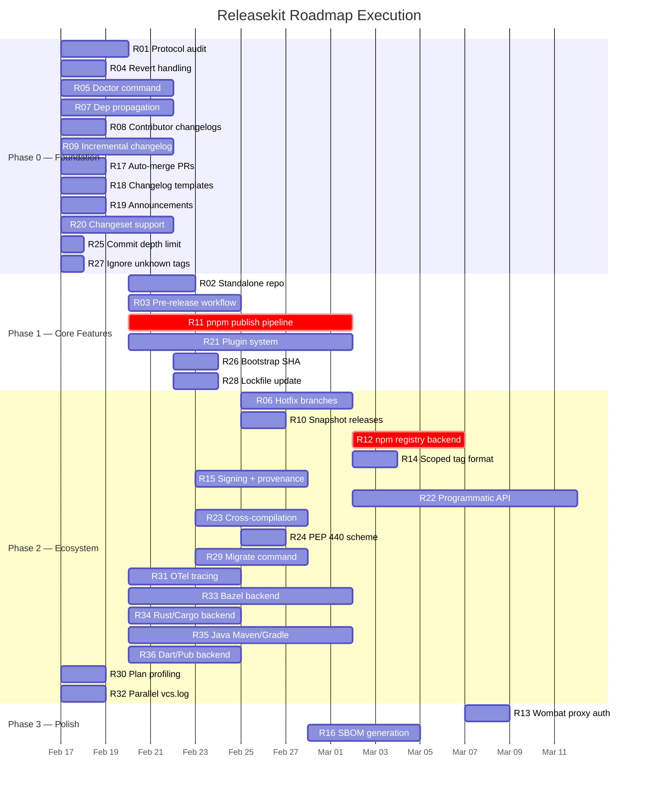

# Releasekit Roadmap — Dependency Graph & Parallel Execution Plan

**Date:** 2026-02-12

This document models every roadmap item as a node in a dependency graph,
reverse-topologically sorts it, and partitions it into **parallel execution
phases** (levels) so that independent work streams can proceed simultaneously.

---

## 0. Genkit Python Release — Prioritized Items

The full roadmap (§1–§9) covers releasekit's long-term vision across all
ecosystems. This section extracts the items **immediately relevant to
shipping Genkit Python** and orders them by release-blocking priority.

Context: [PR #4586](https://github.com/firebase/genkit/pull/4586) migrates
`publish_python.yml` to use `releasekit publish`. The
[FIXES.md](../FIXES.md) audit identifies 6 concrete fixes (F1–F6). The
`releasekit.toml` config already defines groups (core, google_plugins,
community_plugins), tag format, and publish exclusions.

### Tier 0 — Release Blockers (must land before first real publish)

| ID | Item | Effort | Why Blocking |
|----|------|--------|-------------|
| **F4** | `--first-parent` in `git log` | S | Without this, merge commits produce **duplicate changelog entries**. Every release will have wrong changelogs. |
| **F1** | Label new PRs with `autorelease: pending` | S | Without this, `tag_release` can't find the merged Release PR → **publish won't trigger**. |
| **F2** | Filter merged PR lookup by head branch | S | Without this, a stale PR from a previous cycle could be picked up → **wrong release tagged**. |
| **F3** | Fix `actions/checkout@v5` → `@v4` | S | v5 doesn't exist → **workflow fails immediately**. |

> **Estimated effort:** 1–2 days total. All four are small, independent fixes.

### Tier 1 — High Value for First Release (should land with or shortly after Tier 0)

| ID | Item | Effort | Why Important |
|----|------|--------|--------------|
| **F6** | Write per-package `CHANGELOG.md` to disk | M | Published PyPI packages have no changelog file. Users can't see what changed. Depends on F4. |
| **F5** | Auto-prepare on push to main | S | Without this, someone must manually trigger `prepare` after every merge. High friction. |
| **R07** | Internal dep version propagation | M | When `genkit` bumps, plugins that depend on it should auto-update their dep specifier. Without this, published plugins may reference stale `genkit` versions. |
| **R32** | Parallel `vcs.log()` in `compute_bumps` | S | Genkit has 60+ packages. Sequential git log = ~6s. Parallel = ~0.6s. Quick win. |
| **R04** | Revert commit handling | S | If a feat commit is reverted before release, the version still gets a minor bump. Incorrect version. |
| **R27** | `--ignore-unknown-tags` flag | S | Pre-existing non-conforming tags in the genkit repo could cause `compute_bumps` to error. |

> **Estimated effort:** ~2 weeks total (F5, R32, R04, R27 are small; F6 and R07 are medium).

### Tier 2 — Important but Not Blocking (next release cycle)

| ID | Item | Effort | Why Important |
|----|------|--------|--------------|
| **R25** | `--commit-depth` / `--max-commits` | S | Bounds changelog generation for initial runs on the genkit repo (long history). |
| **R26** | `bootstrap-sha` config | S | Sets a starting point so releasekit doesn't scan the entire genkit commit history. |
| **R05** | `releasekit doctor` | M | Diagnoses inconsistent state (orphaned tags, missing releases). Useful after first few releases. |
| **R08** | Contributor attribution in changelogs | S | Nice for community engagement. Not blocking. |
| **R28** | Lockfile update after version bump | S | `uv.lock` should be updated after version bumps. Currently manual. |
| **R17** | Auto-merge release PRs | S | Reduces manual steps. Not blocking. |

### Tier 3 — Not Relevant to Genkit Python Release

These roadmap items are **not needed** for Genkit Python and can be
deferred to future work:

- **R02, R15, R16, R23, R29** — Standalone repo, signing, SBOM, cross-compilation, migrate
- **R03, R06, R10, R24** — Pre-release workflow, hotfix branches, snapshots, PEP 440 scheme
- **R11–R14** — JS/pnpm/npm ecosystem support
- **R18–R22** — Changelog templates, announcements, changesets, plugins, programmatic API
- **R30, R31** — Plan profiling, OpenTelemetry tracing
- **R33–R36** — Bazel, Rust, Java, Dart ecosystem backends

### Execution Order

```
Week 1:  F3 → F4 → F1 → F2          (Tier 0: unblock CI + fix changelog)
         R32 → R27                    (Tier 1: quick wins, parallel)
Week 2:  F5 + F6                      (Tier 1: auto-prepare + changelog files)
         R04 + R07                    (Tier 1: revert handling + dep propagation)
Week 3:  R25 + R26 + R28             (Tier 2: large repo support)
         R05 + R08 + R17             (Tier 2: doctor + attribution + auto-merge)
```

### Dependency Graph (Genkit Python subset)

```mermaid
graph TD
    F3[F3: checkout v4]
    F4[F4: --first-parent]
    F1[F1: Label new PRs]
    F2[F2: Filter by head branch]
    F5[F5: Auto-prepare on push]
    F6[F6: CHANGELOG.md files]
    R04[R04: Revert handling]
    R07[R07: Dep propagation]
    R27[R27: Ignore unknown tags]
    R32[R32: Parallel vcs.log]
    R25[R25: Commit depth limit]
    R26[R26: Bootstrap SHA]
    R05[R05: Doctor]
    R28[R28: Lockfile update]

    F4 --> F6
    F1 --> F5
    F2 --> F5
    R07 --> R28
    R05 --> R26

    classDef blocker fill:#f8d7da,stroke:#dc3545
    classDef high fill:#fff3cd,stroke:#ffc107
    classDef tier2 fill:#d4edda,stroke:#28a745

    class F1,F2,F3,F4 blocker
    class F5,F6,R04,R07,R27,R32 high
    class R05,R08,R17,R25,R26,R28 tier2
```



---

## 1. Roadmap Items (Nodes)

Each item has an ID, description, estimated effort, and list of dependencies.

| ID | Item | Effort | Depends On |
|----|------|--------|------------|
| `R01` | Core protocol audit — ensure all 6 protocols are fully agnostic | S | — |
| `R02` | Standalone repo scaffolding (CI, pyproject.toml, LICENSE, docs) | S | `R01` |
| `R03` | Pre-release workflow (`--prerelease` flag, PEP 440 / SemVer) | M | `R01` |
| `R04` | Revert commit handling (cancel bumps for reverted commits) | S | — |
| `R05` | `releasekit doctor` (state consistency checker) | M | — |
| `R06` | Hotfix / maintenance branch support (`--base-branch`) | M | `R03` |
| `R07` | Internal dep version propagation (`fix_internal_dep_versions`) | M | — |
| `R08` | Contributor attribution in changelogs | S | — |
| `R09` | Incremental changelog generation (perf for large repos) | M | — |
| `R10` | Snapshot releases (`--snapshot` for CI testing) | S | `R03` |
| `R11` | pnpm workspace publish pipeline (end-to-end JS support) | L | `R01` |
| `R12` | npm registry backend (wire up `NpmRegistry` for publish) | M | `R11` |
| `R13` | Wombat proxy auth support (Google internal npm proxy) | S | `R12` |
| `R14` | `@scope/name@version` tag format support | S | `R11` |
| `R15` | Sigstore / GPG signing + provenance | M | `R02` |
| `R16` | SBOM generation (CycloneDX / SPDX) | M | `R15` |
| `R17` | Auto-merge release PRs | S | — |
| `R18` | Custom changelog templates (Jinja2) | S | — |
| `R19` | Announcement integrations (Slack, Discord) | S | — |
| `R20` | Optional changeset file support (hybrid with conv. commits) | M | — |
| `R21` | Plugin system for custom steps (entry-point discovery) | L | `R01` |
| `R22` | Programmatic Python API | L | `R01`, `R21` |
| `R23` | Cross-compilation orchestration (CLI binaries) | M | `R02` |
| `R24` | PEP 440 version scheme (`version_scheme = "pep440"`) | S | `R03` |
| `R25` | `--commit-depth` / `--max-commits` for large repos | S | — |
| `R26` | `bootstrap-sha` config for mid-stream adoption | S | `R05` |
| `R27` | `--ignore-unknown-tags` flag | S | — |
| `R28` | Lockfile update after version bump | S | `R07` |
| `R29` | `releasekit migrate` — protocol-based migration from alternatives | M | `R01`, `R02` |
| `R30` | `releasekit plan --analyze` — critical path & bottleneck profiling | S | — |
| `R31` | OpenTelemetry tracing backend (spans for publish stages, HTTP, git) | M | `R01` |
| `R32` | Parallel `vcs.log()` in `compute_bumps` via `asyncio.gather` | S | — |
| `R33` | Bazel workspace backend (BUILD files, `bazel run //pkg:publish`) | L | `R01` |
| `R34` | Rust/Cargo workspace backend (`Cargo.toml`, `cargo publish`) | M | `R01` |
| `R35` | Java backend (Maven `pom.xml` / Gradle `build.gradle`, `mvn deploy`) | L | `R01` |
| `R36` | Dart/Pub workspace backend (`pubspec.yaml`, `dart pub publish`) | M | `R01` |

**Effort key:** S = Small (1–3 days), M = Medium (3–7 days), L = Large (1–2 weeks)

### Gap → Roadmap Traceability

Every gap identified in the [competitive analysis](competitive-gap-analysis.md)
maps to one or more roadmap nodes:

| Severity | Gap | Roadmap Node(s) | Alternative Tool Issues |
|----------|-----|-----------------|-------------------|
| 🔴 Critical | Pre-release workflow | `R03`, `R24` | release-please [#510](https://github.com/googleapis/release-please/issues/510), semantic-release [#563](https://github.com/semantic-release/semantic-release/issues/563) |
| 🔴 Critical | Revert commit handling | `R04` | release-please [#296](https://github.com/googleapis/release-please/issues/296) |
| 🔴 Critical | Hotfix / maintenance branches | `R06` | release-please [#2475](https://github.com/googleapis/release-please/issues/2475), semantic-release [#1038](https://github.com/semantic-release/semantic-release/issues/1038) |
| 🟠 High | Dep version propagation | `R07`, `R28` | release-please [#1032](https://github.com/googleapis/release-please/issues/1032) |
| 🟠 High | Contributor attribution | `R08` | release-please [#292](https://github.com/googleapis/release-please/issues/292) |
| 🟠 High | PEP 440 version scheme | `R24` | python-semantic-release [#455](https://github.com/python-semantic-release/python-semantic-release/issues/455) |
| 🟠 High | Performance on large repos | `R09`, `R25`, `R26` | python-semantic-release [#722](https://github.com/python-semantic-release/python-semantic-release/issues/722) |
| 🟠 High | `releasekit doctor` | `R05`, `R26` | release-please [#1946](https://github.com/googleapis/release-please/issues/1946) |
| 🟡 Nice | GPG / Sigstore signing | `R15`, `R16` | release-please [#1314](https://github.com/googleapis/release-please/issues/1314) |
| 🟡 Nice | Auto-merge release PRs | `R17` | release-please [#2299](https://github.com/googleapis/release-please/issues/2299) |
| 🟡 Nice | Custom changelog templates | `R18` | release-please [#2007](https://github.com/googleapis/release-please/issues/2007) |
| 🟡 Nice | Plugin / extension system | `R21`, `R22` | python-semantic-release [#321](https://github.com/python-semantic-release/python-semantic-release/issues/321) |
| 🟡 Nice | Snapshot releases | `R10` | changesets (built-in feature) |
| 🟡 Nice | Changeset file support | `R20` | changesets [#862](https://github.com/changesets/changesets/issues/862) |
| 🟡 Nice | Announcement integrations | `R19` | goreleaser (built-in feature) |
| 🟢 Growth | `releasekit migrate` command | `R29` | Users of all alternatives |
| 🟠 High | Plan profiling / bottleneck analysis | `R30` | python-semantic-release [#722](https://github.com/python-semantic-release/python-semantic-release/issues/722) |
| 🟠 High | OpenTelemetry tracing | `R31` | No alternative has this |
| 🟠 High | Parallel commit log fetching | `R32` | python-semantic-release [#722](https://github.com/python-semantic-release/python-semantic-release/issues/722) |
| 🟢 Growth | Bazel workspace support | `R33` | No alternative supports Bazel monorepos |
| 🟢 Growth | Rust/Cargo workspace support | `R34` | cargo-release is single-crate only |
| 🟢 Growth | Java (Maven/Gradle) support | `R35` | jreleaser covers Java but no monorepo graph |
| 🟢 Growth | Dart/Pub workspace support | `R36` | No alternative supports Dart workspaces |

---

## 2. Dependency Graph (Mermaid)

```mermaid
graph TD
    R01[R01: Protocol audit]
    R02[R02: Standalone repo]
    R03[R03: Pre-release workflow]
    R04[R04: Revert handling]
    R05[R05: Doctor command]
    R06[R06: Hotfix branches]
    R07[R07: Dep version propagation]
    R08[R08: Contributor changelogs]
    R09[R09: Incremental changelog]
    R10[R10: Snapshot releases]
    R11[R11: pnpm publish pipeline]
    R12[R12: npm registry backend]
    R13[R13: Wombat proxy auth]
    R14[R14: Scoped tag format]
    R15[R15: Signing + provenance]
    R16[R16: SBOM generation]
    R17[R17: Auto-merge PRs]
    R18[R18: Changelog templates]
    R19[R19: Announcements]
    R20[R20: Changeset file support]
    R21[R21: Plugin system]
    R22[R22: Programmatic API]
    R23[R23: Cross-compilation]
    R24[R24: PEP 440 scheme]
    R25[R25: Commit depth limit]
    R26[R26: Bootstrap SHA]
    R27[R27: Ignore unknown tags]
    R28[R28: Lockfile update]
    R29[R29: Migrate command]
    R30[R30: Plan profiling]
    R31[R31: OTel tracing]
    R32[R32: Parallel vcs.log]
    R33[R33: Bazel backend]
    R34[R34: Rust/Cargo backend]
    R35[R35: Java Maven/Gradle]
    R36[R36: Dart/Pub backend]

    R01 --> R33
    R01 --> R34
    R01 --> R35
    R01 --> R36
    R01 --> R02
    R01 --> R29
    R02 --> R29
    R01 --> R31
    R01 --> R03
    R01 --> R11
    R01 --> R21
    R01 --> R22
    R03 --> R06
    R03 --> R10
    R03 --> R24
    R05 --> R26
    R07 --> R28
    R11 --> R12
    R11 --> R14
    R12 --> R13
    R02 --> R15
    R15 --> R16
    R02 --> R23
    R21 --> R22

    classDef small fill:#d4edda,stroke:#28a745
    classDef medium fill:#fff3cd,stroke:#ffc107
    classDef large fill:#f8d7da,stroke:#dc3545

    class R01,R04,R08,R10,R13,R14,R17,R18,R19,R24,R25,R26,R27,R28,R02 small
    class R03,R05,R06,R07,R09,R12,R15,R16,R20,R23,R29,R31 medium
    class R11,R21,R22,R33,R35 large
    class R30,R32 small
    class R34,R36 medium
```



---

## 3. Reverse Topological Sort

Reverse topological order (leaves first, roots last):

```
Level 0 (no deps):     R01, R04, R05, R07, R08, R09, R17, R18, R19, R20, R25, R27, R30, R32
Level 1 (deps on L0):  R02, R03, R11, R21, R26, R28
Level 2 (deps on L1):  R06, R10, R12, R14, R15, R22, R23, R24, R29, R31, R33, R34, R35, R36
Level 3 (deps on L2):  R13, R16
```

---

## 4. Parallel Execution Phases

Items within each phase can execute **simultaneously**. A phase starts only
after all items in the previous phase are complete.

### Phase 0 — Foundation (all independent, max parallelism)

```
┌─────────────────────────────────────────────────────────────────────┐
│  R01  Protocol audit                                          [S]  │
│  R04  Revert commit handling                                  [S]  │
│  R05  Doctor command                                          [M]  │
│  R07  Internal dep version propagation                        [M]  │
│  R08  Contributor attribution in changelogs                   [S]  │
│  R09  Incremental changelog generation                        [M]  │
│  R17  Auto-merge release PRs                                  [S]  │
│  R18  Custom changelog templates                              [S]  │
│  R19  Announcement integrations                               [S]  │
│  R20  Optional changeset file support                         [M]  │
│  R25  Commit depth limit                                      [S]  │
│  R27  Ignore unknown tags                                     [S]  │
│  R30  Plan profiling / bottleneck analysis                     [S]  │
│  R32  Parallel vcs.log in compute_bumps                        [S]  │
├─────────────────────────────────────────────────────────────────────┤
│  14 items │ ~7 days wall-clock (limited by M items)                │
│  Critical path: R01 (gates Phase 1)                                │
└─────────────────────────────────────────────────────────────────────┘
```

### Phase 1 — Core Features (depends on Phase 0)

```
┌─────────────────────────────────────────────────────────────────────┐
│  R02  Standalone repo scaffolding                  [S] ← R01       │
│  R03  Pre-release workflow                         [M] ← R01       │
│  R11  pnpm workspace publish pipeline              [L] ← R01       │
│  R21  Plugin system                                [L] ← R01       │
│  R26  Bootstrap SHA config                         [S] ← R05       │
│  R28  Lockfile update after bump                   [S] ← R07       │
├─────────────────────────────────────────────────────────────────────┤
│  6 items │ ~10 days wall-clock (limited by L items: R11, R21)      │
│  Critical path: R11 (gates JS publish in Phase 2)                  │
└─────────────────────────────────────────────────────────────────────┘
```

### Phase 2 — Ecosystem & Extensions (depends on Phase 1)

```
┌─────────────────────────────────────────────────────────────────────┐
│  R06  Hotfix branch support                        [M] ← R03       │
│  R10  Snapshot releases                            [S] ← R03       │
│  R12  npm registry backend                         [M] ← R11       │
│  R14  Scoped tag format                            [S] ← R11       │
│  R15  Sigstore / GPG signing                       [M] ← R02       │
│  R22  Programmatic Python API                      [L] ← R01, R21  │
│  R23  Cross-compilation orchestration              [M] ← R02       │
│  R24  PEP 440 version scheme                       [S] ← R03       │
│  R29  Migrate command                              [M] ← R01, R02  │
│  R31  OpenTelemetry tracing                        [M] ← R01       │
│  R33  Bazel workspace backend                      [L] ← R01       │
│  R34  Rust/Cargo workspace backend                 [M] ← R01       │
│  R35  Java (Maven/Gradle) backend                  [L] ← R01       │
│  R36  Dart/Pub workspace backend                   [M] ← R01       │
├─────────────────────────────────────────────────────────────────────┤
│  14 items │ ~10 days wall-clock (limited by L items: R22, R33, R35)│
│  Critical path: R12 (gates Wombat proxy in Phase 3)                │
└─────────────────────────────────────────────────────────────────────┘
```

### Phase 3 — Polish (depends on Phase 2)

```
┌─────────────────────────────────────────────────────────────────────┐
│  R13  Wombat proxy auth                            [S] ← R12       │
│  R16  SBOM generation                              [M] ← R15       │
├─────────────────────────────────────────────────────────────────────┤
│  2 items │ ~5 days wall-clock                                      │
└─────────────────────────────────────────────────────────────────────┘
```

---

## 5. Critical Path Analysis

The **longest path** through the dependency graph determines the minimum
total wall-clock time:

```
R01 (S:3d) → R11 (L:10d) → R12 (M:5d) → R13 (S:2d)
Total critical path: ~20 working days
```

Alternative critical path (for plugin system):
```
R01 (S:3d) → R21 (L:10d) → R22 (L:10d)
Total: ~23 working days
```

**Optimization:** R22 (Programmatic API) can start as soon as R21 reaches
a stable internal API, even before R21 is fully complete. With this overlap,
effective critical path is ~20 days.

---

## 6. Gantt Chart (Mermaid)



---

## 7. Standalone Repo Readiness Checklist

Releasekit is already architecturally independent. These items ensure it
can live in its own repository:

- [x] **No hardcoded paths** — All paths are relative to workspace root
      (discovered at runtime via `releasekit.toml` location).
- [x] **Protocol-based backends** — 6 protocols (VCS, PackageManager,
      Workspace, Registry, Forge, Telemetry) with no concrete coupling in core.
- [x] **Ecosystem-agnostic core** — `graph.py`, `scheduler.py`,
      `versioning.py`, `changelog.py` operate on abstract `Package` objects.
- [x] **Config-driven** — All repo-specific settings in `releasekit.toml`.
- [x] **No imports from parent packages** — `releasekit` has zero imports
      from the genkit monorepo.
- [x] **Own pyproject.toml** — Complete with build system, dependencies,
      entry point.
- [x] **Own test suite** — `tests/` directory with full coverage.
- [ ] **LICENSE file** — Currently references `../../LICENSE`; needs own copy.
- [ ] **CI workflows** — Needs own `.github/workflows/` for testing and
      publishing.
- [ ] **PyPI publishing** — Needs Trusted Publisher setup.
- [ ] **Documentation site** — `docs/mkdocs.yml` exists; needs deployment.

### Abstraction Layers (6 Protocols)

```
┌──────────────────────────────────────────────────────────────────┐
│                        releasekit core                           │
│                                                                  │
│  graph.py  scheduler.py  versioning.py  changelog.py  plan.py   │
│  preflight.py  state.py  lock.py  tags.py  groups.py            │
│                                                                  │
│  ┌──────────┐ ┌──────────┐ ┌──────────┐ ┌──────────┐ ┌────────┐│
│  │   VCS    │ │ Package  │ │Workspace │ │ Registry │ │ Forge  ││
│  │ Protocol │ │ Manager  │ │ Protocol │ │ Protocol │ │Protocol││
│  │          │ │ Protocol │ │          │ │          │ │        ││
│  └────┬─────┘ └────┬─────┘ └────┬─────┘ └────┬─────┘ └───┬────┘│
└───────┼────────────┼────────────┼────────────┼────────────┼─────┘
        │            │            │            │            │
   ┌────┴────┐  ┌────┴────┐  ┌───┴────┐  ┌───┴────┐  ┌───┴─────┐
   │  git    │  │  uv     │  │  uv    │  │  PyPI  │  │ GitHub  │
   │  hg     │  │  pnpm   │  │  pnpm  │  │  npm   │  │ GitLab  │
   │         │  │  cargo  │  │  cargo │  │crates.io│  │Bitbucket│
   │         │  │  maven  │  │  bazel │  │  Maven │  │  Gitea  │
   │         │  │  gradle │  │  dart  │  │  Pub   │  │         │
   │         │  │  dart   │  │  maven │  │        │  │         │
   └─────────┘  └─────────┘  └────────┘  └────────┘  └─────────┘
```

Each protocol is a `typing.Protocol` (structural subtyping) — no base
class inheritance required. New backends are added by implementing the
protocol and registering in `detection.py`.

---

## 8. Algorithm & Data Structure Audit

An audit of the current codebase confirms optimal choices across all
performance-critical paths:

### Algorithms

| Module | Algorithm | Complexity | Status |
|--------|-----------|------------|--------|
| `graph.py` `topo_sort` | Kahn's algorithm (BFS-based) | O(V+E) | ✅ Optimal |
| `graph.py` `detect_cycles` | DFS with 3-color marking | O(V+E) | ✅ Optimal |
| `graph.py` `forward_deps` / `reverse_deps` | BFS with `deque` | O(V+E) | ✅ Optimal |
| `versioning.py` transitive propagation | BFS via `deque` over reverse edges | O(V+E) | ✅ Optimal |
| `scheduler.py` dispatch | Dependency-triggered queue (not level-lockstep) | O(1) per completion | ✅ Optimal |
| `scheduler.py` retry | Exponential backoff + full jitter (capped 60s) | — | ✅ Best practice |
| `net.py` HTTP retry | Exponential backoff on 429/5xx + connection errors | — | ✅ Best practice |

### Data Structures

| Structure | Where Used | Why |
|-----------|-----------|-----|
| `dict[str, Package]` | `DependencyGraph.packages` | O(1) lookup by name |
| `dict[str, list[str]]` | `edges`, `reverse_edges` | O(1) adjacency lookup |
| `dict[str, int]` | `in_degree` in Kahn's | O(1) decrement |
| `set[str]` | `_done`, `_enqueued`, `_cancelled` in Scheduler | O(1) membership test |
| `deque[str]` | BFS queues in topo sort, forward/reverse deps | O(1) append + popleft |
| `asyncio.Queue` | Scheduler work queue | Thread-safe async FIFO |
| `asyncio.Semaphore` | Concurrency limiter | Cooperative async gating |
| `frozenset[int]` | `RETRYABLE_STATUS_CODES` | O(1) membership, immutable |
| `frozen dataclass` | `Package`, `SchedulerResult` | Hashable, safe to share |

### Async Runtime

| Component | Implementation | Notes |
|-----------|---------------|-------|
| Event loop | `asyncio.run()` (stdlib) | Single-loop, no thread contention |
| Concurrency | `asyncio.Semaphore(N)` | Cooperative, no OS thread overhead |
| Worker pool | `asyncio.create_task()` × N | Lightweight coroutines, not threads |
| HTTP | `httpx.AsyncClient` with connection pooling | Reuses TCP connections |
| Subprocess | `asyncio.create_subprocess_exec` (via `_run.py`) | Non-blocking process I/O |
| File I/O | `aiofiles` | Non-blocking disk I/O |
| Pause/resume | `asyncio.Event` gate | Zero-cost when not paused |
| Signals | `loop.add_signal_handler` (SIGUSR1/2) | OS-level, no polling |

### Identified Optimization: R32 — Parallel `vcs.log()`

**Current:** `compute_bumps` calls `vcs.log()` sequentially for each
package (N serial git subprocess calls for N packages).

**Fix:** Use `asyncio.gather()` to fetch all commit logs in parallel,
bounded by a semaphore to avoid fork-bombing:

```python
# Before (sequential):
for pkg in packages:
    log_lines = await vcs.log(since_tag=tag, paths=[str(pkg.path)])

# After (parallel):
sem = asyncio.Semaphore(10)
async def _fetch(pkg):
    async with sem:
        return await vcs.log(since_tag=tag, paths=[str(pkg.path)])
results = await asyncio.gather(*[_fetch(p) for p in packages])
```

For a 60-package workspace, this reduces commit log fetching from
~60 × 0.1s = 6s to ~0.6s (10× speedup).

---

## 9. OpenTelemetry Tracing Design (R31)

### Why

No alternative has built-in observability. For large workspaces (60+
packages), understanding where time is spent is critical:

- Which packages are on the critical path?
- Is the bottleneck git, the registry, or the build?
- How long does each publish stage take?

### Architecture

```
┌──────────────────────────────────────────────────────────┐
│                    releasekit core                        │
│                                                          │
│  scheduler.py ──┐                                        │
│  publisher.py ──┤── @traced decorator ──► TracerProvider  │
│  versioning.py ─┤                            │           │
│  net.py ────────┘                            ▼           │
│                                     ┌────────────────┐   │
│                                     │ SpanExporter   │   │
│                                     │  (pluggable)   │   │
│                                     └───┬────┬───┬───┘   │
└─────────────────────────────────────────┼────┼───┼───────┘
                                          │    │   │
                              ┌───────────┘    │   └──────────┐
                              ▼                ▼              ▼
                        OTLP/gRPC        Console         JSON file
                        (Jaeger,         (--verbose)     (CI artifact)
                         Grafana)
```

### Span Hierarchy

```
releasekit.publish
├── releasekit.discover          (workspace discovery)
├── releasekit.graph.build       (graph construction)
├── releasekit.graph.topo_sort   (topological sort)
├── releasekit.compute_bumps     (version computation)
│   ├── releasekit.vcs.log [pkg=genkit]
│   ├── releasekit.vcs.log [pkg=genkit-plugin-foo]
│   └── ...
├── releasekit.preflight         (preflight checks)
└── releasekit.scheduler.run     (publish orchestration)
    ├── releasekit.publish_one [pkg=genkit]
    │   ├── releasekit.pin
    │   ├── releasekit.build
    │   ├── releasekit.checksum
    │   ├── releasekit.upload     (registry publish)
    │   ├── releasekit.poll       (availability check)
    │   ├── releasekit.verify     (checksum verify)
    │   └── releasekit.smoke_test
    ├── releasekit.publish_one [pkg=genkit-plugin-foo]
    └── ...
```

### Implementation Plan

1. **Optional dependency** — `opentelemetry-api` + `opentelemetry-sdk` as
   extras: `pip install releasekit[telemetry]`.
2. **`Telemetry` protocol** — New 6th protocol in `backends/`:
   ```python
   class Telemetry(Protocol):
       def start_span(self, name: str, **attrs) -> Span: ...
       def record_metric(self, name: str, value: float, **attrs) -> None: ...
   ```
3. **`NullTelemetry`** — Default no-op backend (zero overhead when tracing
   is not configured).
4. **`OTelTelemetry`** — OpenTelemetry backend that creates real spans.
5. **`@traced` decorator** — Wraps async functions to auto-create spans:
   ```python
   @traced('releasekit.vcs.log')
   async def log(self, *, since_tag=None, paths=None, ...): ...
   ```
6. **`--trace` CLI flag** — Enables tracing with console exporter.
   `--trace-endpoint` sends to OTLP collector.
7. **`plan --analyze`** (R30) — Uses trace data to compute:
   - Critical path through the dependency graph
   - Estimated wall-clock time per phase
   - Bottleneck packages (longest build/publish time)
   - Parallelism efficiency (actual vs. theoretical speedup)

### Metrics to Track

| Metric | Type | Description |
|--------|------|-------------|
| `releasekit.publish.duration` | Histogram | Total publish time |
| `releasekit.package.duration` | Histogram | Per-package publish time |
| `releasekit.stage.duration` | Histogram | Per-stage time (pin, build, upload, ...) |
| `releasekit.vcs.log.duration` | Histogram | Git log fetch time |
| `releasekit.http.duration` | Histogram | HTTP request time |
| `releasekit.scheduler.queue_wait` | Histogram | Time waiting in queue |
| `releasekit.scheduler.concurrency` | Gauge | Active workers |
| `releasekit.retry.count` | Counter | Total retries |

### Plan Profiling Output (R30)

```bash
$ releasekit plan --analyze

Critical Path: genkit → genkit-plugin-firebase → genkit-plugin-google-cloud
  Estimated: 45s (build: 20s, publish: 15s, poll: 10s)

Bottleneck Packages:
  1. genkit-plugin-firebase  — 18s build (heaviest)
  2. genkit                  — 15s build (most dependents: 42)
  3. genkit-plugin-ollama    — 12s build

Parallelism:
  Theoretical speedup: 8.2× (60 packages, 5 workers)
  Estimated speedup:   5.1× (critical path limits parallelism)
  Utilization:         62%

Phase Breakdown:
  Phase 0 (12 pkgs): ~8s  ████████░░░░░░░░
  Phase 1 (18 pkgs): ~12s ████████████░░░░
  Phase 2 (20 pkgs): ~15s ███████████████░
  Phase 3 (10 pkgs): ~10s ██████████░░░░░░
```
