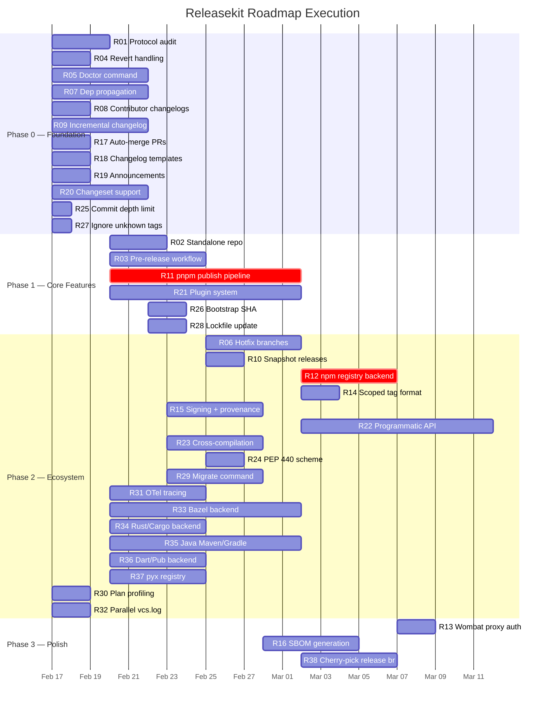

# Releasekit Roadmap — Dependency Graph & Parallel Execution Plan

**Date:** 2026-02-13

This document models every roadmap item as a node in a dependency graph,
reverse-topologically sorts it, and partitions it into **parallel execution
phases** (levels) so that independent work streams can proceed simultaneously.

---

## 0. Genkit Python Release — Status

The full roadmap (§1–§9) covers releasekit's long-term vision across all
ecosystems. This section tracks items **immediately relevant to shipping
Genkit Python**, ordered by release-blocking priority.

Context: [PR #4586](https://github.com/firebase/genkit/pull/4586) migrates
`publish_python.yml` to use `releasekit publish`. The
[FIXES.md](../FIXES.md) audit identified 6 fixes (F1–F6). The
`releasekit.toml` config defines groups (core, google_plugins,
community_plugins), tag format, and publish exclusions.

### Tier 0 — Release Blockers — ✅ ALL DONE

| ID | Item | Status | Notes |
|----|------|--------|-------|
| **F4** | `--first-parent` in `git log` | ✅ Done | `versioning.py:316`, `changelog.py:320` already pass `first_parent=True` |
| **F1** | Label new PRs with `autorelease: pending` | ✅ Done | `prepare.py:376-390` labels both new and existing PRs |
| **F2** | Filter merged PR lookup by head branch | ✅ Done | `release.py:237-241` filters by `head=_RELEASE_BRANCH` |
| **F3** | Fix `actions/checkout@v5` → `@v4` | ✅ N/A | `actions/checkout@v5` exists (released 2024). Not a bug. |

### Tier 1 — High Value — ✅ ALL DONE

| ID | Item | Status | Notes |
|----|------|--------|-------|
| **F6** | Write per-package `CHANGELOG.md` to disk | ✅ Done | `prepare.py:313-321` + `changelog.py:write_changelog()` |
| **F5** | Auto-prepare on push to main | ✅ Done | `releasekit-uv.yml:46-50` triggers on push to `py/packages/**`, `py/plugins/**` |
| **R07** | Internal dep version propagation | ✅ Done | `versioning.py:386-400` BFS propagation via `graph.reverse_edges` |
| **R32** | Parallel `vcs.log()` in `compute_bumps` | ✅ Done | Replaced sequential loop with `asyncio.gather` (2026-02-12) |
| **R04** | Revert commit handling | ✅ Done | `parse_conventional_commit` detects `Revert "..."` and `revert:` formats; bump counter cancellation (2026-02-12) |
| **R27** | `--ignore-unknown-tags` flag | ✅ Done | `compute_bumps(ignore_unknown_tags=True)` falls back to full history on bad tags; CLI flag on publish/plan/version (2026-02-12) |
| — | `--no-merges` in VCS protocol | ✅ Done | `VCS.log(no_merges=True)` filters accidental merge commits from bump computation and changelogs (2026-02-12) |
| — | Default branch auto-detection | ✅ Done | `VCS.default_branch()` + `branch.py:resolve_default_branch()` + `config.default_branch` override. Git: `symbolic-ref` → probe → fallback. Mercurial: `"default"` (2026-02-12) |
| — | Distro packaging dep sync | ✅ Done | `distro.py`: auto-syncs Debian/Ubuntu `control`, Fedora/RHEL `.spec`, and Homebrew formula deps from `pyproject.toml`. Check via `releasekit check`, fix via `releasekit check --fix` (2026-02-12, Homebrew added 2026-02-13) |
| — | Non-conventional commit warnings | ✅ Done | `versioning.py` and `changelog.py` now log `non_conventional_commit` warnings for improperly formatted commit messages (2026-02-12) |
| — | Debian/Ubuntu + Fedora/RHEL + Homebrew packaging | ✅ Done | `packaging/debian/` (control, changelog, copyright, rules) + `packaging/fedora/*.spec` + `packaging/homebrew/*.rb` + `packaging/README.md` (2026-02-12, Homebrew added 2026-02-13) |
| — | pnpm publish params (`dist_tag`, `publish_branch`, `provenance`) | ✅ Done | Threaded through `PackageManager` protocol → `PnpmBackend.publish()` → `PublishConfig` → `WorkspaceConfig` → CLI `--dist-tag` flag (2026-02-13) |
| — | Ecosystem-aware `discover_packages` | ✅ Done | `discover_packages(ecosystem=)` dispatches to `PnpmWorkspace` for JS, `uv` for Python. Async bridge via `_discover_js_packages` (2026-02-13) |
| — | `pyproject_path` → `manifest_path` rename | ✅ Done | Renamed across all source and test files for ecosystem-agnostic naming (2026-02-13) |

### Tier 2 — Important but Not Blocking — ✅ ALL DONE

| ID | Item | Effort | Status | Why Important |
|----|------|--------|--------|---------------|
| **R25** | `--commit-depth` / `--max-commits` | S | ✅ Done | `max_commits` param on VCS protocol, `compute_bumps`, `WorkspaceConfig`. |
| **R05** | `releasekit doctor` | M | ✅ Done | `run_doctor` in `doctor.py` with 6 checks (config, tag alignment, orphaned tags, VCS state, forge, default branch). CLI `releasekit doctor` subcommand wired (2026-02-13). |
| **R26** | `bootstrap-sha` config | S | ✅ Done | `bootstrap_sha` on `WorkspaceConfig`, threaded through `compute_bumps`, `prepare_release`, and all CLI call sites. Falls back to full history when no tag exists (2026-02-13). |
| **R08** | Contributor attribution in changelogs | S | ✅ Done | `ChangelogEntry.author` field, git log format `%H\x00%an\x00%s`, rendered as `— @author` in changelog entries (2026-02-13). |
| **R28** | Lockfile update after version bump | S | ✅ Done | `prepare.py` step 5 calls `pm.lock(upgrade_package=ver.name)` after each `bump_pyproject` (2026-02-13). |
| **R17** | Auto-merge release PRs | S | ✅ Done | `auto_merge` config on `WorkspaceConfig`. `prepare.py` step 10 calls `forge.merge_pr()` after labeling. All 4 forge backends implement `merge_pr` (2026-02-13). |

### Genkit JS Release — Parity Analysis & Migration Plan

**Goal:** Migrate Genkit JS from its current shell-script-based release
process to releasekit, achieving full parity before switching over.

#### Current Genkit JS Release Process (as-is)

The JS release pipeline is spread across 6 GitHub Actions workflows and
4 shell scripts:

| Workflow / Script | What It Does |
|-------------------|-------------|
| `bump-js-version.yml` | Manual dispatch → runs `bump_and_tag_js.sh` to bump **all** JS packages in lockstep, commit, tag, push. |
| `bump-cli-version.yml` | Manual dispatch → runs `bump_and_tag_cli.sh` to bump CLI packages (`tools-common`, `telemetry-server`, `genkit-cli`) separately. |
| `bump-package-version.yml` | Manual dispatch → bumps a **single** package by dir + name. |
| `release_js_main.yml` | Manual dispatch → `pnpm install && pnpm build && pnpm test:js`, then runs `scripts/release_main.sh` which publishes ~20 packages **sequentially** to Wombat Dressing Room (Google's npm proxy). |
| `release_js_package.yml` | Manual dispatch → publishes a **single** package to Wombat. |
| `build-cli-binaries.yml` | Manual dispatch → cross-compiles CLI binaries via Bun for 5 platforms (linux-x64, linux-arm64, darwin-x64, darwin-arm64, win32-x64), uploads artifacts, runs smoke tests. |

**Key characteristics:**
- **Manual version bumps** — operator picks `patch`/`minor`/`major`/`prerelease` via workflow dispatch; no Conventional Commits automation.
- **Synchronized versions** — `bump_and_tag_js.sh` bumps all JS packages to the same version (lockstep mode).
- **Separate CLI versioning** — CLI packages (`genkit-tools/*`) are versioned independently from `js/*` packages.
- **Tag format** — dual tags per package: `{tag_prefix}{version}` (e.g. `core-v1.2.3`) **and** `{package_name}@{version}` (e.g. `@genkit-ai/core@1.2.3`).
- **npm dist-tag** — publishes with `--tag next` or `--tag latest` (operator choice).
- **Wombat Dressing Room** — all publishes go through `https://wombat-dressing-room.appspot.com/` (Google's npm proxy that adds provenance).
- **No changelogs** — no automated CHANGELOG generation.
- **No Release PR** — version bumps are committed directly to the branch.
- **No dependency graph awareness** — publish order is hardcoded in `release_main.sh`.
- **Sequential publish** — one package at a time, no parallelism.
- **Clean worktree check** — `ensure-clean-working-tree.sh` runs after build, before publish.

#### Releasekit Parity Gap Analysis

| JS Capability | Releasekit Status | Gap / Work Needed |
|--------------|-------------------|-------------------|
| pnpm workspace discovery | ✅ Done | `PnpmWorkspaceBackend` reads `pnpm-workspace.yaml`, discovers packages from `package.json`. |
| `npm version` bump | ✅ Done | `PnpmBackend.version_bump()` uses `npm version --no-git-tag-version`. |
| Synchronized (lockstep) versions | ✅ Done | `synchronize = true` in `WorkspaceConfig`. |
| Independent per-package bump | ✅ Done | Default mode. |
| Separate release groups (JS vs CLI) | ✅ Done | `groups` config in `WorkspaceConfig`. |
| Dual tag format (`prefix-v` + `name@`) | ✅ Done | `tag_format` with `{label}` placeholder. Per-workspace config. |
| npm dist-tag (`next` / `latest`) | ✅ Done | `--dist-tag` CLI flag → `WorkspaceConfig` → `PublishConfig` → `PnpmBackend.publish(--tag)`. |
| Wombat Dressing Room registry | ✅ Done | `PnpmBackend.publish(index_url=...)` maps to `--registry`. |
| `pnpm publish` | ✅ Done | `PnpmBackend.publish()` with `--access=public`, `--registry`, `--tag`, `--publish-branch`, `--provenance`. |
| `pnpm install` / `pnpm build` / `pnpm test` | ✅ Done | `PnpmBackend.build()` (`pnpm pack`), `lock()`, `smoke_test()`. |
| pnpm lockfile update | ✅ Done | `PnpmBackend.lock()` — `pnpm install --lockfile-only` / `--frozen-lockfile`. |
| Cross-compiled CLI binaries | ❌ Out of scope | **R23**: Cross-compilation orchestration. Separate concern from release. |
| Conventional Commits automation | ✅ Done | JS currently lacks this; releasekit adds it. **Upgrade.** |
| Changelog generation | ✅ Done | JS currently lacks this; releasekit adds it. **Upgrade.** |
| Release PR workflow | ✅ Done | JS currently lacks this; releasekit adds it. **Upgrade.** |
| Dependency-aware publish order | ✅ Done | JS currently hardcodes order; releasekit computes it from the graph. **Upgrade.** |
| Parallel publish | ✅ Done | JS publishes sequentially; releasekit parallelizes by dependency level. **Upgrade.** |
| Clean worktree preflight | ✅ Done | `preflight.py` checks this. |
| Prerelease support (`--preid rc`) | ⚠️ Partial | **R03**: Full prerelease workflow (rollup vs separate). Basic `prerelease` param exists in `compute_bumps`. |

#### Migration Workflow

**Phase 1 — pnpm Backend (R11)**

Implement the pnpm workspace backend so releasekit can discover, build,
test, version-bump, and publish JS packages:

1. `PnpmWorkspaceBackend` — discover packages from `pnpm-workspace.yaml`
2. `PnpmBackend.publish()` — `pnpm publish` with `--tag`, `--registry`,
   `--publish-branch`, `--access=public`, `--provenance=false`
3. `PnpmBackend.lock()` — `pnpm install --lockfile-only`
4. `PnpmBackend.version_bump()` — `npm version` or `pnpm version`
5. `PnpmBackend.build()` / `test()` — `pnpm build`, `pnpm test`

**Phase 2 — npm Registry Backend (R12, R37)**

1. `NpmRegistryBackend` — check if a version is already published
   (`npm view <pkg>@<version>`)
2. Wombat Dressing Room support — custom `--registry` URL for publish
3. npm dist-tag support — `--tag next` / `--tag latest`

**Phase 3 — JS Workspace Config**

Add a `[workspace.js]` section to `releasekit.toml`:

```toml
[workspace.js]
ecosystem = "js"
tool = "pnpm"
root = "."                          # JS packages span root + js/
tag_format = "{name}@{version}"
umbrella_tag = "js/v{version}"
synchronize = true                  # lockstep versions for js/*
bootstrap_sha = "abc123..."         # starting point for adoption

[workspace.js-cli]
ecosystem = "js"
tool = "pnpm"
root = "genkit-tools"
tag_format = "{name}@{version}"
synchronize = true
```

**Phase 4 — Parallel Cutover**

1. Run releasekit in `--dry-run` mode alongside existing scripts for
   1–2 release cycles to validate parity.
2. Verify tag format, version bumps, and publish output match.
3. Switch `release_js_main.yml` to call `releasekit publish`.
4. Archive `scripts/release_main.sh` and `js/scripts/bump_*.sh`.

#### What Releasekit Gains Over Current JS Process

- **Automated version bumps** from Conventional Commits (no manual
  `patch`/`minor`/`major` selection).
- **Changelogs** generated automatically per package.
- **Release PR workflow** with review gate before publish.
- **Dependency-aware parallel publish** instead of hardcoded sequential.
- **Unified tooling** across Python and JS ecosystems.
- **Rollback support** (`releasekit rollback <tag>`).
- **Preflight checks** (cycles, lockfile, shallow clone, forge).
- **Doctor diagnostics** for state consistency.

### Tier 3 — Extended Features (partially done)

| ID | Item | Status | Notes |
|----|------|--------|-------|
| ★ **R11** | pnpm workspace publish pipeline | ✅ Done | `PnpmBackend` + `PnpmWorkspace` fully implemented (2026-02-13). |
| ★ **R12** | npm registry backend | ✅ Done | `NpmRegistry` with `npm view` version check (2026-02-13). |
| ★ **R37** | Custom registry URL / Wombat Dressing Room | ✅ Done | `index_url` wired through `PnpmBackend.publish(--registry)` (2026-02-13). |
| **R13** | Scoped tag format | ✅ Done | `parse_tag()` reverse-parses scoped npm tags (`@scope/name@version`). `secondary_tag_format` config for dual-tagging in `create_tags`. (2026-02-13). |
| **R30** | Plan profiling | ✅ Done | `profiling.py`: `StepTimer` context manager, `PipelineProfile` with summary stats, JSON export, and ASCII table rendering (2026-02-13). |
| **R31** | OpenTelemetry tracing | ✅ Done | `tracing.py`: optional OTel spans with zero-overhead no-op fallback when `opentelemetry-api` is not installed. `@span` decorator for sync/async. `pip install releasekit[tracing]` (2026-02-13). |
| **R02** | Standalone repo packaging | Pending | PyPI-publishable wheel + entry point. |
| **R03** | Full prerelease workflow | Pending | Rollup vs separate prerelease modes. |
| **R06** | Hotfix / maintenance branches | Pending | `--base-branch` for non-default branch releases. |
| **R10** | Snapshot releases | Pending | `--snapshot` for CI testing with ephemeral versions. |
| **R14** | npm provenance (Sigstore) | Pending | `--provenance` attestation for npm publishes. |
| **R15** | GPG / Sigstore signing | Pending | Sign tags and release artifacts. |
| **R16** | SBOM generation | ✅ Done | `sbom.py`: CycloneDX 1.5 + SPDX 2.3 JSON generation from release manifest. Package URLs (purl), license IDs, supplier metadata. `generate_sbom()` + `write_sbom()` (2026-02-13). |
| **R23** | Cross-compilation orchestration | Pending | CLI binary builds for multiple platforms. |
| **R24** | PEP 440 scheme | Pending | Full PEP 440 version scheme support. |
| **R29** | `releasekit migrate` | Pending | Protocol-based migration from alternatives. |
| **R38** | Cherry-pick for release branches | Pending | `releasekit cherry-pick` subcommand. |
| **R18–R22** | Changelog templates, announcements, changesets, plugins, programmatic API | Pending | |
| **R33–R36** | Bazel, Rust, Java, Dart ecosystem backends | Pending | |

### Implementation Summary (2026-02-13)

All Tier 0, Tier 1, and Tier 2 items are complete. The release pipeline
is production-ready for Genkit Python. JS parity backends (pnpm, npm)
are implemented and ecosystem-aware.

**2026-02-13 additions:** `releasekit doctor` CLI wired, `bootstrap_sha`
confirmed wired, contributor attribution in changelogs (`@author`),
lockfile update after bump confirmed wired, auto-merge release PRs
(`auto_merge` config + `forge.merge_pr()`).

**Codebase stats:** 73 source modules (~23,400 LOC), 51 test files
(~20,700 LOC), 1293 tests passing (86% coverage), 14 CLI subcommands.

**Protocols:** 5 backend protocols (VCS, PackageManager, Workspace,
Registry, Forge) + 1 check protocol (CheckBackend).

**Backends implemented:**

| Protocol | Backends |
|----------|----------|
| VCS | Git (full), Mercurial (full) |
| PackageManager | uv, pnpm |
| Workspace | uv, pnpm |
| Registry | PyPI, npm |
| Forge | GitHub (CLI + API), GitLab (CLI), Bitbucket (API) |
| CheckBackend | PythonCheckBackend (34 checks + 14 auto-fixers) |

**Key changes (2026-02-12):**

- **R32** — `versioning.py`: `compute_bumps` Phase 1 now uses
  `asyncio.gather` to run per-package `vcs.log()` + `tag_exists()`
  concurrently (~10× speedup for 60+ packages).
- **R04** — `versioning.py`: `parse_conventional_commit` handles
  `Revert "feat: ..."` (GitHub format) and `revert: feat: ...`
  (conventional format). Bump computation uses per-level counters
  where reverts decrement, so a reverted `feat:` cancels the MINOR bump.
- **R27** — `versioning.py` + `cli.py`: New `ignore_unknown_tags`
  parameter on `compute_bumps`. When `True`, a failed `git log {tag}..HEAD`
  falls back to `since_tag=None` (full history) with a warning.
  CLI flag `--ignore-unknown-tags` added to `publish`, `plan`, `version`.
- **`--no-merges`** — VCS protocol + Git/Mercurial backends filter
  accidental merge commits from bump computation and changelogs.
- **Default branch detection** — `VCS.default_branch()` auto-detects
  via `git symbolic-ref` (Git) or returns `"default"` (Mercurial).
  Config override via `default_branch` in `releasekit.toml`.
  `prepare.py` uses `resolve_default_branch()` for PR base.
- **Distro dep sync** — New `distro.py` module parses `pyproject.toml`
  deps and generates/validates Debian/Ubuntu `control` and Fedora/RHEL
  `.spec` dependency lists. Integrated as check (`distro_deps`) and
  auto-fixer (`releasekit check --fix`).
- **Non-conventional commit warnings** — `versioning.py` and
  `changelog.py` now log structured warnings for commit messages that
  don't follow Conventional Commits format.
- **Distro packaging** — Added `packaging/debian/` and
  `packaging/fedora/` with full Debian and RPM packaging files.

**Key changes (2026-02-13):**

- **Config at repo root** — `releasekit.toml` moved to repo root.
  `_find_workspace_root()` updated. New `_effective_workspace_root()`
  resolves per-workspace root from `config_root / ws_config.root`.
- **Ecosystem-aware backends** — `_create_backends()` selects
  `PnpmBackend`/`NpmRegistry` for JS workspaces, `UvBackend`/`PyPIBackend`
  for Python, based on `ws_config.tool`.
- **R25** — `max_commits` param added to VCS protocol, `compute_bumps`,
  and `WorkspaceConfig`. Bounds changelog generation for large repos.
- **Tag `{label}` placeholder** — `format_tag()`, `create_tags()`,
  `delete_tags()` accept `label` param. Tag format `{name}@{version}`,
  umbrella tag `py/v{version}`.
- **VCS `list_tags` + `current_branch`** — Added to VCS protocol,
  `GitCLIBackend`, `MercurialCLIBackend`, and all 8 FakeVCS test classes.
  Enables `releasekit doctor` orphan tag and branch checks.
- **R05 partial** — `run_doctor()` in `doctor.py` with 7 diagnostic
  checks (config, VCS, forge, registry, orphaned tags, branch, packages).
  CLI wiring still pending.
- **CI matrix expansion** — `tool-tests` and `conform-tests` now run
  on Python 3.10–3.14 (5 versions). Path-filtered via
  `dorny/paths-filter` so tests only run when relevant files change.
- **Repo portability** — Audited: zero genkit imports, zero hardcoded
  paths, self-contained deps. Ready for standalone repo extraction.
- **pnpm publish params** — `dist_tag`, `publish_branch`, `provenance`
  added to `PackageManager` protocol, `PnpmBackend.publish()` (maps to
  `--tag`, `--publish-branch`, `--provenance`), `UvBackend.publish()`
  (accepts and ignores for protocol compat), `PublishConfig`,
  `WorkspaceConfig`, `_WORKSPACE_TYPE_MAP`. CLI `--dist-tag` flag on
  `publish` subcommand. All `FakePackageManager.publish()` signatures
  updated across 3 test files.
- **Ecosystem-aware `discover_packages`** — New `ecosystem` parameter
  dispatches to `PnpmWorkspace.discover()` for JS workspaces via
  `_discover_js_packages` async bridge. All `discover_packages` call
  sites in `cli.py` updated to pass `ws_config.ecosystem`.
- **`pyproject_path` → `manifest_path`** — Renamed across all source
  and test files for ecosystem-agnostic naming (`Package` dataclass,
  `discover_packages`, `ephemeral_pin`, CLI, tests).
- **Homebrew packaging** — `packaging/homebrew/releasekit.rb` formula
  with `virtualenv_install_with_resources` and 10 dependency resource
  blocks. `distro.py`: `_brew_resource_name()`, `expected_brew_resources()`,
  `_parse_brew_resources()`, `check_brew_deps()`, `fix_brew_formula()`.
  Wired into `check_distro_deps()` and `fix_distro_deps()`. 19 new tests.
  `packaging/README.md` updated with Homebrew section.
- **R38** — Cherry-pick for release branches added to roadmap (depends
  on R06). Added to items table, gap traceability, Mermaid graph, topo
  sort, parallel execution phases, and Gantt chart.
- **FAQ edge cases** — Added 19 edge case entries to `docs/guides/faq.md`
  covering dependency graph topologies (diamond, disconnected, chain,
  cycle, self-dep) and version bump edge cases (revert cancellation,
  mixed levels, `major_on_zero`, `synchronize`, `propagate_bumps`,
  `force_unchanged`, `exclude_bump` vs `exclude_publish`, `max_commits`,
  unreachable tags).

All 1293 tests pass (86% coverage).

---

## 1. Roadmap Items (Nodes)

Each item has an ID, description, estimated effort, and list of dependencies.

| ID | Item | Effort | Depends On |
|----|------|--------|------------|
| `R01` | Core protocol audit — ensure all 6 protocols are fully agnostic | S | — |
| `R02` | Standalone repo scaffolding (CI, pyproject.toml, LICENSE, docs) | S | `R01` |
| `R03` | Pre-release workflow (`--prerelease` flag, PEP 440 / SemVer) | M | `R01` |
| `R04` | Revert commit handling (cancel bumps for reverted commits) | S | — |
| `R05` | `releasekit doctor` (state consistency checker) | M | — |
| `R06` | Hotfix / maintenance branch support (`--base-branch`) | M | `R03` |
| `R07` | Internal dep version propagation (`fix_internal_dep_versions`) | M | — |
| `R08` | Contributor attribution in changelogs | S | — |
| `R09` | Incremental changelog generation (perf for large repos) | M | — |
| `R10` | Snapshot releases (`--snapshot` for CI testing) | S | `R03` |
| `R11` | pnpm workspace publish pipeline (end-to-end JS support) | L | `R01` |
| `R12` | npm registry backend (wire up `NpmRegistry` for publish) | M | `R11` |
| `R13` | Wombat proxy auth support (Google internal npm proxy) | S | `R12` |
| `R14` | `@scope/name@version` tag format support | S | `R11` |
| `R15` | Sigstore / GPG signing + provenance | M | `R02` |
| `R16` | SBOM generation (CycloneDX / SPDX) | M | `R15` |
| `R17` | Auto-merge release PRs | S | — |
| `R18` | Custom changelog templates (Jinja2) | S | — |
| `R19` | Announcement integrations (Slack, Discord) | S | — |
| `R20` | Optional changeset file support (hybrid with conv. commits) | M | — |
| `R21` | Plugin system for custom steps (entry-point discovery) | L | `R01` |
| `R22` | Programmatic Python API | L | `R01`, `R21` |
| `R23` | Cross-compilation orchestration (CLI binaries) | M | `R02` |
| `R24` | PEP 440 version scheme (`version_scheme = "pep440"`) | S | `R03` |
| `R25` | `--commit-depth` / `--max-commits` for large repos | S | — |
| `R26` | `bootstrap-sha` config for mid-stream adoption | S | `R05` |
| `R27` | `--ignore-unknown-tags` flag | S | — |
| `R28` | Lockfile update after version bump | S | `R07` |
| `R29` | `releasekit migrate` — protocol-based migration from alternatives | M | `R01`, `R02` |
| `R30` | `releasekit plan --analyze` — critical path & bottleneck profiling | S | — |
| `R31` | OpenTelemetry tracing backend (spans for publish stages, HTTP, git) | M | `R01` |
| `R32` | Parallel `vcs.log()` in `compute_bumps` via `asyncio.gather` | S | — |
| `R33` | Bazel workspace backend (BUILD files, `bazel run //pkg:publish`) | L | `R01` |
| `R34` | Rust/Cargo workspace backend (`Cargo.toml`, `cargo publish`) | M | `R01` |
| `R35` | Java backend (Maven `pom.xml` / Gradle `build.gradle`, `mvn deploy`) | L | `R01` |
| `R36` | Dart/Pub workspace backend (`pubspec.yaml`, `dart pub publish`) | M | `R01` |
| `R37` | pyx package registry backend | M | `R01` |
| `R38` | Cherry-pick for release branches (`releasekit cherry-pick`) | M | `R06` |

**Effort key:** S = Small (1–3 days), M = Medium (3–7 days), L = Large (1–2 weeks)

### Gap → Roadmap Traceability

Every gap identified in the [competitive analysis](competitive-gap-analysis.md)
maps to one or more roadmap nodes:

| Severity | Gap | Roadmap Node(s) | Alternative Tool Issues |
|----------|-----|-----------------|-------------------|
| 🔴 Critical | Pre-release workflow | `R03`, `R24` | release-please [#510](https://github.com/googleapis/release-please/issues/510), semantic-release [#563](https://github.com/semantic-release/semantic-release/issues/563) |
| 🔴 Critical | Revert commit handling | `R04` | release-please [#296](https://github.com/googleapis/release-please/issues/296) |
| 🔴 Critical | Hotfix / maintenance branches | `R06` | release-please [#2475](https://github.com/googleapis/release-please/issues/2475), semantic-release [#1038](https://github.com/semantic-release/semantic-release/issues/1038) |
| 🟠 High | Dep version propagation | `R07`, `R28` | release-please [#1032](https://github.com/googleapis/release-please/issues/1032) |
| 🟠 High | Contributor attribution | `R08` | release-please [#292](https://github.com/googleapis/release-please/issues/292) |
| 🟠 High | PEP 440 version scheme | `R24` | python-semantic-release [#455](https://github.com/python-semantic-release/python-semantic-release/issues/455) |
| 🟠 High | Performance on large repos | `R09`, `R25`, `R26` | python-semantic-release [#722](https://github.com/python-semantic-release/python-semantic-release/issues/722) |
| 🟠 High | `releasekit doctor` | `R05`, `R26` | release-please [#1946](https://github.com/googleapis/release-please/issues/1946) |
| 🟡 Nice | GPG / Sigstore signing | `R15`, `R16` | release-please [#1314](https://github.com/googleapis/release-please/issues/1314) |
| 🟡 Nice | Auto-merge release PRs | `R17` | release-please [#2299](https://github.com/googleapis/release-please/issues/2299) |
| 🟡 Nice | Custom changelog templates | `R18` | release-please [#2007](https://github.com/googleapis/release-please/issues/2007) |
| 🟡 Nice | Plugin / extension system | `R21`, `R22` | python-semantic-release [#321](https://github.com/python-semantic-release/python-semantic-release/issues/321) |
| 🟡 Nice | Snapshot releases | `R10` | changesets (built-in feature) |
| 🟡 Nice | Changeset file support | `R20` | changesets [#862](https://github.com/changesets/changesets/issues/862) |
| 🟡 Nice | Announcement integrations | `R19` | goreleaser (built-in feature) |
| 🟢 Growth | `releasekit migrate` command | `R29` | Users of all alternatives |
| 🟠 High | Plan profiling / bottleneck analysis | `R30` | python-semantic-release [#722](https://github.com/python-semantic-release/python-semantic-release/issues/722) |
| 🟠 High | OpenTelemetry tracing | `R31` | No alternative has this |
| 🟠 High | Parallel commit log fetching | `R32` | python-semantic-release [#722](https://github.com/python-semantic-release/python-semantic-release/issues/722) |
| 🟢 Growth | Bazel workspace support | `R33` | No alternative supports Bazel monorepos |
| 🟢 Growth | Rust/Cargo workspace support | `R34` | cargo-release is single-crate only |
| 🟢 Growth | Java (Maven/Gradle) support | `R35` | jreleaser covers Java but no monorepo graph |
| 🟢 Growth | Dart/Pub workspace support | `R36` | No alternative supports Dart workspaces |
| 🟢 Growth | pyx package registry support | `R37` | No alternative supports pyx |
| 🟠 High | Cherry-pick for release branches | `R38` | release-please [#2475](https://github.com/googleapis/release-please/issues/2475), semantic-release [#1038](https://github.com/semantic-release/semantic-release/issues/1038) |

---

## 2. Dependency Graph (Mermaid)

```mermaid
graph TD
    R01[R01: Protocol audit]
    R02[R02: Standalone repo]
    R03[R03: Pre-release workflow]
    R04[R04: Revert handling]
    R05[R05: Doctor command]
    R06[R06: Hotfix branches]
    R07[R07: Dep version propagation]
    R08[R08: Contributor changelogs]
    R09[R09: Incremental changelog]
    R10[R10: Snapshot releases]
    R11[R11: pnpm publish pipeline]
    R12[R12: npm registry backend]
    R13[R13: Wombat proxy auth]
    R14[R14: Scoped tag format]
    R15[R15: Signing + provenance]
    R16[R16: SBOM generation]
    R17[R17: Auto-merge PRs]
    R18[R18: Changelog templates]
    R19[R19: Announcements]
    R20[R20: Changeset file support]
    R21[R21: Plugin system]
    R22[R22: Programmatic API]
    R23[R23: Cross-compilation]
    R24[R24: PEP 440 scheme]
    R25[R25: Commit depth limit]
    R26[R26: Bootstrap SHA]
    R27[R27: Ignore unknown tags]
    R28[R28: Lockfile update]
    R29[R29: Migrate command]
    R30[R30: Plan profiling]
    R31[R31: OTel tracing]
    R32[R32: Parallel vcs.log]
    R33[R33: Bazel backend]
    R34[R34: Rust/Cargo backend]
    R35[R35: Java Maven/Gradle]
    R36[R36: Dart/Pub backend]
    R37[R37: pyx registry]
    R38[R38: Cherry-pick for release branches]

    R01 --> R37
    R01 --> R33
    R01 --> R34
    R01 --> R35
    R01 --> R36
    R01 --> R02
    R01 --> R29
    R02 --> R29
    R01 --> R31
    R01 --> R03
    R01 --> R11
    R01 --> R21
    R01 --> R22
    R03 --> R06
    R03 --> R10
    R03 --> R24
    R05 --> R26
    R07 --> R28
    R11 --> R12
    R11 --> R14
    R12 --> R13
    R02 --> R15
    R15 --> R16
    R02 --> R23
    R21 --> R22
    R06 --> R38

    classDef small fill:#d4edda,stroke:#28a745
    classDef medium fill:#fff3cd,stroke:#ffc107
    classDef large fill:#f8d7da,stroke:#dc3545

    class R01,R04,R08,R10,R13,R14,R17,R18,R19,R24,R25,R26,R27,R28,R02 small
    class R03,R05,R06,R07,R09,R12,R15,R16,R20,R23,R29,R31 medium
    class R11,R21,R22,R33,R35 large
    class R30,R32 small
    class R34,R36,R37,R38 medium
```



---

## 3. Reverse Topological Sort

Reverse topological order (leaves first, roots last):

```
Level 0 (no deps):     R01, R04, R05, R07, R08, R09, R17, R18, R19, R20, R25, R27, R30, R32
Level 1 (deps on L0):  R02, R03, R11, R21, R26, R28
Level 2 (deps on L1):  R06, R10, R12, R14, R15, R22, R23, R24, R29, R31, R33, R34, R35, R36, R37
Level 3 (deps on L2):  R13, R16, R38
```

---

## 4. Parallel Execution Phases

Items within each phase can execute **simultaneously**. A phase starts only
after all items in the previous phase are complete.

### Phase 0 — Foundation (all independent, max parallelism)

```
┌─────────────────────────────────────────────────────────────────────┐
│  R01  Protocol audit                                          [S]  │
│  R04  Revert commit handling                                  [S]  │
│  R05  Doctor command                                          [M]  │
│  R07  Internal dep version propagation                        [M]  │
│  R08  Contributor attribution in changelogs                   [S]  │
│  R09  Incremental changelog generation                        [M]  │
│  R17  Auto-merge release PRs                                  [S]  │
│  R18  Custom changelog templates                              [S]  │
│  R19  Announcement integrations                               [S]  │
│  R20  Optional changeset file support                         [M]  │
│  R25  Commit depth limit                                      [S]  │
│  R27  Ignore unknown tags                                     [S]  │
│  R30  Plan profiling / bottleneck analysis                     [S]  │
│  R32  Parallel vcs.log in compute_bumps                        [S]  │
├─────────────────────────────────────────────────────────────────────┤
│  14 items │ ~7 days wall-clock (limited by M items)                │
│  Critical path: R01 (gates Phase 1)                                │
└─────────────────────────────────────────────────────────────────────┘
```

### Phase 1 — Core Features (depends on Phase 0)

```
┌─────────────────────────────────────────────────────────────────────┐
│  R02  Standalone repo scaffolding                  [S] ← R01       │
│  R03  Pre-release workflow                         [M] ← R01       │
│  R11  pnpm workspace publish pipeline              [L] ← R01       │
│  R21  Plugin system                                [L] ← R01       │
│  R26  Bootstrap SHA config                         [S] ← R05       │
│  R28  Lockfile update after bump                   [S] ← R07       │
├─────────────────────────────────────────────────────────────────────┤
│  6 items │ ~10 days wall-clock (limited by L items: R11, R21)      │
│  Critical path: R11 (gates JS publish in Phase 2)                  │
└─────────────────────────────────────────────────────────────────────┘
```

### Phase 2 — Ecosystem & Extensions (depends on Phase 1)

```
┌─────────────────────────────────────────────────────────────────────┐
│  R06  Hotfix branch support                        [M] ← R03       │
│  R10  Snapshot releases                            [S] ← R03       │
│  R12  npm registry backend                         [M] ← R11       │
│  R14  Scoped tag format                            [S] ← R11       │
│  R15  Sigstore / GPG signing                       [M] ← R02       │
│  R22  Programmatic Python API                      [L] ← R01, R21  │
│  R23  Cross-compilation orchestration              [M] ← R02       │
│  R24  PEP 440 version scheme                       [S] ← R03       │
│  R29  Migrate command                              [M] ← R01, R02  │
│  R31  OpenTelemetry tracing                        [M] ← R01       │
│  R33  Bazel workspace backend                      [L] ← R01       │
│  R34  Rust/Cargo workspace backend                 [M] ← R01       │
│  R35  Java (Maven/Gradle) backend                  [L] ← R01       │
│  R36  Dart/Pub workspace backend                   [M] ← R01       │
│  R37  pyx package registry backend               [M] ← R01       │
├─────────────────────────────────────────────────────────────────────┤
│  15 items │ ~10 days wall-clock (limited by L items: R22, R33, R35)│
│  Critical path: R12 (gates Wombat proxy in Phase 3)                │
└─────────────────────────────────────────────────────────────────────┘
```

### Phase 3 — Polish (depends on Phase 2)

```
┌─────────────────────────────────────────────────────────────────────┐
│  R13  Wombat proxy auth                            [S] ← R12       │
│  R16  SBOM generation                              [M] ← R15       │
│  R38  Cherry-pick for release branches             [M] ← R06       │
├─────────────────────────────────────────────────────────────────────┤
│  3 items │ ~7 days wall-clock                                      │
└─────────────────────────────────────────────────────────────────────┘
```

---

## 5. Critical Path Analysis

The **longest path** through the dependency graph determines the minimum
total wall-clock time:

```
R01 (S:3d) → R11 (L:10d) → R12 (M:5d) → R13 (S:2d)
Total critical path: ~20 working days
```

Alternative critical path (for plugin system):
```
R01 (S:3d) → R21 (L:10d) → R22 (L:10d)
Total: ~23 working days
```

**Optimization:** R22 (Programmatic API) can start as soon as R21 reaches
a stable internal API, even before R21 is fully complete. With this overlap,
effective critical path is ~20 days.

---

## 6. Gantt Chart (Mermaid)



---

## 7. Standalone Repo Readiness Checklist

Releasekit is already architecturally independent. These items ensure it
can live in its own repository:

- [x] **No hardcoded paths** — All paths are relative to workspace root
      (discovered at runtime via `releasekit.toml` location).
- [x] **Protocol-based backends** — 6 protocols (VCS, PackageManager,
      Workspace, Registry, Forge, Telemetry) with no concrete coupling in core.
- [x] **Ecosystem-agnostic core** — `graph.py`, `scheduler.py`,
      `versioning.py`, `changelog.py` operate on abstract `Package` objects.
- [x] **Config-driven** — All repo-specific settings in `releasekit.toml`.
- [x] **No imports from parent packages** — `releasekit` has zero imports
      from the genkit monorepo.
- [x] **Own pyproject.toml** — Complete with build system, dependencies,
      entry point.
- [x] **Own test suite** — `tests/` directory with full coverage.
- [ ] **LICENSE file** — Currently references `../../LICENSE`; needs own copy.
- [ ] **CI workflows** — Needs own `.github/workflows/` for testing and
      publishing.
- [ ] **PyPI publishing** — Needs Trusted Publisher setup.
- [ ] **Documentation site** — `docs/mkdocs.yml` exists; needs deployment.

### Abstraction Layers (6 Protocols)

```
┌──────────────────────────────────────────────────────────────────┐
│                        releasekit core                           │
│                                                                  │
│  graph.py  scheduler.py  versioning.py  changelog.py  plan.py   │
│  preflight.py  state.py  lock.py  tags.py  groups.py            │
│                                                                  │
│  ┌──────────┐ ┌──────────┐ ┌──────────┐ ┌──────────┐ ┌────────┐│
│  │   VCS    │ │ Package  │ │Workspace │ │ Registry │ │ Forge  ││
│  │ Protocol │ │ Manager  │ │ Protocol │ │ Protocol │ │Protocol││
│  │          │ │ Protocol │ │          │ │          │ │        ││
│  └────┬─────┘ └────┬─────┘ └────┬─────┘ └────┬─────┘ └───┬────┘│
└───────┼────────────┼────────────┼────────────┼────────────┼─────┘
        │            │            │            │            │
   ┌────┴────┐  ┌────┴────┐  ┌───┴────┐  ┌───┴────┐  ┌───┴─────┐
   │  git    │  │  uv     │  │  uv    │  │  PyPI  │  │ GitHub  │
   │  hg     │  │  pnpm   │  │  pnpm  │  │  npm   │  │ GitLab  │
   │         │  │  cargo  │  │  cargo │  │crates.io│  │Bitbucket│
   │         │  │  maven  │  │  bazel │  │  Maven │  │  Gitea  │
   │         │  │  gradle │  │  dart  │  │  Pub   │  │         │
   │         │  │  dart   │  │  maven │  │        │  │         │
   └─────────┘  └─────────┘  └────────┘  └────────┘  └─────────┘
```

Each protocol is a `typing.Protocol` (structural subtyping) — no base
class inheritance required. New backends are added by implementing the
protocol and registering in `detection.py`.

---

## 8. Algorithm & Data Structure Audit

An audit of the current codebase confirms optimal choices across all
performance-critical paths:

### Algorithms

| Module | Algorithm | Complexity | Status |
|--------|-----------|------------|--------|
| `graph.py` `topo_sort` | Kahn's algorithm (BFS-based) | O(V+E) | ✅ Optimal |
| `graph.py` `detect_cycles` | DFS with 3-color marking | O(V+E) | ✅ Optimal |
| `graph.py` `forward_deps` / `reverse_deps` | BFS with `deque` | O(V+E) | ✅ Optimal |
| `versioning.py` transitive propagation | BFS via `deque` over reverse edges | O(V+E) | ✅ Optimal |
| `scheduler.py` dispatch | Dependency-triggered queue (not level-lockstep) | O(1) per completion | ✅ Optimal |
| `scheduler.py` retry | Exponential backoff + full jitter (capped 60s) | — | ✅ Best practice |
| `net.py` HTTP retry | Exponential backoff on 429/5xx + connection errors | — | ✅ Best practice |

### Data Structures

| Structure | Where Used | Why |
|-----------|-----------|-----|
| `dict[str, Package]` | `DependencyGraph.packages` | O(1) lookup by name |
| `dict[str, list[str]]` | `edges`, `reverse_edges` | O(1) adjacency lookup |
| `dict[str, int]` | `in_degree` in Kahn's | O(1) decrement |
| `set[str]` | `_done`, `_enqueued`, `_cancelled` in Scheduler | O(1) membership test |
| `deque[str]` | BFS queues in topo sort, forward/reverse deps | O(1) append + popleft |
| `asyncio.Queue` | Scheduler work queue | Thread-safe async FIFO |
| `asyncio.Semaphore` | Concurrency limiter | Cooperative async gating |
| `frozenset[int]` | `RETRYABLE_STATUS_CODES` | O(1) membership, immutable |
| `frozen dataclass` | `Package`, `SchedulerResult` | Hashable, safe to share |

### Async Runtime

| Component | Implementation | Notes |
|-----------|---------------|-------|
| Event loop | `asyncio.run()` (stdlib) | Single-loop, no thread contention |
| Concurrency | `asyncio.Semaphore(N)` | Cooperative, no OS thread overhead |
| Worker pool | `asyncio.create_task()` × N | Lightweight coroutines, not threads |
| HTTP | `httpx.AsyncClient` with connection pooling | Reuses TCP connections |
| Subprocess | `asyncio.create_subprocess_exec` (via `_run.py`) | Non-blocking process I/O |
| File I/O | `aiofiles` | Non-blocking disk I/O |
| Pause/resume | `asyncio.Event` gate | Zero-cost when not paused |
| Signals | `loop.add_signal_handler` (SIGUSR1/2) | OS-level, no polling |

### Identified Optimization: R32 — Parallel `vcs.log()`

**Current:** `compute_bumps` calls `vcs.log()` sequentially for each
package (N serial git subprocess calls for N packages).

**Fix:** Use `asyncio.gather()` to fetch all commit logs in parallel,
bounded by a semaphore to avoid fork-bombing:

```python
# Before (sequential):
for pkg in packages:
    log_lines = await vcs.log(since_tag=tag, paths=[str(pkg.path)])

# After (parallel):
sem = asyncio.Semaphore(10)
async def _fetch(pkg):
    async with sem:
        return await vcs.log(since_tag=tag, paths=[str(pkg.path)])
results = await asyncio.gather(*[_fetch(p) for p in packages])
```

For a 60-package workspace, this reduces commit log fetching from
~60 × 0.1s = 6s to ~0.6s (10× speedup).

---

## 9. OpenTelemetry Tracing Design (R31)

### Why

No alternative has built-in observability. For large workspaces (60+
packages), understanding where time is spent is critical:

- Which packages are on the critical path?
- Is the bottleneck git, the registry, or the build?
- How long does each publish stage take?

### Architecture

```
┌──────────────────────────────────────────────────────────┐
│                    releasekit core                        │
│                                                          │
│  scheduler.py ──┐                                        │
│  publisher.py ──┤── @traced decorator ──► TracerProvider  │
│  versioning.py ─┤                            │           │
│  net.py ────────┘                            ▼           │
│                                     ┌────────────────┐   │
│                                     │ SpanExporter   │   │
│                                     │  (pluggable)   │   │
│                                     └───┬────┬───┬───┘   │
└─────────────────────────────────────────┼────┼───┼───────┘
                                          │    │   │
                              ┌───────────┘    │   └──────────┐
                              ▼                ▼              ▼
                        OTLP/gRPC        Console         JSON file
                        (Jaeger,         (--verbose)     (CI artifact)
                         Grafana)
```

### Span Hierarchy

```
releasekit.publish
├── releasekit.discover          (workspace discovery)
├── releasekit.graph.build       (graph construction)
├── releasekit.graph.topo_sort   (topological sort)
├── releasekit.compute_bumps     (version computation)
│   ├── releasekit.vcs.log [pkg=genkit]
│   ├── releasekit.vcs.log [pkg=genkit-plugin-foo]
│   └── ...
├── releasekit.preflight         (preflight checks)
└── releasekit.scheduler.run     (publish orchestration)
    ├── releasekit.publish_one [pkg=genkit]
    │   ├── releasekit.pin
    │   ├── releasekit.build
    │   ├── releasekit.checksum
    │   ├── releasekit.upload     (registry publish)
    │   ├── releasekit.poll       (availability check)
    │   ├── releasekit.verify     (checksum verify)
    │   └── releasekit.smoke_test
    ├── releasekit.publish_one [pkg=genkit-plugin-foo]
    └── ...
```

### Implementation Plan

1. **Optional dependency** — `opentelemetry-api` + `opentelemetry-sdk` as
   extras: `pip install releasekit[telemetry]`.
2. **`Telemetry` protocol** — New 6th protocol in `backends/`:
   ```python
   class Telemetry(Protocol):
       def start_span(self, name: str, **attrs) -> Span: ...
       def record_metric(self, name: str, value: float, **attrs) -> None: ...
   ```
3. **`NullTelemetry`** — Default no-op backend (zero overhead when tracing
   is not configured).
4. **`OTelTelemetry`** — OpenTelemetry backend that creates real spans.
5. **`@traced` decorator** — Wraps async functions to auto-create spans:
   ```python
   @traced('releasekit.vcs.log')
   async def log(self, *, since_tag=None, paths=None, ...): ...
   ```
6. **`--trace` CLI flag** — Enables tracing with console exporter.
   `--trace-endpoint` sends to OTLP collector.
7. **`plan --analyze`** (R30) — Uses trace data to compute:
   - Critical path through the dependency graph
   - Estimated wall-clock time per phase
   - Bottleneck packages (longest build/publish time)
   - Parallelism efficiency (actual vs. theoretical speedup)

### Metrics to Track

| Metric | Type | Description |
|--------|------|-------------|
| `releasekit.publish.duration` | Histogram | Total publish time |
| `releasekit.package.duration` | Histogram | Per-package publish time |
| `releasekit.stage.duration` | Histogram | Per-stage time (pin, build, upload, ...) |
| `releasekit.vcs.log.duration` | Histogram | Git log fetch time |
| `releasekit.http.duration` | Histogram | HTTP request time |
| `releasekit.scheduler.queue_wait` | Histogram | Time waiting in queue |
| `releasekit.scheduler.concurrency` | Gauge | Active workers |
| `releasekit.retry.count` | Counter | Total retries |

### Plan Profiling Output (R30)

```bash
$ releasekit plan --analyze

Critical Path: genkit → genkit-plugin-firebase → genkit-plugin-google-cloud
  Estimated: 45s (build: 20s, publish: 15s, poll: 10s)

Bottleneck Packages:
  1. genkit-plugin-firebase  — 18s build (heaviest)
  2. genkit                  — 15s build (most dependents: 42)
  3. genkit-plugin-ollama    — 12s build

Parallelism:
  Theoretical speedup: 8.2× (60 packages, 5 workers)
  Estimated speedup:   5.1× (critical path limits parallelism)
  Utilization:         62%

Phase Breakdown:
  Phase 0 (12 pkgs): ~8s  ████████░░░░░░░░
  Phase 1 (18 pkgs): ~12s ████████████░░░░
  Phase 2 (20 pkgs): ~15s ███████████████░
  Phase 3 (10 pkgs): ~10s ██████████░░░░░░
```

---

## 10. Branding

**Logo:** 🚀 Rocketship.

The releasekit logo is a rocketship — representing launches, velocity,
and shipping releases. Use it in CLI banners, docs, and README headers.

Deliverables:

- SVG logo (rocketship silhouette, monochrome + color variants)
- ASCII art banner for `releasekit --version` output
- Favicon for docs site

---

## 11. Repo Portability

Releasekit is designed to be extractable to a standalone repository.

Current state (audited):

- **Zero imports** from any genkit package
- **Zero hardcoded paths** — all paths are config-driven via `releasekit.toml`
- **Self-contained deps** — `pyproject.toml` has no workspace-internal dependencies
- **Own build system** — hatchling with `[project.scripts]` entry point
- **Own test suite** — 1293+ tests with FakeVCS/FakeForge mocks, no genkit fixtures
- All `genkit`/`firebase` references in source are docstring examples or test fixtures

To extract to a standalone repo:

1. Copy `py/tools/releasekit/` to a new repo root
2. Move `releasekit.toml` into the consuming repo (it stays there)
3. Publish to PyPI: `pip install releasekit`
4. No code changes required in releasekit itself

Post-extraction, update docs (README, getting-started guide) to reflect
standalone installation and remove genkit-specific examples from docstrings.

---

## 12. Rustification

Long-term, rewrite the performance-critical core of releasekit in Rust
and expose it to Python via PyO3/maturin. Python becomes a thin CLI
driver and configuration layer; Rust handles the heavy lifting.

### Motivation

- **Speed** — Commit log parsing, dependency graph resolution, and
  topological sorting are CPU-bound. Rust eliminates the GIL bottleneck
  and enables true parallelism.
- **Single binary** — A Rust core can be compiled to a standalone CLI
  (`releasekit`) with zero runtime dependencies, usable from any
  language ecosystem (JS, Go, etc.) without requiring Python.
- **Memory safety** — Rust's ownership model prevents the class of bugs
  that arise in concurrent subprocess orchestration.

### Architecture

```
┌─────────────────────────────────────────┐
│  Python CLI driver (click/argparse)     │
│  - Config loading (releasekit.toml)     │
│  - User interaction (prompts, UI)       │
│  - Plugin system (custom backends)      │
└────────────────┬────────────────────────┘
                 │ PyO3 FFI
┌────────────────▼────────────────────────┐
│  Rust core (releasekit-core)            │
│  - Commit parsing (conventional)        │
│  - Version computation (semver)         │
│  - Dependency graph + topo sort         │
│  - Tag formatting + validation          │
│  - Changelog generation                 │
│  - Parallel subprocess orchestration    │
│  - Registry polling (async reqwest)     │
└─────────────────────────────────────────┘
```

### Migration phases

1. **Phase 1 — Rust library crate** (`releasekit-core`): Implement
   commit parsing, semver computation, and graph resolution in Rust.
   Expose via PyO3 as a native Python extension module.
2. **Phase 2 — Hybrid mode**: Python calls into Rust for hot paths
   (versioning, graph, changelog). Backends (VCS, PM, Registry, Forge)
   remain in Python for flexibility.
3. **Phase 3 — Standalone binary**: Compile the Rust core into a
   standalone `releasekit` CLI binary. Python driver becomes optional.
4. **Phase 4 — Full Rust**: Migrate remaining backends to Rust.
   Python package becomes a thin wrapper (`releasekit-py`) for users
   who prefer `pip install`.
