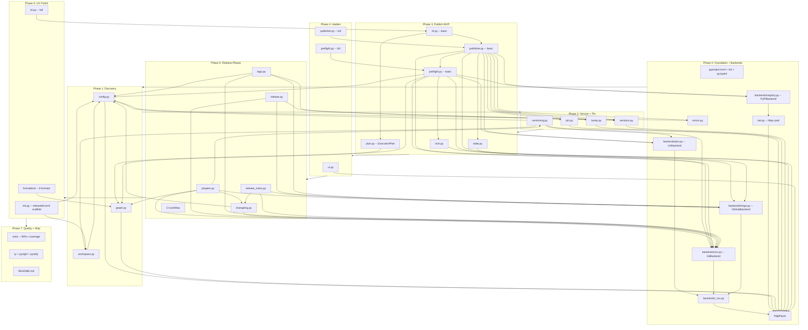
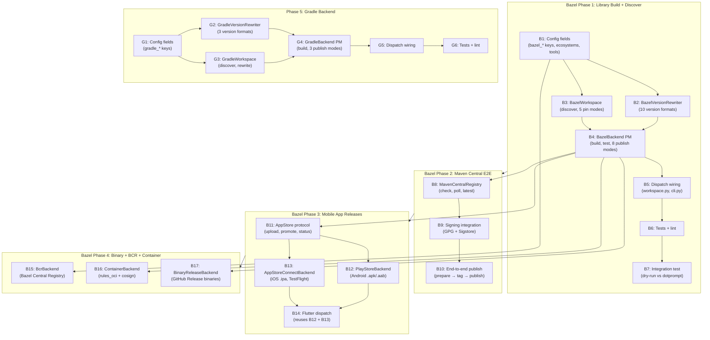

# releasekit Implementation Roadmap

Release orchestration for polyglot monorepos — publish packages in
topological order across uv (Python), pnpm (JavaScript/TypeScript),
and Go ecosystems with dependency-triggered scheduling, ephemeral
version pinning, retry with jitter, and crash-safe file restoration.

**Target location**: `py/tools/releasekit/` in `firebase/genkit`
**Published as**: `releasekit` on PyPI
**Invocation**: `uvx releasekit publish`

---

## Versioning Strategy

`releasekit` supports two versioning models for monorepos, configurable via `synchronize` in `releasekit.toml`.

### 1. Independent Versioning (Default)
`synchronize = false` (default)

Packages are versioned independently based on their own changes, but **propagated transitively**:
1.  **Direct Bumps**: Commits to a package directory trigger semantic version bumps (Major/Minor/Patch).
2.  **Transitive Propagation**: If a package depends on another package that was bumped, it receives a **PATCH bump**.
    - **Rule**: ANY bump in a dependency (Major, Minor, or Patch) triggers a Patch bump in all dependents.
    - **Why**: Ensures lockfiles and pins are updated to point to the new dependency version.
    - **Mental Model**: Releases ripple through the dependency tree. A change in a leaf node (e.g. `genkit`) forces a republication of all consuming nodes.

### 2. Synchronized Versioning (Lockstep)
`synchronize = true`

All packages in the workspace share the same version number.
1.  **Compute Max Bump**: Calculate the highest semantic bump across *all* packages based on commits.
2.  **Apply globally**: Bump *every* package to that new version.
    - Example: `genkit` has a breaking change (Major), so `plugin-vertex-ai` also gets a Major bump, even if unchanged.
    - **Use Case**: Frameworks where components must be installed with matching versions (e.g. `genkit==0.6.0` needs `genkit-plugin-x==0.6.0`).

### 3. Workspace-Sourced Dependency Model

Not all workspace members participate in the same release tree. The
release graph is determined by **workspace-sourced dependencies**, not
merely by co-location in the workspace:

```
┌─────────────────────────────────────────────────────────────────────┐
│                     Workspace Members                              │
│                                                                     │
│  ┌──────────────────────────────┐  ┌───────────────────────────┐   │
│  │ Release Tree 1               │  │ Independent Package       │   │
│  │ (workspace-sourced)          │  │ (pinned to PyPI)          │   │
│  │                              │  │                           │   │
│  │  genkit ──► plugin-a         │  │  app-legacy               │   │
│  │         └─► plugin-b         │  │  deps: genkit==1.0.0      │   │
│  │                              │  │                           │   │
│  │  [tool.uv.sources]           │  │  NOT in [tool.uv.sources] │   │
│  │  genkit = {workspace=true}   │  │  with workspace=true      │   │
│  │  plugin-a = {workspace=true} │  │                           │   │
│  │  plugin-b = {workspace=true} │  │  → Released independently │   │
│  └──────────────────────────────┘  └───────────────────────────┘   │
└─────────────────────────────────────────────────────────────────────┘
```

**How it works:**

1. A dependency is classified as **internal** (part of the release graph)
   only if it satisfies BOTH conditions:
   - Its name matches a workspace member.
   - It has `workspace = true` in `[tool.uv.sources]` of the root
     `pyproject.toml`.

2. If a workspace member depends on another member but uses a **pinned
   PyPI version** (e.g. `genkit==1.0.0`), the dependency edge is
   treated as **external**. The dependent package is excluded from
   version propagation and can be released independently.

3. **No explicit `exclude` configuration needed.** The graph topology
   emerges naturally from `[tool.uv.sources]`. Packages opt out of a
   release tree simply by not having `workspace = true`.

**Why this matters:**

| Scenario | Before | After |
|----------|--------|-------|
| App A pins `genkit==1.0.0` | Force-bumped on genkit 2.0 (broken) | Untouched |
| Plugin uses workspace genkit | Correctly propagated | Same |
| Sample with `Private :: Do Not Upload` | Excluded from publish | Same |

### 4. Independent Release Trees

A single workspace can contain multiple disconnected release trees.
Each tree is a connected component in the dependency graph where
edges are workspace-sourced dependencies.

```
Tree 1 (genkit ecosystem):     Tree 2 (internal tool):
  genkit ──► plugin-a            tool-x ──► tool-y
         └─► plugin-b

Tree 3 (legacy, pinned):       Tree 4 (standalone):
  app-legacy                     sample-demo
  (genkit==1.0.0 from PyPI)      (no internal deps)
```

- `releasekit prepare` processes ALL trees in a single pass.
- Only packages with actual changes (+ transitive dependents) get bumped.
- The Release PR contains all bumped packages from all trees.
- Each tree's version propagation is independent — changes in Tree 1
  cannot affect Tree 2 or Tree 3.

### 5. Cross-Repository Workflow (Plugins)

To support dependent packages in external repositories (e.g. `genkit-community-plugins`):

1.  **Trigger**: The main repo (`firebase/genkit`) fires a `repository_dispatch` event upon successful publish.
2.  **Action**: The dependent repo runs `releasekit prepare`.
3.  **Update**: `prepare` runs `uv lock --upgrade-package genkit` (checking PyPI).
4.  **Result**: If `uv.lock` changes:
    - Creates a `chore(deps): update genkit` bump.
    - Bumps the plugin version (Patch).
    - Opens/Updates a Release PR with the dependency update included.

### 6. Cross-Ecosystem Release Groups

Groups can **span ecosystems**. This is the key design that enables
releasing a pnpm frontend and a uv backend together as a single
coordinated release unit.

#### Two-tier TOML configuration

All releasekit configuration uses **TOML only**. Ecosystem manifests
(`pyproject.toml`, `package.json`, `go.mod`) are never modified for
releasekit config — they are only read/written for version bumps and
dependency declarations (their actual purpose).

1. **Root config** (`releasekit.toml` at monorepo root) —
   workspace-level settings: `synchronize`, `tag_format`, ecosystem
   roots, and global knobs.
2. **Per-package config** (`releasekit.toml` in each package dir) —
   package-level labels: `group`, `publishable` overrides, etc.

##### Root config (`releasekit.toml`)

Flat top-level keys, no `[tool.*]` nesting:

```toml
# releasekit.toml (at the monorepo root)

forge            = "github"
repo_owner       = "firebase"
repo_name        = "genkit"
default_branch   = "main"
pr_title_template = "chore(release): v{version}"

[workspace.py]
ecosystem      = "python"
tool           = "uv"
root           = "py"
tag_format     = "{name}@{version}"
umbrella_tag   = "py/v{version}"
changelog      = true
smoke_test     = true
max_commits    = 500

[workspace.js]
ecosystem      = "js"
tool           = "pnpm"
root           = "."
tag_format     = "{name}@{version}"
umbrella_tag   = "js/v{version}"
synchronize    = true

# Go workspace (future)
# [workspace.go]
# ecosystem    = "go"
# root         = "go"
```

##### Per-package config (`releasekit.toml`)

Each package directory can have its own `releasekit.toml` with
package-level settings:

```toml
# py/packages/genkit/releasekit.toml
group = "core"
```

```toml
# py/plugins/vertex-ai/releasekit.toml
group = "plugins"
```

```toml
# js/packages/core/releasekit.toml
group = "core"
```

```toml
# go/genkit/releasekit.toml
group = "core"
```

Packages without a `releasekit.toml` (or without a `group` key)
are included in all unfiltered runs (`releasekit prepare` without
`--group`) but excluded when a specific group is requested.

**Why TOML everywhere?**

- **Consistent format**: One syntax for all ecosystems. No need to
  invent `[tool.releasekit]` (Python), `"releasekit":{}` (JS), or
  `// releasekit:group=` (Go) conventions.
- **No manifest pollution**: Ecosystem manifests stay clean — they
  only contain what their ecosystem tools expect.
- **Ecosystem-agnostic**: `releasekit.toml` works identically
  regardless of whether the package is Python, JS, Go, or Rust.

#### How it works

```
releasekit prepare --group core

  1. Read root releasekit.toml → find ecosystem roots
  2. For each ecosystem:
     a. Instantiate (Workspace, PackageManager, Registry)
     b. Discover all packages (from ecosystem manifests)
     c. Read per-package releasekit.toml → get group label
     d. Filter: keep only packages where group == "core"
  3. Compute version bumps across all filtered packages
  4. Create single Release PR with bumps from all ecosystems

  ┌──────────── Packages labeled group = "core" ───────────────────┐
  │                                                                 │
  │  py/ (uv workspace)                                            │
  │    genkit/releasekit.toml     → group = "core"   → PyPI        │
  │                                                                 │
  │  js/ (pnpm workspace)                                          │
  │    core/releasekit.toml       → group = "core"   → npm         │
  │                                                                 │
  │  go/ (go workspace)                                            │
  │    genkit/releasekit.toml     → group = "core"   → proxy       │
  │                                                                 │
  │  Single Release PR ── single version bump ── single tag         │
  └─────────────────────────────────────────────────────────────────┘
```

#### Key design decisions

- **TOML only**: All releasekit config uses `releasekit.toml` files.
  Ecosystem manifests are never read or written for config —
  only for version bumps and dependency declarations.
- **Labels, not globs**: Group membership is declared per-package
  as a label in its `releasekit.toml`, not via glob patterns at
  the root. No breakage on rename, no silent mis-matches.
- **Standalone root config**: `releasekit.toml` is ecosystem-agnostic.
  No dependency on any ecosystem's manifest for workspace settings.
- **One PR, multiple ecosystems**: The prepare step creates a single
  Release PR with version bumps across all manifests.
- **Ecosystem-specific publishing**: Each ecosystem's packages are
  published using its own backend (`uv publish` → PyPI,
  `pnpm publish` → npm, `git tag` → `proxy.golang.org`).
- **Independent version propagation**: Version rippling stays within
  each ecosystem's dependency graph. A bump to `genkit` (Python)
  does NOT auto-bump `@genkit-ai/core` (JS) — separate graphs.
  But they share the same Release PR and tag.
- **Shared version number**: When `synchronize = true`, ALL packages
  in ALL ecosystems get the same version number.

#### Implementation plan

1. ✅ Add root `releasekit.toml` reader (flat TOML, no `[tool.*]`). — **Done** (`config.py`).
2. ✅ `init.py` scaffolds `releasekit.toml` (root + per-package). — **Done**.
3. Add per-package `releasekit.toml` reader (same flat TOML format,
   discovered during `Workspace.discover()`).
4. Add `group` field to `Package` dataclass.
5. Wire `_create_backends()` to iterate over declared ecosystems.
6. The `prepare` step collects packages from all ecosystems,
   filters by group label, computes bumps, and creates one PR.
7. The `publish` step iterates over ecosystems and publishes each
   using the correct backend.

### 7. Decentralized Release Model (Go Modules)

Go uses a fundamentally different release model from workspace-based
registries. Understanding this is critical for integrating Go into
releasekit.

**How Go releases work:**

```
┌──────────────────────────────────────────────────────────────────┐
│                    Go Module Release Model                       │
│                                                                  │
│  1. Developer pushes a git tag: v1.2.3                           │
│                                                                  │
│  2. Users run: go get github.com/myorg/mymod@v1.2.3              │
│                                                                  │
│  3. proxy.golang.org fetches the tag from GitHub,                │
│     caches it, and serves it to all `go get` requests.           │
│                                                                  │
│  No upload step. No registry API. Just git tags.                 │
└──────────────────────────────────────────────────────────────────┘
```

**Key differences from workspace-based ecosystems:**

| Aspect | uv/pnpm (centralized) | Go (decentralized) |
|--------|----------------------|--------------------|
| Publish | Upload artifact to registry | Push git tag |
| Registry | PyPI / npm (mutable, authenticated) | proxy.golang.org (immutable, no auth) |
| Versioning | In manifest file (`pyproject.toml`, `package.json`) | In git tag only |
| Workspace | `pyproject.toml` / `pnpm-workspace.yaml` | `go.work` (dev only, not published) |
| Multi-module | Workspace members share lockfile | Each module is independent |
| Internal deps | `workspace:*` / `workspace = true` | `replace` directives in `go.work` |
| Build artifact | Wheel / tarball | Source code (via git) |
| Retract | Delete version (PyPI) / unpublish (npm) | `retract` directive in `go.mod` |

**Go workspace (go.work) structure:**

```
monorepo/
├── go.work           # Dev-only workspace (NOT published)
│   go 1.24
│   use (
│       ./genkit
│       ./plugins/google-genai
│       ./plugins/vertex-ai
│   )
├── genkit/
│   ├── go.mod        # module github.com/firebase/genkit/go/genkit
│   └── genkit.go
├── plugins/
│   ├── google-genai/
│   │   ├── go.mod    # module github.com/firebase/genkit/go/plugins/google-genai
│   │   └── plugin.go
│   └── vertex-ai/
│       ├── go.mod    # module github.com/firebase/genkit/go/plugins/vertex-ai
│       └── plugin.go
```

**How releasekit handles Go:**

1. **Workspace discovery**: Parse `go.work` for `use` directives.
   Parse each `go.mod` for `module` path, `require` directives,
   and `replace` directives.
2. **Internal dependency detection**: A dependency is "internal" if
   its module path matches a `use` directive in `go.work` AND
   it has a `replace` directive pointing to a local path (or is
   implicitly replaced by the workspace).
3. **Version bumping**: Write the new `go.mod` version (for the
   `require` directive in consumers) and create the git tag.
   Go modules use **path-prefixed tags**:
   `genkit/v0.6.0`, `plugins/google-genai/v0.6.0`.
4. **Publishing**: Create annotated git tags and push them.
   `proxy.golang.org` fetches the tag automatically. There is
   no upload API.
5. **Verification**: Poll `pkg.go.dev/module@version` or
   `proxy.golang.org/module/@v/version.info` to confirm
   the version is available.

**GoBackend protocol mapping:**

| Protocol Method | Go Implementation |
|----------------|-------------------|
| `build()` | No-op (Go distributes source, not artifacts) |
| `publish()` | `git tag <module/path>/v<version>` + `git push --tags` |
| `lock()` | `go mod tidy` (update) or `go mod verify` (check) |
| `version_bump()` | Edit `go.mod` `require` in consumers, create tag |
| `resolve_check()` | `GOPROXY=proxy.golang.org go list -m <module>@v<version>` |
| `smoke_test()` | `go build <module>/...` in a temp module |

**GoWorkspace protocol mapping:**

| Protocol Method | Go Implementation |
|----------------|-------------------|
| `discover()` | Parse `go.work` `use` directives → `go.mod` per module |
| `rewrite_version()` | Update `require <mod> v<new>` in consumer `go.mod` files |
| `rewrite_dependency_version()` | Update `require` + remove `replace` for publishing |

**GolangProxyRegistry protocol mapping:**

| Protocol Method | Go Implementation |
|----------------|-------------------|
| `check_published()` | `GET proxy.golang.org/<mod>/@v/<ver>.info` → 200 |
| `poll_available()` | Poll above endpoint until 200 or timeout |
| `project_exists()` | `GET proxy.golang.org/<mod>/@v/list` → non-empty |
| `latest_version()` | `GET proxy.golang.org/<mod>/@latest` → `Version` field |
| `verify_checksum()` | `GET sum.golang.org/lookup/<mod>@<ver>` |

**Key challenge — `go.work` is dev-only:**

Unlike `pnpm-workspace.yaml` which is committed, `go.work` is
often `.gitignore`d and used only for local development. The
Genkit Go SDK DOES commit `go.work`, so releasekit can parse it.
But for repos that don't commit `go.work`, releasekit would need
to scan for `go.mod` files recursively to discover modules.

### 6. Multi-Ecosystem Extensibility (Future)

The workspace-sourced dependency model is currently implemented for
**uv** workspaces (`[tool.uv.sources]`). The same concept applies to
other ecosystems, each with its own way of declaring workspace deps.

To support multiple ecosystems, the following **7 protocols** are
needed. Each protocol defines the semantic operations; implementations
own the transport and format details.

```
┌─────────────────────────────────────────────────────────────────────┐
│                      Protocol Abstraction Map                       │
│                                                                     │
│  ┌─────────────┐  ┌─────────────┐  ┌─────────────┐                │
│  │     VCS      │  │    Forge    │  │  Workspace   │               │
│  │ git, hg      │  │ gh, glab,  │  │ uv, pnpm,   │               │
│  │              │  │ bitbucket  │  │ cargo, go    │               │
│  └──────┬───────┘  └──────┬──────┘  └──────┬───────┘               │
│         │                 │                │                        │
│         │    ┌────────────┴────────────┐   │                        │
│         │    │                         │   │                        │
│  ┌──────┴───┴──┐  ┌──────────────┐  ┌─┴───┴────────┐              │
│  │ ManifestParser│  │VersionRewriter│  │PackageManager│              │
│  │ pyproject,   │  │ pyproject,   │  │ uv, pnpm,   │              │
│  │ package.json,│  │ package.json,│  │ cargo        │              │
│  │ Cargo.toml   │  │ Cargo.toml   │  │              │              │
│  └──────────────┘  └──────────────┘  └──────┬───────┘              │
│                                              │                      │
│                                       ┌──────┴───────┐              │
│                                       │   Registry    │              │
│                                       │ pypi, npm,   │              │
│                                       │ crates.io    │              │
│                                       └──────────────┘              │
└─────────────────────────────────────────────────────────────────────┘
```

#### Protocol details

| # | Protocol | Responsibility | Current | Future |
|---|----------|---------------|---------|--------|
| 1 | **`VCS`** | Commit, tag, push, log, branch operations | `GitCLIBackend`, `MercurialBackend` | — |
| 2 | **`Forge`** | PRs, releases, labels, availability check | `GitHubCLIBackend`, `GitLabBackend`, `BitbucketAPIBackend` | — |
| 3 | **`Workspace`** | Discover members, classify deps, rewrite versions | ✅ `UvWorkspace`, ✅ `PnpmWorkspace` | `GoWorkspace`, `CargoWorkspace`, `PubWorkspace`, `MavenWorkspace`, `GradleWorkspace` |
| 4 | **`PackageManager`** | Lock, build, publish | ✅ `UvBackend`, ✅ `PnpmBackend` | `GoBackend`, `CargoBackend`, `PubBackend`, `MavenBackend`, `GradleBackend` |
| 5 | **`Registry`** | Check published versions, checksums | ✅ `PyPIBackend`, ✅ `NpmRegistry` | `GolangProxy`, `CratesIoRegistry`, `PubDevRegistry`, `MavenCentralRegistry` |

> **Design note:** `ManifestParser` and `VersionRewriter` were folded
> into the `Workspace` protocol as `rewrite_version()` and
> `rewrite_dependency_version()` methods, because parsing and rewriting
> are tightly coupled to the manifest format each workspace owns.

#### Ecosystem matrix (all 6 genkit target languages)

| Ecosystem | Workspace Config | Source Mechanism | Manifest File | Registry | Status |
|-----------|-----------------|-----------------|---------------|----------|--------|
| **Python (uv)** | `[tool.uv.workspace]` | `[tool.uv.sources]` `workspace = true` | `pyproject.toml` | PyPI | ✅ Implemented |
| **TypeScript (pnpm)** | `pnpm-workspace.yaml` | `"workspace:*"` protocol in `package.json` | `package.json` | npm | ✅ Implemented |
| **Go** | `go.work` | `use ./pkg` directives | `go.mod` | proxy.golang.org | ⬜ Designed (see §7) |
| **Java (Maven)** | reactor POM `<modules>` | `<version>${project.version}</version>` | `pom.xml` | Maven Central | ⬜ Future |
| **Java (Gradle)** | `settings.gradle` `include` | `project(':sub')` deps | `build.gradle(.kts)` | Maven Central | ⬜ Future |
| **Dart (pub/melos)** | `melos.yaml` packages | `dependency_overrides` with `path:` | `pubspec.yaml` | pub.dev | ⬜ Future |
| **Rust (Cargo)** | `[workspace]` in `Cargo.toml` | `path = "..."` in `[dependencies]` | `Cargo.toml` | crates.io | ⬜ Future |

#### Migration path

The `Workspace` protocol has been extracted into
`backends/workspace/` with `UvWorkspace` and `PnpmWorkspace`
implementations.
Remaining migration steps:

1. ✅ Extract `Workspace` protocol with `discover()`,
   `rewrite_version()`, `rewrite_dependency_version()` — **done**.
2. ✅ Implement `UvWorkspace` — **done**.
3. ✅ Implement `PnpmWorkspace` — **done** (39 tests).
4. ✅ Implement `PnpmBackend` — **done** (19 tests).
5. ✅ Implement `NpmRegistry` — **done** (tests included).
6. ✅ Migrate config from `pyproject.toml` to `releasekit.toml` — **done** (`config.py`, `init.py`).
7. Wire `Workspace` selection through `_create_backends()` in `cli.py`,
   auto-detected from project structure.
8. Update callers (`prepare.py`, `publish.py`, `cli.py`) to use
   `Workspace` protocol instead of `discover_packages()` and
   `bump_pyproject()`.
9. Add cross-ecosystem group support (see §6).
10. Add Go workspace + proxy.golang.org support (see §7).

---

## Progress

| Phase | Status | Notes |
|-------|--------|-------|
| 0: Foundation + Backends | ✅ Complete | 1,812 lines src, 864 lines tests, 82 tests pass |
| 1: Discovery | ✅ Complete | 3 modules, 65 tests pass, named error codes |
| 2: Version + Pin | ✅ Complete | 4 modules, 64 tests (incl. 6 integration), 211 total tests pass |
| 3: Publish MVP | ✅ Complete | Critical milestone |
| 4: Harden | ✅ Complete | UI, checks, registry verification, observer, interactive controls |
| 4b: Streaming Core | ✅ Complete | scheduler.py, retry, jitter, pause/resume, 27 tests |
| 4c: UI States | ✅ Complete | observer.py, sliding window, keyboard shortcuts, signal handlers |
| 5: Release-Please | ✅ Complete | Orchestrators, CI workflow, workspace-sourced deps |
| 6: UX Polish | ✅ Complete | init, formatters (9), rollback, completion, diagnostics, granular flags, TOML config migration |
| 7: Quality + Ship | 🔶 In progress | 2,572 tests pass, 82+ source modules, 68+ test files, 91%+ coverage |
| 8: Release Automation | ✅ Complete | hooks.py, should_release.py, calver.py, channels.py, config Phase 8 fields, CLI wiring, 73 new tests |
| 9: Advanced Workflows | ✅ Complete | prerelease.py, hotfix.py, snapshot.py, announce.py, changesets.py, api.py, incremental changelog, Jinja2 templates, promote/snapshot CLI, 113 new tests |

### Phase 5 completion status

| Item | Status | Notes |
|------|--------|-------|
| Forge protocol extensions | ✅ Done | `list_prs`, `add_labels`, `remove_labels`, `update_pr` |
| Transitive propagation (BFS) | ✅ Done | Multi-level via `deque`, 4 tests |
| Synchronized versioning | ✅ Done | `synchronize=True` config, 3 tests |
| `GitLabCLIBackend` | ✅ Done | Forge via `glab` CLI, protocol conformance |
| `MercurialCLIBackend` | ✅ Done | VCS via `hg` CLI, protocol conformance |
| `BitbucketAPIBackend` | ✅ Done | Forge via REST API (`httpx`), lazy client reuse |
| Protocol conformance tests | ✅ Done | 41 tests (parametrized across all backends) |
| `prepare.py` | ✅ Done | Prepare step: bump → changelog → Release PR |
| `release.py` | ✅ Done | Tag step: find PR → tag → Release → labels |
| `changelog.py` | ✅ Done | Conventional Commits → grouped Markdown |
| `release_notes.py` | ✅ Done | Umbrella release notes from manifest |
| Workspace-sourced deps | ✅ Done | `[tool.uv.sources]` determines release graph |
| CI workflow (`releasekit-uv.yml`) | ✅ Done | Automated prepare → release → publish pipeline |
| Migrate `publish_python.yml` | 🔶 Planned | Replace manual workflow_dispatch with releasekit |
| README docs update | ✅ Done | Architecture, backends, config format, new commands |

---

## Engineering Design

### Backend Comparison

#### Forge Backends

| Feature | GitHub (`gh` CLI) | GitLab (`glab` CLI) | Bitbucket (REST API) |
|---------|:-:|:-:|:-:|
| Transport | CLI subprocess | CLI subprocess | `httpx` async HTTP |
| Auth | `GH_TOKEN` / `gh auth` | `GITLAB_TOKEN` / `glab auth` | Bearer token / App password |
| Create PR/MR | ✅ `gh pr create` | ✅ `glab mr create` | ✅ `POST /pullrequests` |
| Update PR/MR | ✅ `gh pr edit` | ✅ `glab mr update` | ✅ `PUT /pullrequests/{id}` |
| Labels on PR | ✅ `--label` | ✅ `--label` | ❌ Not supported (no-op + warning) |
| Draft releases | ✅ `--draft` | ❌ Silently ignored | ❌ No releases (tags only) |
| Prerelease flag | ✅ `--prerelease` | ❌ Silently ignored | ❌ N/A |
| Release assets | ✅ Via `gh release upload` | ✅ Via `glab release upload` | ✅ Via Downloads API |
| Delete release | ✅ `gh release delete` | ✅ `glab release delete` | ✅ `DELETE /downloads` |
| gRPC reflection | N/A | N/A | N/A |

#### VCS Backends

| Feature | Git (`git` CLI) | Mercurial (`hg` CLI) |
|---------|:-:|:-:|
| Transport | CLI subprocess | CLI subprocess |
| Shallow clone detection | ✅ `--is-shallow-repository` | ✅ `hg log -r 'ancestors(.) and not ancestors(p1(min(all())))'` |
| Branch operations | ✅ `checkout -b` | ✅ `hg branch` |
| Tag creation | ✅ `git tag -a` | ✅ `hg tag` |
| Tag existence check | ✅ `git tag -l` | ✅ `hg tags` |
| Remote push | ✅ `git push` | ✅ `hg push` |
| Log since tag | ✅ `git log TAG..HEAD` | ✅ `hg log -r 'TAG::.'` |
| Current SHA | ✅ `git rev-parse HEAD` | ✅ `hg id -i` |

#### Protocol Design Rationale

- **Transport-agnostic**: Each backend owns its transport (CLI subprocess,
  HTTP, SDK). The protocol only defines the semantic operations.
- **Auth as constructor concern**: Credentials are resolved at
  construction time, never leaked into method signatures.
- **Graceful degradation**: Unsupported features (e.g. labels on
  Bitbucket) log a warning and return success, never fail.
- **Idempotent operations**: Re-running any step is safe — existing
  tags are skipped, already-published versions are detected.

### Release Pipeline Architecture

```
┌──────────────────────────────────────────────────────────────────────┐
│                    releasekit prepare (on push to main)             │
│                                                                      │
│  1. discover_packages()  ─► workspace members                       │
│  2. build_graph()        ─► workspace-sourced dep edges only        │
│  3. compute_bumps()      ─► Conventional Commits → semver bumps     │
│  4. propagate (BFS)      ─► transitive PATCH bumps within trees     │
│  5. bump_pyproject()     ─► rewrite versions in pyproject.toml      │
│  6. pm.lock()            ─► update uv.lock                          │
│  7. generate_changelog() ─► per-package Markdown changelogs         │
│  8. vcs.commit + push    ─► release branch                          │
│  9. forge.create_pr()    ─► Release PR with embedded manifest       │
└───────────────────────────────────┬──────────────────────────────────┘
                                    │ merge
┌───────────────────────────────────▼──────────────────────────────────┐
│                    releasekit release (on PR merge)                  │
│                                                                      │
│  1. forge.list_prs()     ─► find PR with "autorelease: pending"     │
│  2. extract_manifest()   ─► parse embedded JSON from PR body        │
│  3. create_tags()        ─► per-package + umbrella tags              │
│  4. forge.create_release ─► GitHub/GitLab Release with notes        │
│  5. forge.add_labels()   ─► "autorelease: tagged"                   │
└───────────────────────────────────┬──────────────────────────────────┘
                                    │
┌───────────────────────────────────▼──────────────────────────────────┐
│                    releasekit publish (after tagging)                │
│                                                                      │
│  1. topo_sort()          ─► topological publish order                │
│  2. pin_dependencies()   ─► ephemeral version pinning               │
│  3. uv build             ─► sdist + wheel per package               │
│  4. uv publish           ─► upload to PyPI with retry + jitter      │
│  5. restore_pyproject()  ─► undo ephemeral pins                     │
│  6. repository_dispatch  ─► notify downstream repos                 │
└─────────────────────────────────────────────────────────────────────┘
```

---

## Why This Tool Exists

The genkit Python SDK is a uv workspace with 21+ packages that have
inter-dependencies. Publishing them to PyPI requires dependency-ordered
builds with ephemeral version pinning -- and no existing tool does this.

**Why not use an existing tool?**

| Tool | Why it doesn't work for us |
|------|---------------------------|
| **python-semantic-release** | Monorepo support has been the [#1 most requested feature](https://github.com/python-semantic-release/python-semantic-release/issues/168) since **Feb 2020** -- still unresolved. No workspace discovery, no dependency graph, no topological publish, no ephemeral pinning. |
| **changesets** | npm only. No topological ordering. [No --dry-run for publish](https://github.com/changesets/changesets/issues/614) (open since 2021). Suffers from [unexpected major version bumps](https://github.com/changesets/changesets/issues/1011) (62 upvotes) from transitive deps. |
| **lerna** | npm only. [Lock file not updated](https://github.com/lerna/lerna/issues/1171) after internal dep version bumps (40 upvotes, open since **Dec 2017**). [No --dry-run](https://github.com/lerna/lerna/issues/51) (open since **Feb 2016**). |
| **cargo-release** | Rust only. [Can't exclude unchanged crates](https://github.com/crate-ci/cargo-release/issues/298) by default (open since 2021). Not portable to Python. |
| **Bash scripts** | Current approach. No dependency ordering, no resume, no safety, untestable. |

These tools have had critical gaps open for years. Rather than wait,
releasekit solves these problems natively for Python/uv workspaces.

**Problems we avoid by design** (learned from their issue trackers):

- **Lock file staleness**: `uv lock --upgrade-package` after version bump,
  included in the version commit. (lerna #1171, open since 2017)
- **Prerelease changelog empty on full release**: rollup mode merges
  prerelease entries into the final release. (PSR #555, open since 2023)
- **Unchanged packages published needlessly**: skip packages with no commits
  since last tag. (cargo-release #298, open since 2021)
- **Concurrent release race conditions**: advisory lock + CI concurrency
  key guidance. (PSR #168 comments)
- **No dry run**: `--dry-run` and `plan` alias from day one.
  (lerna #51, open since 2016; changesets #614, open since 2021)
- **Protected branch conflicts**: `--publish-from=ci` creates a PR, never
  pushes directly. (lerna #1957, cargo-release #119)

---

## Major Design Issues Addressed

Issues found through cross-verification with `uv` docs, PSR, cargo-release,
changesets, and lerna issue trackers.

| ID | Sev. | Issue | Solution | Phase |
|----|------|-------|---------|-------|
| D-1 | Crit | **Version commit missing from pipeline.** Both PSR and cargo-release do: version bump -> commit -> tag -> publish. Without a commit step, git tags point to a commit with the *old* version. | Add commit step after version bump: `versioning.py` -> `uv lock --upgrade-package` -> `git commit` -> `git tag` -> publish. | 2 |
| D-2 | Crit | **`uv.lock` stale after version bump.** Same bug open on [lerna since 2017](https://github.com/lerna/lerna/issues/1171) (40 upvotes). PSR [documents the fix](https://python-semantic-release.readthedocs.io/en/stable/configuration/configuration-guides/uv_integration.html). | Run `uv lock --upgrade-package <pkg>` for each bumped package, `git add uv.lock` before version commit. | 2 |
| D-3 | Crit | **`uv build --no-sources` required.** [uv docs](https://docs.astral.sh/uv/guides/package/) recommend `--no-sources` for publishing to verify the package builds without workspace source overrides. | Use `uv build --no-sources` in `publisher.py`. | 3 |
| D-4 | High | **Prerelease changelog empty on full release.** [PSR #555](https://github.com/python-semantic-release/python-semantic-release/issues/555) (open since 2023). Promoting rc1 to stable produces empty changelog. | `changelog_prerelease_mode = "rollup"` (default): merge prerelease entries into full release. | 5 |
| D-5 | High | **Unchanged packages published needlessly.** [cargo-release #298](https://github.com/crate-ci/cargo-release/issues/298) (open since 2021). | Skip packages with no commits since last tag. `--force-unchanged` to override. | 2, 3 |
| D-6 | High | **Concurrent CI release race condition.** [PSR #168](https://github.com/python-semantic-release/python-semantic-release/issues/168) comments. | Advisory lock locally. `concurrency: release` in CI. Detect in-progress draft releases in preflight. | 3 |
| D-7 | High | **`uv publish` has native retry flags.** `--check-url` and `--skip-existing` handle partial upload retries. | Use `uv publish --check-url` instead of custom 409 handling. | 3 |
| D-8 | Med | **Attestation support.** `uv publish` auto-discovers `.publish.attestation` files. | Document support. Don't interfere with attestation files. Passthrough `--no-attestations`. | 4 |
| D-9 | Med | **`resolve_check` uses wrong tool.** Plan said `pip install --dry-run`. | Use `uv pip install --dry-run` for consistency. | 3 |
| D-10 | Med | **`gh` CLI not installed.** | Graceful degradation: skip GitHub Releases with warning. Core publish works without `gh`. | 3, 5 |
| D-11 | Med | **Transitive major bump propagation.** [changesets #1011](https://github.com/changesets/changesets/issues/1011) (62 upvotes). | Transitive propagation as **PATCH bumps only** (not matching the original bump type). Avoids the changesets problem where a transitive dep causes an unexpected Major bump. Configurable via `synchronize` (lockstep) vs independent (default). | 2 |
| D-12 | Med | **`uv version` command overlap.** `uv version --bump` already handles PEP 440. | Evaluate delegating version writing to `uv version --frozen` during Phase 2. | 2 |

### Corrected Pipeline (Release-Please Model)

The pipeline is split into 3 independent commands, each triggered by a
different CI event. All external tool calls go through the backend shim
layer (see Phase 0).

`vcs.*` = VCS/GitBackend, `pm.*` = PackageManager/UvBackend,
`forge.*` = Forge/GitHubBackend, `registry.*` = Registry/PyPIBackend.

```
 ── STEP 1: releasekit prepare (on push to main) ──────────────────────
  0. preflight       vcs.is_clean(), pm.lock() --check, forge.is_available() (D-10),
                     forge.list_releases() concurrent detection (D-6),
                     vcs.is_shallow(), OSS file checks
  1. versioning      vcs.log(paths=[pkg.path]) -> compute semver (skip unchanged D-5)
  2. propagate       graph.reverse_deps() -> PATCH bump for dependents (D-11)
  3. bump            bump.bump_pyproject() for each bumped package
  4. lock update     pm.lock(upgrade_package=<pkg>) for each bumped package (D-2)
  5. changelog       vcs.log() + prerelease rollup mode (D-4)
  6. commit + push   vcs.commit() on release branch, vcs.push() (D-1)
  7. Release PR      forge.create_pr() or forge.update_pr() with embedded manifest
                     forge.add_labels("autorelease: pending")

 ── STEP 2: releasekit tag (on Release PR merge) ──────────────────────
  0. find PR         forge.list_prs(label="autorelease: pending", state="merged")
  1. parse manifest  extract embedded manifest from PR body
  2. tag             vcs.tag() per-package tags + umbrella tag on merge commit
  3. GitHub Release  forge.create_release() (graceful skip, D-10)
  4. label           forge.remove_labels("pending"), forge.add_labels("tagged")

 ── STEP 3: releasekit publish (on GitHub Release creation) ───────────
  0. checkout        vcs.checkout(tag)
  1. for each topo level:
       pin ──► pm.build(no_sources=True) (D-3) ──► verify ──► checksum
           ──► pm.publish(check_url=...) (D-7) ──► pm.resolve_check() (D-9)
           ──► registry.poll_available() ──► registry.verify_checksum()
           ──► pm.smoke_test() ──► restore
  2. label           forge.add_labels("autorelease: published")
  3. dispatch        forge.repository_dispatch() to downstream repos
```

---

## Module Dependency Graph

### ASCII (viewable in any editor / terminal / git diff)

```
Phase 0: Foundation  ✅ COMPLETE
┌─────────────────────────────────────────────────────────┐
│  scaffold (releasekit.toml, __init__.py, py.typed)      │
│  errors.py (diagnostic lib, RK-NAMED-KEY codes)             │
│  logging.py (structlog + Rich)                          │
│                                                         │
│  backends/ (Protocol-based shim layer):                 │
│    _run.py ──► logging.py (subprocess abstraction)      │
│    pm.py ──► _run.py (PackageManager + UvBackend)       │
│    vcs.py ──► _run.py (VCS + GitBackend)                │
│    forge.py ──► _run.py (Forge + GitHubBackend, async)  │
│    registry.py ──► net.py (Registry + PyPIBackend,async)│
│  net.py ──► logging.py (httpx connection pool, retry)   │
└──────────────────────────┬──────────────────────────────┘
                           │
Phase 1: Discovery         ▼
┌─────────────────────────────────────────────────────────┐
│  config.py ──► errors.py, logging.py                    │
│  workspace.py ──► config.py                             │
│  graph.py ──► logging.py                                │
│                                                         │
│  ✓ releasekit discover                                 │
│  ✓ releasekit graph                                    │
│  ✓ releasekit check-cycles                             │
└──────────────────────────┬──────────────────────────────┘
                           │
Phase 2: Version + Pin     ▼
┌─────────────────────────────────────────────────────────┐
│  versioning.py ──► config.py, workspace.py              │
│    + skip unchanged packages (D-5)                      │
│    + uv lock --upgrade-package (D-2)                    │
│    + git commit version bump (D-1)                      │
│  pin.py ──► logging.py                                  │
│  bump.py ──► logging.py                                 │
│  versions.py ──► logging.py                             │
│                                                         │
│  ✓ releasekit version (skips unchanged)                │
│  ✓ releasekit pin --apply                              │
│  ✓ Version commit includes uv.lock                      │
└──────────────────────────┬──────────────────────────────┘
                           │
Phase 3: Publish MVP ★     ▼    ← CRITICAL MILESTONE ✅ COMPLETE
┌─────────────────────────────────────────────────────────┐
│  lock.py ──► logging.py                                 │
│  state.py ──► logging.py                                │
│  plan.py ──► graph.py (ExecutionPlan + table/JSON/CSV)  │
│  preflight.py (basic) ──► lock, graph, config, backends │
│    + forge.is_available() check (D-10, graceful)        │
│    + concurrent release detection (D-6)                 │
│  publisher.py (basic) ──► pin, state, preflight,        │
│                           versions, bump, errors,       │
│                           backends (pm, vcs, forge, reg)│
│    + pm.build(no_sources=True) (D-3)                    │
│    + pm.publish(check_url=...) (D-7)                    │
│    + pm.resolve_check() (D-9)                           │
│  cli.py (basic) ──► publisher, plan                     │
│    + --force-unchanged (D-5)                            │
│                                                         │
│  ★ releasekit publish --publish-from=local             │
│  ★ Corrected: preflight → version → uv lock → commit   │
│    → tag → [pin → build → publish → poll → smoke →     │
│    restore] per level → push                            │
│  ✓ Dry run validated: 60 packages, 4 levels, 0 errors  │
└──────────────────────────┬──────────────────────────────┘
                           │
Phase 4: Harden            ▼    ✅ COMPLETE
┌─────────────────────────────────────────────────────────┐
│  observer.py ──► PublishStage, SchedulerState, Observer │
│  ui.py ──► observer.py, logging.py                      │
│  checks/ ──► graph.py, preflight.py, workspace.py       │
│    + 33 health checks in subpackage (protocol-based)    │
│  preflight.py (full) ──► + pip-audit,                   │
│                            metadata validation          │
│  publisher.py (full) ──► + staging, manifest, Test PyPI,│
│                            resume-from-registry,        │
│                            attestation passthrough (D-8)│
│                                                         │
│  ✓ Rich progress table (PR #4558)                       │
│  ✓ releasekit check (PR #4563)                          │
│  ✓ --stage, --index=testpypi, --resume-from-registry    │
│  ✓ observer.py: extracted enums/protocol, sliding window│
│  ✓ keyboard shortcuts + SIGUSR1/2 signal handlers       │
└──────────────────────────┬──────────────────────────────┘
                           │
Phase 4b: Streaming Core   ▼    ✅ COMPLETE
┌───────────────────────────────────────────────────────────┐
│  scheduler.py ──▶ graph.py, workspace.py                  │
│    + asyncio.Queue-based dependency-triggered dispatch    │
│    + Per-package dep counters, not level-based lockstep   │
│    + Retry with exponential backoff + full jitter         │
│    + Suspend/resume (pause/resume methods)                │
│    + Cancellation safety (Ctrl+C → partial results)       │
│    + Duplicate completion guard (idempotent mark_done)    │
│    + already_published for resume-after-crash             │
│  publisher.py refactor ──▶ scheduler.py                   │
│    + Workers consume from queue, not level iteration      │
│    + _publish_one unchanged, only dispatch loop changes   │
│                                                           │
│  ✓ 27 tests, dry-run validated with 60 packages           │
│  ★ Streaming-ready for CI pipelines + dynamic feeds       │
└───────────────────────────┬───────────────────────────────┘
                           │
Phase 4c: UI States        ▼    ✅ COMPLETE
┌───────────────────────────────────────────────────────────┐
│  observer.py ──▶ PublishStage, SchedulerState, Observer   │
│    + Extracted enums + protocol from ui.py                │
│    + Clean dependency graph (no circular imports)         │
│  ui.py refactor ──▶ observer.py                           │
│    + Sliding window for large workspaces (>30 packages)   │
│    + RETRYING / BLOCKED per-package stage indicators      │
│    + PAUSED / CANCELLED scheduler-level banners           │
│    + Keyboard shortcuts (p=pause, r=resume, q=cancel)     │
│    + ETA estimate in footer                               │
│    + Control hint in footer (key shortcuts + PID)         │
│  scheduler.py ──▶ observer.py                             │
│    + SIGUSR1/SIGUSR2 signal handlers for external control │
│    + Async key listener with select()-based polling       │
│    + _block_dependents: recursive transitive blocking     │
│    + Observer callbacks for retry/blocked/state changes   │
│                                                           │
│  ✓ 243 tests pass                                         │
│  ★ Interactive terminal + CI-friendly log output          │
└───────────────────────────┬───────────────────────────────┘
                           │
Future: Dynamic Scheduler  ▼    ✅ COMPLETE
┌───────────────────────────────────────────────────────────┐
│  scheduler.py ──▶ add_package() / remove_package() API   │
│    + Live node insertion with dependency wiring           │
│    + Immediate enqueue if remaining_deps == 0             │
│    + _cancelled set for deferred removal on dequeue       │
│    + block_dependents option on remove                    │
│    + Update _total counter dynamically                    │
│                                                           │
│  Use case: HTTP server process, watch-mode, plugin feeds, │
│  dynamic package discovery during CI                      │
│                                                           │
│  ✓ 13 tests (7 add + 6 remove)                            │
│  ★ Scheduler is fully dynamic — ready for HTTP server     │
└───────────────────────────┬───────────────────────────────┘
                           │
Phase 5: Release-Please    ▼
┌─────────────────────────────────────────────────────────┐
│  prepare.py ──► versioning, graph, changelog, forge     │
│    (Release PR with embedded manifest)                  │
│  release.py ──► versions, vcs, forge                    │
│    (tag merge commit, create GitHub Release)            │
│  tags.py ──► config, versions, vcs, forge               │
│  changelog.py ──► config, vcs (prerelease rollup, D-4) │
│  release_notes.py ──► changelog, vcs, forge             │
│  .github/workflows/releasekit-uv.yml (3-job pipeline)   │
│                                                         │
│  ✓ releasekit prepare (Release PR)                     │
│  ✓ releasekit tag (tag + GitHub Release)               │
│  ✓ releasekit publish (build + upload to PyPI)         │
└──────────────────────────┬──────────────────────────────┘
                           │
Phase 6: UX Polish         ▼    ✅ COMPLETE
┌─────────────────────────────────────────────────────────┐
│  init.py ──► config, workspace (scaffolds releasekit.toml)│
│  formatters/ (9 formats) ──► graph                      │
│  config.py ──► releasekit.toml reader (flat TOML)       │
│  cli.py (full) ──► + rollback, completion, --explain,   │
│                      --no-tag, --no-push, --version-only│
│                                                         │
│  ✓ releasekit init (generates releasekit.toml)         │
│  ✓ releasekit graph --format dot|mermaid|ascii|d2|json │
│  ✓ releasekit rollback                                 │
│  ✓ releasekit completion bash|zsh|fish                 │
│  ✓ Migrated config from pyproject.toml to releasekit.toml│
└──────────────────────────┬──────────────────────────────┘
                           │
Phase 7: Quality + Ship    ▼    🔶 IN PROGRESS
┌─────────────────────────────────────────────────────────┐
│  tests (1,470 tests, 56 files, ~24K lines)              │
│  type checking (ty, pyright, pyrefly -- zero errors)    │
│  README.md (21 sections, mermaid diagrams)              │
│  workspace config (releasekit init on genkit repo)     │
│  sbom.py (CycloneDX + SPDX SBOM generation)             │
│  profiling.py (pipeline step timing + bottleneck)       │
│  tracing.py (optional OpenTelemetry, graceful no-op)    │
│  doctor.py (release state consistency checker)          │
│  distro.py (Debian/Fedora/Homebrew dep sync)            │
│  branch.py (default branch resolution)                  │
│  commit_parsing/ (conventional commit parser)           │
│                                                         │
│  ✓ Ship v0.1.0 to PyPI                                  │
└─────────────────────────────────────────────────────────┘
```

### Mermaid (renders on GitHub / docs)



---

## Phase Details

### Phase 0: Foundation + Backends  ✅ Complete

| Module | Description | Est. Lines | Actual | Status |
|--------|-------------|-----------|--------|--------|
| `pyproject.toml` | Package scaffold with `[project.scripts]`, hatchling build, 8 deps | ~40 | 68 | ✅ |
| `__init__.py` | `__version__` only | ~3 | 32 | ✅ |
| `py.typed` | PEP 561 marker | 0 | 0 | ✅ |
| `README.md` | Quick-start usage and project description | ~30 | 34 | ✅ |
| `errors.py` | Structured error system with `RK-NAMED-KEY` codes, `StrEnum`, `ErrorInfo`, error catalog, `explain()`. | ~150 | 261 | ✅ |
| `logging.py` | `structlog` configuration. Rich console when TTY, JSON for machines. `--verbose` / `--quiet`. | ~60 | 128 | ✅ |
| `backends/_run.py` | Central `run_command()` subprocess abstraction. Dry-run, structured logging, timeout. | ~60 | 192 | ✅ |
| `backends/pm.py` | `PackageManager` Protocol + `UvBackend`. `build()`, `publish()`, `lock()`, `version_bump()`, `resolve_check()`, `smoke_test()`. | ~120 | 281 | ✅ |
| `backends/vcs.py` | `VCS` Protocol + `GitBackend`. `is_clean()`, `is_shallow()`, `log()`, `commit()`, `tag()`, `push()`, etc. | ~100 | 278 | ✅ |
| `backends/forge.py` | `Forge` Protocol + `GitHubBackend`. `is_available()`, `create_release()`, `list_releases()`, `create_pr()`, etc. Graceful degradation. | ~120 | 307 | ✅ |
| `backends/registry.py` | `Registry` Protocol + `PyPIBackend`. `check_published()`, `poll_available()`, `project_exists()`, `latest_version()`. Async HTTP. | ~80 | 192 | ✅ |
| `net.py` | HTTP utilities: connection pooling, retry with exponential backoff, structured logging. | ~60 | 173 | ✅ |
| **Tests** | 82 tests across 8 test files. Protocol conformance, dry-run, integration (git, PyPI). | — | 864 | ✅ |

**Totals**: 1,812 lines source (estimated ~750), 864 lines tests.

**Done when**: `import releasekit` works, errors render with Rich formatting,
structlog outputs to stderr. All 4 backend protocols defined with default
implementations. `run_command()` logs and supports dry-run.

**Milestone**: Project skeleton passes `uv build`. Backends are injectable and mockable.

### Phase 1: Discovery  ✅ Complete

| Module | Description | Est. Lines | Actual | Status |
|--------|-------------|-----------|--------|--------|
| `config.py` | Read `releasekit.toml` from workspace root (flat TOML, no `[tool.*]` nesting). `ReleaseConfig` dataclass. Config validation with fuzzy suggestions for typos (`difflib.get_close_matches`). Value type checking. Group integrity validation. Returns defaults when file is absent. | ~120 | 319 | ✅ |
| `workspace.py` | Discover packages from `[tool.uv.workspace].members` globs. Parse each member's `pyproject.toml`. Classify internal vs external deps. Return `list[Package]`. | ~100 | 248 | ✅ |
| `graph.py` | `DependencyGraph` dataclass, `build_graph()`, `detect_cycles()` (DFS), `topo_sort()` (Kahn's returning levels), `reverse_deps()` (BFS), `forward_deps()` (transitive closure), `filter_graph()` (dependency-aware: auto-include deps, group/package/exclude filters). | ~200 | 310 | ✅ |
| **Tests** | 65 tests across 3 test files: config_test.py (16), workspace_test.py (15), graph_test.py (34). Named error codes (RK-NAMED-KEY format). | — | 435 | ✅ |

**Done when**: `releasekit discover` prints JSON package list,
`releasekit graph` prints topological levels,
`releasekit check-cycles` exits 0 on acyclic graph.

**Milestone**: Can discover and visualize the genkit workspace.

**Smoke test results** (against real genkit workspace):
- Discovered 60 packages, 4 topological levels.
- Caught a real bug: `genkit-plugin-flask` lists itself as a dependency.
- Level 0: `genkit`, Level 1: 19 plugins, Level 2: 34 samples/plugins, Level 3: 5 packages.

### Phase 2: Version + Pin  ✅ Complete

| Module | Description | Est. Lines | Actual | Status |
|--------|-------------|-----------|--------|--------|
| `versioning.py` | Parse Conventional Commits via `vcs.log(paths=[pkg.path])`, compute per-package semver bumps. Monorepo-aware scoping. Configurable `tag_format`. PEP 440 compliance. Skip unchanged packages (D-5). Transitive PATCH propagation to dependents via dependency graph (D-11). Supports `synchronize` (lockstep) mode. `--prerelease`, `--force-unchanged`. | ~220 | 361 | ✅ |
| `pin.py` | Ephemeral `tomlkit`-based pinning. Context manager with triple-layer crash safety (atexit + SIG_DFL/os.kill + `.bak` backup). `shutil.move` atomic restore. SHA-256 verification. `packaging.Requirement` for PEP 508 dep parsing. | ~120 | 279 | ✅ |
| `bump.py` | Version string rewriting in `pyproject.toml` (tomlkit, comment-preserving) and arbitrary files (`__init__.py`, constants). Regex-based with `BumpTarget(path, pattern)` config. | ~80 | 195 | ✅ |
| `versions.py` | JSON version manifest. `ReleaseManifest` + `PackageVersion` dataclasses. Fail-fast on missing required fields. `bumped`/`skipped` filter properties. | ~80 | 188 | ✅ |
| **Tests** | 64 tests across 4 test files: rk_versioning_test.py (33 incl. 6 integration with FakeVCS), rk_bump_test.py (12), rk_pin_test.py (9), rk_versions_test.py (10). | — | ~550 | ✅ |

**Totals**: 1,023 lines source (estimated ~500), ~550 lines tests.

**Done when**: `releasekit version` shows computed bumps (skipping unchanged),
`releasekit pin --apply` modifies and restores pyproject.toml correctly,
version commit includes updated `uv.lock`.

**Milestone**: Version computation, ephemeral pinning, and version commit work
end-to-end.

**Key review learnings (PR #4555)**:
- Per-package commit scoping via `vcs.log(paths=...)` (not global fetch + diff_files mapping)
- Signal handlers use `SIG_DFL + os.kill`, not `default_int_handler`
- `shutil.move` for atomic restore (not `copy2 + unlink`)
- `packaging.Requirement` for robust dep parsing (not chained `.split()`)
- Fail-fast `KeyError → ValueError` on required manifest fields
- Integration tests with `FakeVCS` catch scoping bugs unit tests miss

### Phase 3: Publish MVP (Critical Path) ✅ COMPLETE

This is the most important milestone. Everything before it is a prerequisite;
everything after it is enhancement.

| Module | Description | Est. Lines | Status |
|--------|-------------|-----------|--------|
| `lock.py` | Advisory lock file (`.releasekit.lock`). PID/hostname/timestamp. Stale detection. `atexit` cleanup. | ~60 | ✅ |
| `state.py` | `RunState` dataclass. Per-package status tracking. Atomic save via `tempfile` + `os.replace`. Resume support with git SHA validation. | ~100 | ✅ |
| `plan.py` | `ExecutionPlan` dataclass. Per-package rows: order, level, name, current version, next version, status, reason. Output as Rich table (with emoji status), JSON, or CSV. Shared between `plan` and `publish` subcommands. Status values: `included`, `skipped`, `excluded`, `already_published`, `dependency_only`. | ~80 | ✅ |
| `preflight.py` (basic) | Receives `vcs: VCS`, `pm: PackageManager`, `forge: Forge`, `registry: Registry` via DI. Lock acquisition, `vcs.is_clean()`, `pm.lock()` check, cycle detection, `registry.latest_version()` validation, `vcs.is_shallow()` detection, `forge.is_available()` check (D-10), concurrent release detection via `forge.list_releases()` (D-6). | ~150 | ✅ |
| `publisher.py` (basic) | Receives all 4 backends via DI. Async level-by-level orchestration. Atomic step: `pin -> pm.build(no_sources=True) (D-3) -> verify -> checksum -> pm.publish(check_url=...) (D-7) -> pm.resolve_check() (D-9) -> registry.poll_available() -> pm.smoke_test() -> restore`. Semaphore concurrency, retry, fail-fast. | ~350 | ✅ |
| `cli.py` (basic) | Constructs backends, injects into modules. argparse with `publish`, `plan` (ExecutionPlan table/JSON/CSV output), `discover`, `graph`, `check`. `--dry-run`, `--force/-y`, `--force-unchanged`, `--publish-from=local`. TTY-aware confirmation. | ~220 | ✅ |

**Done when**: `releasekit publish --publish-from=local` executes the full
corrected pipeline via backend shims. `releasekit plan` outputs an
ExecutionPlan table with status/emoji/reason for each package, and `--format=json`
outputs machine-readable JSON.

**Milestone**: Can release the genkit Python SDK to PyPI with a single command.

**Dry run validated**: `releasekit publish --dry-run --force` successfully
processed all 60 packages across 4 topological levels (pin → build →
publish → poll → verify) with zero failures.

### Phase 4: Harden

| Module | Description | Est. Lines | Status |
|--------|-------------|-----------|--------|
| `observer.py` | **Observer protocol and enums** extracted from `ui.py`. `PublishStage` (11 stages incl. `RETRYING`, `BLOCKED`), `SchedulerState` (`RUNNING`/`PAUSED`/`CANCELLED`), `PublishObserver` ABC. Clean dependency graph — both `scheduler.py` and `ui.py` import from here. | ~110 | ✅ Done |
| `ui.py` | **Rich Live progress table** with sliding window for large workspaces (>30 packages). Imports types from `observer.py`. `PAUSED`/`CANCELLED` banners with colored borders. Keyboard shortcut hints and ETA in footer. `LogProgressUI` emits `scheduler_state` events. | ~520 | ✅ Done |
| `checks/` | **Standalone workspace health checks** (`releasekit check`) with `CheckBackend` protocol. 8 universal checks + 25 language-specific via `PythonCheckBackend`. 17 auto-fixers. Refactored into subpackage. | ~2,900 | ✅ Done (PR #4563) |
| `preflight.py` (full) | Added: `dist_clean` (stale dist/ detection, blocking), `trusted_publisher` (OIDC check, advisory). Remaining: `pip-audit` vulnerability scan, metadata validation. | +80 | 🔶 Partial |
| `registry.py` (full) | Added: `verify_checksum()` — downloads SHA-256 from PyPI JSON API and compares against locally-computed checksums. `ChecksumResult` dataclass. | +100 | ✅ Done |
| `publisher.py` (full) | Added: post-publish SHA-256 checksum verification, `verify_checksums` config flag. Remaining: `--stage` two-phase, manifest mode, rate limiting, attestation passthrough (D-8). | +30 | 🔶 Partial |
| `scheduler.py` (controls) | **Interactive controls**: async key listener (`p`/`r`/`q`) with `select()`-based polling, `SIGUSR1`/`SIGUSR2` signal handlers for external pause/resume, `_block_dependents` for recursive transitive blocking, observer callbacks. | +100 | ✅ Done |

**`ui.py` — Rich Live Progress Table (Detailed Spec)**:

Visual mockup (TTY mode):

```
 ╭──────────────────────────────────────────────────────────────────────────╮
 │ releasekit publish ─ 12 packages across 4 levels (concurrency: 5)       │
 ╰──────────────────────────────────────────────────────────────────────────╯

 Level  Package                       Stage           Progress     Duration
 ─────  ────────────────────────────  ──────────────  ───────────  ────────
 0      genkit                        ✅ published    ██████████    12.3s
 0      genkit-plugin-checks          ✅ published    ██████████     8.7s
 0      genkit-plugin-ollama          📤 publishing   ██████░░░░     6.1s
 0      genkit-plugin-compat-oai      🔨 building     ████░░░░░░     4.2s
 0      genkit-plugin-pinecone        🔧 pinning      ██░░░░░░░░     1.8s
 1      genkit-plugin-google-genai    ⏳ waiting       ░░░░░░░░░░       —
 1      genkit-plugin-vertex-ai       ⏳ waiting       ░░░░░░░░░░       —
 2      genkit-plugin-firebase        ⏳ waiting       ░░░░░░░░░░       —
 3      web-endpoints-hello           ⏭️  skipped       ──────────       —

 ── Summary ────────────────────────────────────────────────────────────────
 Published: 2/12  │  Building: 2  │  Publishing: 1  │  Waiting: 4  │  Skipped: 1
 Elapsed: 14.2s   │  ETA: ~45s
```

Stage indicators (pipeline order):

| Stage       | Icon | Description                          |
|-------------|------|--------------------------------------|
| waiting     | ⏳   | Blocked by previous level            |
| pinning     | 🔧   | Pinning internal deps to exact versions |
| building    | 🔨   | Running `uv build --no-sources`      |
| publishing  | 📤   | Running `uv publish`                 |
| polling     | 🔍   | Waiting for PyPI indexing            |
| verifying   | 🧪   | Running smoke test                   |
| retrying    | 🔄   | Retrying after transient failure     |
| published   | ✅   | Successfully published               |
| failed      | ❌   | Failed (error shown below table)     |
| skipped     | ⏭️    | No changes / excluded                |
| blocked     | 🚫   | Dependency failed, cannot proceed    |

Implementation notes:

- Uses `rich.live.Live` with a `rich.table.Table` that refreshes on every state transition
- Progress bars use block characters (`█` filled, `░` empty)
- Duration tracked via `time.monotonic()` per package
- ETA estimated from average per-package duration × remaining
- Non-TTY (CI) mode: falls back to one structured log line per state transition
- Observer protocol: `PublishObserver` ABC (in `observer.py`) with `on_stage`, `on_error`, `on_complete`, `on_level_start`, `on_scheduler_state`
- Three implementations: `RichProgressUI` (TTY), `LogProgressUI` (CI), `NullProgressUI` (tests)
- Error details for failed packages shown below table in a `rich.panel.Panel`
- Sliding window: for >30 packages, shows active + recently completed + failed; collapses rest
- Interactive controls: `p`=pause, `r`=resume, `q`=cancel (async key listener with `select()`)
- Signal handlers: `SIGUSR1`=pause, `SIGUSR2`=resume (from another terminal via `kill -USR1 <pid>`)
- Scheduler state banner: yellow border + "⏸ PAUSED" when paused, red + "✖ CANCELLED" when cancelled

**Done when**: Rich progress UI shows real-time status during publish. Staging
workflow completes both phases. Pre-flight catches common mistakes.
`releasekit check` validates workspace health standalone.

**Milestone**: Production-hardened publish with rich UI and safety checks.

### Phase 4b: Streaming Publisher Core  ✅ Complete

Refactored the publisher from level-based lockstep dispatch to a
dependency-triggered streaming queue. This is a foundational change
that makes the core efficient for future expansion (CI pipelines,
distributed builds, dynamic package feeds).

**Why**: The level-based approach had a fundamental inefficiency —
if one package in level N was slow, all level N+1 packages waited even
if their specific dependencies were already done. With 60 packages
across 4 levels, this wasted significant time.

**Architecture**:

```
Current (level-based lockstep):

  Level 0: [A, B, C]  ─── all must finish ───▶  Level 1: [D, E, F]
                                                  ↑
                                        D waits for C even though
                                        D only depends on A

Proposed (dependency-triggered queue):

  A completes ──▶ D starts immediately (A is D's only dep)
  B completes ──▶ E starts immediately (B is E's only dep)
  C completes ──▶ F starts immediately (A + C are F's deps)
```

| Component | Description | Est. Lines |
|-----------|-------------|-----------|
| `scheduler.py` | **Dependency-aware task scheduler**. `asyncio.Queue`-based workers with semaphore concurrency. Per-package dep counters trigger dependents on completion. Retry with exponential backoff + full jitter. Suspend/resume. Cancellation safety. Duplicate guard. `already_published` for resume-after-crash. | 541 | ✅ |
| `publisher.py` refactor | Replace level iteration with `Scheduler.run()`. `_publish_one` unchanged, only dispatch loop changes. | ±100 | ✅ |
| **Tests** | 27 tests: from_graph, mark_done, run (single/chain/diamond/parallel), failure blocking, cancellation, duplicates, pause/resume, already_published, retry (transient/exhaustion/default/dependent). | ~640 | ✅ |

**Key design**:

```python
@dataclass
class PackageNode:
    """A node in the dependency-aware scheduler."""
    name: str
    remaining_deps: int          # Starts at len(internal_deps)
    dependents: list[str]        # Packages that depend on this one

class Scheduler:
    """Dependency-triggered task scheduler.

    Enqueues packages as their dependencies complete, rather than
    waiting for an entire topological level to finish.
    """
    _queue: asyncio.Queue[PackageNode]
    _nodes: dict[str, PackageNode]
    _semaphore: asyncio.Semaphore

    def mark_done(self, name: str) -> None:
        """Mark a package as published and enqueue ready dependents."""
        for dep_name in self._nodes[name].dependents:
            node = self._nodes[dep_name]
            node.remaining_deps -= 1
            if node.remaining_deps == 0:
                self._queue.put_nowait(node)

    async def run(self, publish_fn) -> PublishResult:
        """Consume from queue until all packages are published."""
        # Seed: enqueue all packages with zero deps.
        for node in self._nodes.values():
            if node.remaining_deps == 0:
                self._queue.put_nowait(node)

        # Worker pool consumes from queue.
        async def worker():
            while True:
                node = await self._queue.get()
                async with self._semaphore:
                    await publish_fn(node.name)
                    self.mark_done(node.name)
                self._queue.task_done()

        workers = [asyncio.create_task(worker())
                   for _ in range(concurrency)]
        await self._queue.join()
        # Cancel workers, collect results...
```

**Benefits**:

- **Retry**: Configurable `max_retries` with exponential backoff + full jitter (`random.uniform(0, base * 2^attempt)`, capped at 60s)
- **Suspend/Resume**: `pause()` clears `asyncio.Event` gate; `resume()` sets it. Workers finish current package but don't start new ones.
- **Cancellation**: `Ctrl+C` → `CancelledError` → workers cancelled → partial `SchedulerResult` returned
- **Duplicate guard**: `_done` set prevents double-completion in `mark_done()`
- **Resume-after-crash**: `already_published` parameter in `from_graph()` excludes packages and pre-unlocks dependents
- **Thread safety**: Single-event-loop safe (cooperative scheduling). Not thread-safe across loops. Multiple event loops intentionally not supported.

**Done**: `releasekit publish --dry-run` produces identical results but
packages start as soon as deps complete (visible in timestamp ordering).
27 tests cover all features.

**Milestone**: Core scheduler is streaming-ready for future expansion.

### Future: Dynamic Scheduler (Complete)

The scheduler now supports **live node insertion and removal** during
a running publish pipeline via `add_package()` and `remove_package()`.

| Method | Description |
|--------|-------------|
| `add_package(name, deps, level)` | Inserts a new node. Wires up dependents on existing nodes. Enqueues immediately if all deps are already completed. Unknown deps silently ignored. |
| `remove_package(name, block_dependents)` | Marks a node for cancellation. Workers skip it on dequeue (`_cancelled` set pattern). Optionally blocks transitive dependents. |

**Thread safety**: All mutations happen on the single asyncio event
loop, so no locks are needed. `add_package()` is safe to call from
within `publish_fn` (i.e., a worker can dynamically add new packages).

**Use case**: An HTTP server process accepts new packages at runtime
and feeds them into the running scheduler. A watch-mode CI pipeline
discovers new packages and adds them dynamically.

**Tests**: 7 add + 6 remove = 13 tests covering all edge cases
(no deps, pending deps, done deps, unknown deps, duplicate rejection,
live scheduler integration, dequeue skip, block dependents, etc.).

### Phase 5: Post-Pipeline + CI

| Module | Description | Est. Lines |
|--------|-------------|-----------|
| `tags.py` | Git tag creation via `vcs.tag()` + `vcs.push()`. GitHub Release via `forge.create_release()` / `forge.promote_release()` (graceful skip via `forge.is_available()`, D-10). Configurable `tag_format` / `umbrella_tag_format`. Dual-mode: CI (draft + manifest + workflow trigger) and local (tags after publish). Tag-exists handling. Rate limit awareness. | ~180 |
| `changelog.py` | Structured changelog grouped by Conventional Commits type (Breaking Changes, Features, Bug Fixes, etc.). Commit data via `vcs.log()`. Exclusion patterns. PR references preserved. Prerelease-to-release rollup mode (D-4). | ~100 |
| `release_notes.py` | Umbrella release notes. Data collection via `vcs.log()`, `forge.pr_data()`, `vcs.diff_files()`, `vcs.tag_exists()`. Jinja2 template rendering (default + custom). AI drafting stub (off by default, future). | ~220 |
| `commitback.py` | Post-release PR to bump to next dev version. Branch creation via `vcs.commit()` + `vcs.push()`, PR creation via `forge.create_pr()`. Uses `bump.py` + `tomlkit`. | ~150 |
| CI workflow | `.github/workflows/publish_python_v2.yml`: download manifest from draft release, `uvx releasekit publish --publish-from=local --manifest=...`, promote release. | ~50 |

**Done when**: `releasekit publish --publish-from=ci` creates tags + draft
release + manifest, triggers CI workflow, CI publishes and promotes release.
Structured changelog and rich release notes appear in GitHub Release body.

**Milestone**: Full CI-driven release pipeline with GitHub Releases.

### Phase 6: UX Polish  ✅ Complete

| Module | Description | Est. Lines |
|--------|-------------|-----------|
| `init.py` | Workspace-aware config scaffolding. Auto-detect groups from directory structure. Generate `releasekit.toml` (flat TOML, no `[tool.*]`). Update `.gitignore`. Show diff, prompt on TTY. Idempotent. | ~120 |
| `config.py` (migration) | Migrated from `[tool.releasekit]` in `pyproject.toml` to standalone `releasekit.toml` at workspace root. Flat top-level keys. Returns defaults when file absent. | ~319 |
| `formatters/` | 9 graph output formats: `dot.py` (Graphviz), `json_fmt.py`, `levels.py`, `ascii_art.py`, `mermaid.py`, `d2.py`, `csv_fmt.py`, `table.py`, `registry.py`. All are pure functions: `graph -> str`. | ~300 |
| `cli.py` (full) | Add: `rollback` subcommand, `init` subcommand, `completion` subcommand, `--explain RK-NAMED-KEY`, granular flags (`--no-tag`, `--no-push`, `--no-release`, `--version-only`), `--rdeps`/`--deps` on graph, `rich-argparse` formatter, `argcomplete` shell completion. All `load_config` calls updated to new `releasekit.toml` signature. | +150 |

**Done when**: `releasekit init` scaffolds config for the genkit workspace.
All 9 graph formats produce correct output. Rollback automates tag/release
deletion. Shell completion works in bash/zsh/fish.

**Milestone**: Developer experience is polished and discoverable.

**Status**: ✅ Complete. Implemented:
- `init.py` — scaffolds `releasekit.toml` (not `pyproject.toml`), auto-detect groups, `.gitignore` update, dry-run
- `config.py` — migrated to `releasekit.toml` reader (flat TOML, no `[tool.*]` nesting)
- `cli.py` — all `load_config` calls updated from `load_config(workspace_root / 'pyproject.toml')` to `load_config(workspace_root)`
- `formatters/` — 9 output formats: `ascii`, `d2`, `dot`, `json`, `levels`, `mermaid`, `csv`, `table`, `registry`
- `cli.py` — `init` and `rollback` subcommands, `rich-argparse` colored help, `--format` expansion
- `errors.py` — `render_error()` and `render_warning()` Rust-compiler-style diagnostics with Rich
- 51+ new tests: formatters (30), init (15), config (26), render diagnostics (14)
- `scripts/dump_diagnostics.py` — diagnostic formatting gallery script

### Phase 7: Quality + Ship

| Item | Description | Est. Lines |
|------|-------------|-----------|
| Tests | 90%+ line coverage across all 30 modules. Mocked subprocess calls via `run_command()` abstraction. Snapshot tests for formatters. Integration tests with `--dry-run`. | ~2000 |
| Type checking | Zero errors from `ty`, `pyright`, and `pyrefly` in strict mode. | config |
| `README.md` | 21 sections with Mermaid workflow diagrams, CLI reference, config reference, testing workflow, vulnerability scanning, migration guide. | ~800 |
| Workspace config | Run `releasekit init` on the genkit repo. Review auto-detected groups. Commit generated config. | config |
| `migrate.py` | ✅ `releasekit migrate` subcommand for mid-stream adoption. See details below. | 119 src + 34 tests |

**Done when**: `pytest --cov-fail-under=90` passes, all three type checkers
report zero errors, README is complete.

**Milestone**: Ship `releasekit` v0.1.0 to PyPI.

### Phase 8: Release Automation  ⬜ Planned

Features identified through competitive analysis against release-it,
semantic-release, and other alternatives. See
[competitive-gap-analysis.md](docs/competitive-gap-analysis.md) §8 for
full rationale.

| Item | Module | Description | Est. Lines | Priority |
|------|--------|-------------|-----------|----------|
| **R1** | `config.py`, `cli.py` | **Continuous deploy mode** — `release_mode = "continuous"` config. In this mode, `releasekit publish` skips PR creation and goes directly to tag + publish. `--if-needed` flag exits 0 if no releasable changes. Idempotent: checks if HEAD already has a release tag → no-op. Uses release lock for concurrent CI safety. | ~120 | High |
| **R2** | `should_release.py`, `cli.py` | **`releasekit should-release`** command for CI cron integration. Returns exit 0 if a release should happen based on: (a) releasable commits exist, (b) within release window, (c) cooldown elapsed, (d) minimum bump met. Designed for `cron` + `should-release || exit 0` pattern. | ~100 | High |
| **R3** | `hooks.py`, `publisher.py` | **Lifecycle hooks** — `[hooks]` section in `releasekit.toml`. `before_publish`, `after_publish`, `after_tag`, `before_prepare` keys, each a list of shell commands. Template variables: `${version}`, `${name}`, `${tag}`. Executed via `_run.py` subprocess abstraction. Dry-run aware. | ~150 | High |
| **R4** | `config.py` | **Scheduled release config** — `[schedule]` section: `cadence` (`daily`, `weekly:monday`, `biweekly`, `on-push`), `release_window` (UTC time range), `cooldown_minutes`, `min_bump` (skip if only chore/docs). Read by `should-release` command. | ~60 | Medium |
| **R5** | `config.py`, `versioning.py` | **Branch-to-channel mapping** — `[branches]` config section: `main = "latest"`, `"release/v1.*" = "v1-maintenance"`, `"next" = "next"`. Maps current branch to a release channel for dist-tag / pre-release suffix. | ~80 | Medium |
| **R6** | `config.py`, `versioning.py` | **CalVer support** — Calendar-based versioning (`YYYY.MM.DD`, `YYYY.MM.MICRO`). New `versioning_scheme = "calver"` config. Compute version from date instead of semver bump. | ~100 | Low |

#### Configuration Override Hierarchy

All Phase 8 settings follow the existing 3-tier config model. Workspace
sections can override root-level defaults; package-level `releasekit.toml`
can override workspace settings where it makes sense.

**Resolution order**: package > workspace > root > built-in default.

##### Phase 8 settings — override scope

| Setting | Root | Workspace | Package | Rationale |
|---------|:----:|:---------:|:-------:|-----------|
| `release_mode` | ✅ | ✅ | ❌ | JS might use continuous deploy while Python uses PR-based |
| `[schedule]` (all keys) | ✅ | ✅ | ❌ | Python daily, JS weekly — different ecosystem velocity |
| `[hooks]` (all keys) | ✅ | ✅ | ✅ | Root hooks run for all; workspace adds ecosystem-specific; package for special cases |
| `[branches]` | ✅ | ✅ | ❌ | JS might ship `next` channel while Python doesn't |
| `versioning_scheme` | ✅ | ✅ | ❌ | One workspace CalVer, another semver |
| `calver_format` | ✅ | ✅ | ❌ | Follows `versioning_scheme` |

##### Existing settings gaining workspace-level override

These settings currently only exist at root level but should be
overridable per-workspace:

| Setting | Current Scope | New Scope | Rationale |
|---------|:------------:|:---------:|-----------|
| `publish_from` | Root | Root + Workspace | Python from CI, Go via git tags locally |
| `concurrency` | Root | Root + Workspace | PyPI is slower than npm — different limits |
| `max_retries` | Root | Root + Workspace | npm rarely needs retries, PyPI often does |
| `poll_timeout` | Root | Root + Workspace | Maven Central ~10min sync vs PyPI ~30s |
| `verify_checksums` | Root | Root + Workspace | Not all registries support checksum verification |
| `major_on_zero` | Root | Root + Workspace | JS commonly ships 0.x breaking changes, Python doesn't |
| `prerelease_mode` | Root | Root + Workspace | Different rollup strategies per ecosystem |

Settings that remain **root-only** (not overridable):

| Setting | Rationale |
|---------|-----------|
| `pr_title_template` | Single PR spans all workspaces — one title |
| `http_pool_size` | Shared connection pool across all registries |
| `forge` | One forge per repo |
| `repo_owner`, `repo_name` | One repo identity |
| `default_branch` | One default branch |

##### Hook merge semantics

Hooks **concatenate** across tiers (root → workspace → package), not
replace. This ensures global hooks (e.g. lint) always run while
workspace/package hooks add specifics.

```toml
# Root releasekit.toml
[hooks]
before_publish = ["./scripts/lint.sh"]

# [workspace.py] section (or workspace-level hooks)
[workspace.py.hooks]
before_publish = ["./scripts/build-docs.sh"]

# py/packages/genkit/releasekit.toml (package-level)
[hooks]
before_publish = ["./scripts/validate-schema.sh"]
```

Effective execution order for `genkit` (Python workspace):

```
before_publish:
  1. ./scripts/lint.sh               ← root
  2. ./scripts/build-docs.sh         ← workspace.py
  3. ./scripts/validate-schema.sh    ← package
```

To **replace** instead of concatenate, set `hooks_replace = true` at
the workspace or package level:

```toml
# py/packages/special/releasekit.toml
hooks_replace = true   # discard root + workspace hooks for this package

[hooks]
before_publish = ["./scripts/special-only.sh"]
```

##### Example: multi-workspace with per-workspace overrides

```toml
# releasekit.toml (root)
forge            = "github"
repo_owner       = "firebase"
repo_name        = "genkit"
default_branch   = "main"
release_mode     = "pr"              # default for all workspaces
major_on_zero    = false
concurrency      = 5
max_retries      = 2

[schedule]
cadence          = "on-push"         # default: release on every push

[hooks]
after_publish    = ["./scripts/notify-slack.sh ${version}"]

[branches]
main             = "latest"

[workspace.py]
ecosystem        = "python"
tool             = "uv"
root             = "py"
tag_format       = "{name}@{version}"
concurrency      = 3                 # override: PyPI is slower
max_retries      = 3                 # override: PyPI needs more retries
poll_timeout     = 60.0              # override: PyPI indexing delay
major_on_zero    = false

[workspace.py.schedule]
cadence          = "daily"           # override: Python releases daily
release_window   = "14:00-16:00"
cooldown_minutes = 120
min_bump         = "patch"

[workspace.py.hooks]
before_publish   = ["./scripts/build-wheels.sh"]

[workspace.py.branches]
main             = "latest"
"release/v1.*"   = "v1-maintenance"

[workspace.js]
ecosystem        = "js"
tool             = "pnpm"
root             = "."
tag_format       = "{name}@{version}"
release_mode     = "continuous"      # override: JS ships on every push
synchronize      = true
concurrency      = 10                # override: npm is fast
verify_checksums = false             # override: npm doesn't support it

[workspace.js.schedule]
cadence          = "on-push"         # override: continuous

[workspace.js.branches]
main             = "latest"
next             = "next"
beta             = "beta"
```

**Done when**: `releasekit publish --if-needed` works in continuous mode,
`releasekit should-release` integrates with CI cron, hooks execute at
lifecycle points, workspace-level overrides resolve correctly.

**Milestone**: First release tool with built-in cadence release support
and per-workspace override hierarchy.

#### `releasekit migrate` — Automatic Tag Detection and Bootstrap

When adopting releasekit on a repo that already has releases, the user
currently needs to manually find the last release tag and set
`bootstrap_sha` in `releasekit.toml`. The `migrate` subcommand automates
this entirely.

**What it does:**

1. **Scan all git tags** in the repo (`git tag -l`).
2. **Classify each tag** by matching against known tag patterns:
   - Umbrella tags: `py/v0.5.0`, `js/v1.2.3`, `go/v0.1.0`
   - Per-package tags: `py/genkit-v0.5.0`, `@genkit-ai/core@1.2.3`
   - Legacy tags: `genkit-python@0.4.0`, `genkit@1.0.0-rc.5`
   - Unrecognized tags are reported but not associated.
3. **Associate tags with workspaces** by matching the tag prefix/format
   against each `[workspace.*]` section's `tag_format`, `umbrella_tag`,
   and `root` fields in `releasekit.toml`.
4. **Associate tags with packages** by matching the `{name}` component
   of the tag against discovered workspace members (from
   `Workspace.discover()`).
5. **Determine the latest release per workspace** by sorting associated
   tags by semver and picking the highest.
6. **Auto-set `bootstrap_sha`** to the commit the latest tag points to
   (via `git rev-list -1 <tag>`).
7. **Generate a migration report** showing:
   - Tags found per workspace (with version, commit SHA, date).
   - Tags that could not be associated (orphaned/legacy).
   - The `bootstrap_sha` that will be written.
   - Per-package tag status (present / missing / legacy format).
8. **Write `bootstrap_sha`** into `releasekit.toml` (using tomlkit for
   comment-preserving edits), or print the diff in `--dry-run` mode.

**CLI interface:**

```
releasekit migrate [--dry-run] [--workspace LABEL]

Options:
  --dry-run       Show what would be written without modifying files.
  --workspace     Migrate a specific workspace (default: all).
```

**Example output:**

```
Scanning tags...
  Found 4 tags:
    py/v0.5.0              → workspace: py  (commit b71a3d20c, 2026-02-05)
    genkit-python@0.4.0    → workspace: py  (legacy format, commit a1b2c3d)
    genkit-python@0.3.2    → workspace: py  (legacy format, commit e4f5g6h)
    genkit-python@0.3.1    → workspace: py  (legacy format, commit i7j8k9l)

  Latest release for workspace 'py': py/v0.5.0 (0.5.0)

  Per-package tag status (workspace: py):
    genkit                          — no per-package tag (will use bootstrap_sha)
    genkit-plugin-google-genai      — no per-package tag (will use bootstrap_sha)
    genkit-plugin-vertex-ai         — no per-package tag (will use bootstrap_sha)
    ... (22 packages total)

Writing bootstrap_sha = "b71a3d20c74b71583edbc652e5b26117caad43f4" to releasekit.toml
  ✅ Migration complete. Run 'releasekit plan' to preview the next release.
```

**Why this matters:**

- Eliminates manual SHA lookup when adopting releasekit.
- Handles repos with mixed tag formats (legacy + new) gracefully.
- Works across multiple workspaces (e.g. `py` + `js` in the same repo).
- The classification logic reuses `tag_format` parsing from
  `versioning.py`, ensuring consistency with how releasekit creates tags.

---

## Critical Path

The critical path runs through the modules that block the first usable release:

```
scaffold ──► errors.py ──► logging.py ──► config.py ──► workspace.py
    │                                         │
    │                                         ▼
    │                                     graph.py
    │                                         │
    ▼                                         ▼
versioning.py ──► uv lock ──► git commit ──► git tag
                                                │
                                                ▼
               pin.py ──► publisher.py ──► cli.py
                                │
                     ┌──────────┼──────────┐
                     ▼          ▼          ▼
                  net.py    state.py   preflight.py
```

**Phase 3 is the gate**: once `publisher.py` and `cli.py` (basic) are done,
the tool can publish packages with the corrected pipeline (D-1 through D-7).
Everything else (UI, changelog, release notes, init, formatters, rollback,
shell completion) is enhancement.

---

## Estimated Effort

| Phase | Modules | Est. Lines | Actual Lines | Status |
|-------|---------|-----------|-------------|--------|
| 0: Foundation + Backends | 8 (+scaffolding) | ~750 | 1,812 src + 864 tests | ✅ Complete |
| 1: Discovery | 3 (+tests) | ~420 | 783 src + 435 tests | ✅ Complete |
| 2: Version + Pin | 4 (+tests) | ~500 | 1,023 src + ~550 tests | ✅ Complete |
| 3: Publish MVP | 6 | ~960 | ~1,660 src | ✅ Complete |
| 4: Harden | 5 (extended) | ~450 | ~973 src | ✅ Complete |
| 4b: Streaming Publisher | 2 (+tests) | ~250 | 541 src + ~640 tests | ✅ Complete |
| 5: Post-Pipeline + CI | 5 (+CI workflow) | ~700 | prepare, release, tags, changelog, release_notes | ✅ Complete |
| 6: UX Polish | 3 (+ 9 formatters) | ~570 | init + formatters + config migration | ✅ Complete |
| 7: Quality + Ship | tests + docs | ~2800 | 1,739 tests pass, 91.07% coverage | 🔶 In progress |
| 8: Release Automation | 6 modules | ~610 | — | ⬜ Planned |

**Current totals**: ~17,400 lines source, ~28K lines tests, 1,739 tests pass, 91.07% coverage.
All three type checkers (ty, pyrefly, pyright) report zero errors.

---

## Dependencies (pyproject.toml)

```toml
[project]
name = "releasekit"
version = "0.1.0"
description = "Release orchestration for uv workspaces"
requires-python = ">=3.10"
license = "Apache-2.0"
dependencies = [
  "tomlkit>=0.13.0",       # Style-preserving TOML manipulation
  "structlog>=25.1.0",     # Structured logging
  "rich>=13.0.0",          # Rich terminal UI + progress
  "rich-argparse>=1.6.0",  # Colorful CLI help
  "argcomplete>=3.0.0",    # Shell tab completion
  "jinja2>=3.1.0",         # Release notes templates
  "diagnostic>=3.0.0",     # Rust-style error rendering
  "httpx>=0.27.0",         # Async HTTP with connection pooling (PyPIBackend)
]

[project.scripts]
releasekit = "releasekit.cli:main"
uvx-releasekit = "releasekit.cli:main"  # backward-compat shim

[build-system]
requires = ["hatchling"]
build-backend = "hatchling.build"
```

8 runtime dependencies, ~6MB total installed size.

---

## Scalability

releasekit is designed to scale from a handful of packages (genkit today) to
hundreds (releasekit v2 vision):

- **Async-first pipeline**: `publisher.py` uses `asyncio.Semaphore` for
  controlled parallelism within each topological level. `Forge` and `Registry`
  protocols are `async def` from day one, avoiding a sync-to-async migration
  later.

- **Connection pooling**: `net.py` provides a shared `httpx.AsyncClient` with
  configurable pool size (`http_pool_size = 10` in `releasekit.toml`). Reused
  across all PyPI API calls within a run.

- **Batch operations**: `vcs.push()` pushes all tags in a single `git push`
  call. `forge.create_release()` can be batched with `asyncio.gather()` per
  level.

- **Graph efficiency**: Kahn's algorithm in `graph.py` is O(V+E), already
  efficient for hundreds of nodes. Level-based processing avoids redundant
  traversals.

- **UI at scale**: `ui.py` uses Rich Live with virtual scrolling. Only visible
  rows are rendered, capped at terminal height. Summary footer shows
  aggregated counts. Works for 500+ packages without lag.

- **Memory management**: Streaming git log parsing (no full history in memory).
  Wheel verification reads in chunks. State file is per-package append-only.

---

## Growth Path to releasekit v2

The Protocol-based backend shim layer makes releasekit v1 a foundation for v2:

| What stays (v1 → v2) | What changes |
|------------------------|-------------|
| `PackageManager` protocol + `UvBackend`, `PnpmBackend` | Add `GoBackend`, `CargoBackend` |
| `VCS` protocol + `GitBackend`, `MercurialBackend` | Unchanged (git + hg cover all cases) |
| `Forge` protocol + `GitHubBackend`, `GitLabBackend`, `BitbucketBackend` | Already complete |
| `Registry` protocol + `PyPIBackend`, `NpmRegistry` | Add `GolangProxy`, `CratesBackend` |
| `Workspace` protocol + `UvWorkspace`, `PnpmWorkspace` | Add `GoWorkspace`, `CargoWorkspace` |
| Graph algorithms | Unchanged (language-agnostic) |
| Error system (RK-NAMED-KEY) | Expand code categories |
| Rich UI, structured logging | Unchanged |
| CLI structure | Add language auto-detection |
| `releasekit.toml` config format | Stable — ecosystem-agnostic by design |

**Migration path**: No breaking changes. v2 adds new backends and a
`language` field to package config. Existing `releasekit.toml` configs
continue to work. The `uvx-releasekit` shim ensures old invocations keep
working.

---

## File Tree

```
py/tools/releasekit/
  pyproject.toml
  README.md
  roadmap.md                          ← this file
  src/
    releasekit/
      __init__.py
      py.typed
      errors.py                       ← diagnostic lib, RK-NAMED-KEY codes
      logging.py                      ← structlog + Rich
      backends/                       ← Protocol-based shim layer
        __init__.py                   ← re-exports all protocols + defaults
        _run.py                       ← run_command() subprocess abstraction
        pm.py                         ← PackageManager protocol + UvBackend
        vcs.py                        ← VCS protocol + GitBackend
        forge.py                      ← Forge protocol + GitHubBackend (async)
        registry.py                   ← Registry protocol + PyPIBackend (async)
      net.py                          ← httpx connection pool, retry, rate limit
      cli.py                          ← argparse + rich-argparse + argcomplete
      config.py                       ← releasekit.toml reader + validator
      workspace.py                    ← uv workspace discovery
      graph.py                        ← dep graph, topo sort, filter
      plan.py                         ← ExecutionPlan dataclass + table/JSON/CSV
      formatters/
        __init__.py
        dot.py                        ← Graphviz DOT
        json_fmt.py                   ← JSON adjacency list
        levels.py                     ← human-readable levels
        ascii_art.py                  ← box-drawing diagram
        mermaid.py                    ← Mermaid syntax
        d2.py                         ← D2 syntax
      init.py                         ← workspace config scaffolding
      migrate.py                      ← mid-stream adoption: tag detection + bootstrap_sha
      versioning.py                   ← Conventional Commits -> semver
      pin.py                          ← ephemeral version pinning
      bump.py                         ← version string rewriting
      versions.py                     ← JSON manifest + ReleaseManifest
      lock.py                         ← advisory lock file
      state.py                        ← run state + resume
      preflight.py                    ← safety checks + pip-audit
      publisher.py                    ← level-by-level orchestration
      prepare.py                      ← Release PR creation (release-please step 1)
      release.py                      ← Tag + GitHub Release (release-please step 2)
      tags.py                         ← git tags + GitHub Releases
      changelog.py                    ← structured changelog
      release_notes.py                ← umbrella release notes (Jinja2)
      ui.py                           ← Rich Live progress table
      templates/
        release_notes.md.j2           ← default release notes template
  tests/
    conftest.py
    errors_test.py
    logging_test.py
    backends/
      run_test.py
      pm_test.py
      vcs_test.py
      forge_test.py
      registry_test.py
    net_test.py
    plan_test.py
    cli_test.py
    config_test.py
    workspace_test.py
    graph_test.py
    formatters/
      dot_test.py
      json_fmt_test.py
      levels_test.py
      ascii_art_test.py
      mermaid_test.py
      d2_test.py
    init_test.py
    versioning_test.py
    pin_test.py
    bump_test.py
    versions_test.py
    lock_test.py
    state_test.py
    preflight_test.py
    publisher_test.py
    tags_test.py
    changelog_test.py
    release_notes_test.py
    rk_prepare_test.py
    rk_release_test.py
    ui_test.py
```

---

## What This Replaces

The existing release process uses:

| Current tool | What it does | Problem |
|-------------|-------------|---------|
| `py/bin/publish_pypi.sh` | Single-package publish | No dependency ordering |
| `py/bin/build_dists` | Build all packages | No topological order |
| `py/bin/bump_version` | Bump all to same version | No per-package semver |
| `.github/workflows/publish_python.yml` | Matrix publish | No level gating |


`releasekit` replaces all four with: `uvx releasekit publish`

---

## Architecture & Data Flow

### 1. Dependency Tree Propagation (Independent Mode)

When a core package updates, the change propagates down the dependency tree to ensure all consumers are tested and pinned against the new version.

```text
       [genkit]  v0.5.0 → v0.6.0  (Minor Bump: "feat: core update")
          │
          ▼
   [genkit-plugin-vertex-ai]
   Depends on: genkit
   Action: v0.5.0 → v0.5.1  (Patch Bump)
   Reason: "dependency genkit bumped"
          │
          ▼
     [sample-app]
     Depends on: genkit-plugin-vertex-ai
     Action: v0.1.0 → v0.1.1  (Patch Bump)
     Reason: "dependency genkit-plugin-vertex-ai bumped"
```

### 2. Release Lifecycle

The 3-stage process separates planning, tagging, and publishing.

```text
   Developer
      │
      │ pushes to main
      ▼
 ┌───────────────────────────────────────────────────────────────┐
 │ STEP 1: PREPARE (releasekit prepare)                          │
 │                                                               │
 │ 1. Scan commits per package                                   │
 │ 2. Compute bumps + Propagate to dependents                    │
 │ 3. Update pyproject.toml & uv.lock                            │
 │ 4. Generate Changelogs                                        │
 │ 5. Create/Update "Release PR" (autorelease: pending)          │
 └───────────────────────────────────────────────────────────────┘
      │
      │ merges Release PR
      ▼
 ┌───────────────────────────────────────────────────────────────┐
 │ STEP 2: TAG (releasekit tag)                                  │
 │                                                               │
 │ 1. Find merged PR with "autorelease: pending"                 │
 │ 2. Parse Manifest from PR Body                                │
 │ 3. Tag Merge Commit (pkg-v1.0 + py-v1.0)                      │
 │ 4. Create GitHub Release                                      │
 │ 5. Label PR "autorelease: tagged"                             │
 └───────────────────────────────────────────────────────────────┘
      │
      │ triggered by Release creation
      ▼
 ┌───────────────────────────────────────────────────────────────┐
 │ STEP 3: PUBLISH (releasekit publish)                          │
 │                                                               │
 │ 1. Checkout Tag                                               │
 │ 2. Rewrite deps in pyproject.toml (Ephemeral Pinning)         │
 │ 3. Build Wheels/Sdists                                        │
 │ 4. Upload to PyPI                                             │
 │ 5. Label PR "autorelease: published"                          │
 │ 6. Dispatch "repository_dispatch" to Plugins Repos            │
 └───────────────────────────────────────────────────────────────┘
```

## Bazel Backend — Polyglot Build & Publish Support

Bazel is a polyglot build system used by many of the largest open-source
projects. This section defines the implementation plan for adding Bazel
support to releasekit, informed by analysis of 20 major Bazel repositories:

**Library publishing repos** (Phase 1–2):

| Repo | Languages | Publish Pattern | Version Pattern |
|------|-----------|----------------|-----------------|
| google/dotprompt | 7 (Java, Python, Go, Rust, Dart, JS, Kotlin) | `java_export .publish` (Java), `dart_pub_publish` (Dart) | `maven_coordinates` inline (Java), `pubspec.yaml version:` (Dart) |
| protocolbuffers/protobuf | 8+ (C++, Java, Python, Ruby, Rust, etc.) | `java_export .publish` | `.bzl` constants |
| google/dagger | Java/Kotlin/Android | `bazel build` + `mvn deploy` | Placeholder (`${project.version}`) |
| angular/angular | JS/TS | Custom `ng-dev` + npm | Placeholder (`0.0.0-PLACEHOLDER`) |
| tensorflow/tensorflow | C++/Python | `bazel build :wheel` + twine | `.bzl` constant (`TF_VERSION`) |
| grpc/grpc | C++/Python/Ruby/PHP/etc. | `setup.py` + twine | `MODULE.bazel` + 15× `grpc_version.py` |

**Container / binary release repos** (Phase 4):

| Repo | Languages | Publish Pattern | Version Pattern |
|------|-----------|----------------|-----------------|
| GoogleContainerTools/distroless | Starlark/Go | `rules_oci` `oci_push` + cosign sign + SBOM attest | Commit SHA tags (no semver) |
| buchgr/bazel-remote | Go | `rules_oci` `oci_push` + multi-arch `go_binary` | `x_defs` git stamp (`{STABLE_GIT_COMMIT}`) |
| buildfarm/buildfarm | Java | `rules_oci` `oci_push` + `java_binary` | `MODULE.bazel` (no version field) |
| envoyproxy/envoy | C++ | GitHub Release + Docker | `VERSION.txt` plain text |
| google/gvisor | Go | Buildkite + GitHub Release | Git tags (injected at build) |
| ApolloAuto/apollo | C++ | Docker images | `version.json` |

**Bazel rules / ecosystem repos** (Phase 4 — BCR):

| Repo | Languages | Publish Pattern | Version Pattern |
|------|-----------|----------------|-----------------|
| bazel-contrib/rules_oci | Starlark/Go | GitHub Release + BCR PR | `MODULE.bazel` `module(version=)` |
| bazelbuild/rules_apple | Starlark | GitHub Release + BCR PR | `MODULE.bazel` `version = "0"` (placeholder) |
| bazelbuild/apple_support | Starlark | GitHub Release + BCR PR | `MODULE.bazel` (no version field) |
| bazel-ios/rules_ios | Starlark | GitHub Release + BCR PR | `MODULE.bazel` `version = "0"` (placeholder) |
| bazelbuild/rules_swift | Starlark | GitHub Release + BCR PR | `MODULE.bazel` `version = "0"` (placeholder) |
| aspect-build/rules_ts | Starlark | GitHub Release + BCR PR | `MODULE.bazel` (no version field) |
| bazelbuild/rules_python | Starlark | GitHub Release + BCR PR | `MODULE.bazel` `module(version=)` |

### Key Findings

**10 version patterns** discovered across 20 repos:

```
Pattern                   Format                                    Used By
─────────────────────────────────────────────────────────────────────────────
module()                  module(version = "X.Y.Z")                 envoy, gvisor, rules_python, rules_oci
maven_coordinates         maven_coordinates = "g:a:X.Y.Z"          dotprompt
bzl_constant              VAR = "X.Y.Z" in *.bzl                   tensorflow, protobuf
version_txt               Plain text file                           envoy
version_json              JSON with per-language versions            protobuf, apollo
placeholder               Sentinel replaced at build/release         dagger, angular
build_define              --define=pom_version=X build flag          dagger
x_defs / embed_label      Go x_defs stamp or --embed_label          bazel-remote, gvisor, rules_oci
pubspec_yaml              version: X.Y.Z in pubspec.yaml             dotprompt (Dart)
package_json              "version": "X.Y.Z" in package.json          rules_js (npm)
```

**12 publish patterns** discovered:

```
Pattern                   Flow                                      Used By
─────────────────────────────────────────────────────────────────────────────
java_export .publish      bazel run //target:name.publish            dotprompt, protobuf
mvn_deploy                bazel build → mvn deploy:deploy-file       dagger
bazel_wheel               bazel build :wheel → twine upload          tensorflow
native_tool               bazel build → ecosystem-native publish     angular (npm), grpc (twine)
github_release            GitHub Release + BCR PR / Docker           envoy, abseil, rules_python
oci_push                  rules_oci oci_push → crane push            distroless, bazel-remote, buildfarm
oci_push + cosign         oci_push + cosign sign + SBOM attest       distroless
dart_pub_publish          bazel run → dart pub publish (pub.dev)      dotprompt (Dart)
npm_package .publish      bazel run //pkg:name.publish (npm)           rules_js
py_wheel .publish         bazel run :wheel.publish (twine→PyPI)        rules_python
kt_jvm_export .publish    bazel run :name.publish (Maven, Kotlin)       rules_jvm_external
dotnet publish_binary     bazel run :publish (dotnet nuget push)        rules_dotnet
```

**WORKSPACE vs bzlmod**: No special handling needed. The difference only
affects dependency resolution (`lock()` command). Build, test, publish,
and version rewriting work identically. WORKSPACE is deprecated in
Bazel 8+; all new projects use bzlmod.

### New Findings from Round 2 Analysis (9 repos + proposals)

**Container publishing via `rules_oci`** is the dominant pattern:

- **distroless**: The canonical example. Uses `sign_and_push_all` macro that
  wraps `oci_push` + `cosign sign` + `cosign attest` (SBOM via SPDX).
  Images are pushed by digest first, then tagged. Cosign keyless signing
  uses OIDC (Google accounts). Multi-arch via `oci_image_index`. No semver —
  tags are `latest`, `nonroot`, `debug`, `debug-nonroot` × arch × distro.
- **bazel-remote**: Go binary cross-compiled to 5 platform variants
  (`linux-amd64`, `linux-arm64`, `darwin-amd64`, `darwin-arm64`). Version
  injected via `x_defs` (`main.gitCommit = "{STABLE_GIT_COMMIT}"`). OCI
  images built with `oci_image` + `pkg_tar`, pushed via `oci_push` to
  Docker Hub. Multi-arch images for amd64 + arm64.
- **buildfarm**: Java binaries (`java_binary`) packaged into OCI images
  with Amazon Corretto base. Uses `rules_oci` `oci.pull` for base images
  with digest pinning and multi-platform support (`linux/amd64`, `linux/arm64/v8`).
  Maven deps managed via `rules_jvm_external` with `REPIN=1 bazel run @maven//:pin`.

**Design implications for B16 (ContainerBackend)**:

1. `oci_push` is the standard — `bazel run //:push` with `--repository` override
2. Cosign signing is table-stakes for production containers (keyless via OIDC)
3. SBOM attestation via `cosign attest --type spdx` is emerging standard
4. Multi-arch is handled by `oci_image_index` (not releasekit's concern)
5. Version tagging: `crane tag` after push-by-digest (atomic push pattern)
6. Container registries: GCR, Docker Hub, ECR, GHCR all supported by crane

**Apple platform rules ecosystem** (informs Phase 3):

- **rules_apple**: The authoritative iOS/macOS/tvOS/watchOS rules. Key rules:
  `ios_application`, `ios_extension`, `ios_framework`, `ios_static_framework`,
  `ios_app_clip`. Versioning via `apple_bundle_version` rule which sets
  `CFBundleVersion` + `CFBundleShortVersionString`. Supports hard-coded
  versions or `--embed_label` parsing with regex capture groups and fallback.
  Provisioning profiles handled via `provisioning_profile_repository` extension.
- **apple_support**: Toolchain layer. Provides `apple_cc_configure` for
  cross-compilation. No versioning or publishing — pure build infrastructure.
- **rules_ios**: Community rules wrapping `rules_apple`. Adds `apple_library`
  convenience macro, `process_infoplists`, `framework_middleman`. Depends on
  `rules_apple` + `rules_swift`. Uses `arm64-to-sim` for simulator builds.
- **rules_swift**: Swift compilation rules. `swift_library`, `swift_binary`,
  `swift_test`. Depends on `apple_support`. Provides Swift toolchain
  registration. No publishing — build-only.

**Design implications for B13 (AppStoreConnectBackend)**:

1. `apple_bundle_version` is the version source of truth for iOS apps —
   releasekit must rewrite the `build_version` and `short_version_string`
   attributes (or the `--embed_label` flag)
2. Provisioning profiles are local-only (`local_provisioning_profiles` repo) —
   releasekit should validate they exist but not manage them
3. Code signing is handled by `rules_apple` at build time — releasekit
   only needs to ensure the right signing identity is configured
4. The `xcarchive` rule produces `.xcarchive` bundles for App Store submission
5. `rules_ios` is a convenience layer — target `rules_apple` directly

**TypeScript / JavaScript rules and npm publishing** (informs Phase 1 JS support):

- **rules_ts** (`aspect-build/rules_ts`): `ts_project` macro wraps
  TypeScript compilation. Version stamping via `expand_template` +
  `stamp_substitutions` (same `BUILD_EMBED_LABEL` pattern as
  `rules_oci`). No publishing — TS output is consumed by `rules_js`.
- **rules_js** (`aspect-build/rules_js`): `npm_package` macro packages
  JS/TS output for npm. With `publishable = True`, produces a
  `[name].publish` target that runs `npm publish` under the hood —
  same `.publish` pattern as `java_export` in `rules_jvm_external`.
  Supports npm workspaces for monorepo packages. Version source is
  `package.json` `"version"` field (10th version pattern).
  Auth via `NPM_TOKEN` env var or `.npmrc` file.
  Lock via `pnpm install --frozen-lockfile` or `npm ci`.
- **Pipeline**: `rules_ts` (compile TS) → `rules_js` `npm_package`
  (package) → `npm_package.publish` (publish to npm registry).

**Dart rules and pub.dev publishing** (informs Phase 1 Dart support):

- **rules_dart** (in `google/dotprompt` at `bazel/rules_dart/`): Full-featured
  Dart Bazel rules with `dart_library`, `dart_binary`, `dart_test`,
  `dart_native_binary`, `dart_js_binary`, `dart_wasm_binary`,
  `dart_aot_snapshot`, `dart_pub_get`, and crucially **`dart_pub_publish`**.
  The `dart_pub_publish` macro wraps `dart pub publish` as a Bazel run target.
  Includes Gazelle extension for BUILD file generation, `dart_deps` module
  extension for `pubspec.lock`-based dependency resolution, toolchain
  abstraction, persistent workers, coverage, proto/gRPC codegen, and
  `build_runner` integration. BCR-ready with `.bcr/` metadata directory.
  Also has a companion `rules_flutter` for Flutter app builds.
- **dotprompt Dart packages**: Two packages — `dotprompt` (core library) and
  `handlebarrz` (Handlebars template engine). Both use `dart_library` +
  `dart_test` in BUILD.bazel. Version in `pubspec.yaml` (`version: 0.0.1`).
  **Blockers for publishing**:
  1. `dart/dotprompt/pubspec.yaml` has `publish_to: none` — must be removed
  2. Neither BUILD.bazel has a `dart_pub_publish` target — must be added

  The `handlebarrz` `path:` dependency is **not** a blocker — releasekit's
  ephemeral pinning handles it automatically (same pattern as Genkit's
  Python monorepo: temporarily rewrite `path: ../handlebarrz` →
  `handlebarrz: 0.0.2` during publish, revert after).
- **Version pattern**: `pubspec.yaml` `version:` field — new 9th pattern.
  Regex: `version:\s*(\d+\.\d+\.\d+.*)` in YAML. Releasekit's
  `BazelVersionRewriter` needs a `pubspec_yaml` handler.
- **Publish pattern**: `dart_pub_publish` — `bazel run //pkg:publish` invokes
  `dart pub publish`. Requires `PUB_TOKEN` env var for authentication
  (or `dart pub token add` pre-configured). New 8th publish pattern.
- **Lock pattern**: `dart_pub_get` — `bazel run //pkg:pub_get` invokes
  `dart pub get`, updating `pubspec.lock`. Releasekit's `lock()` should
  call this target.

**Bazel proposals** — relevant design docs:

- **Build Stamping API for Starlark rules** (implemented): Formalizes
  `--stamp` / `--embed_label` / `ctx.version_file` for injecting version
  info at build time. Releasekit should support `--embed_label` as a
  version injection mechanism (already covered by `build_define` pattern).
- **Bzlmod lockfile** (implemented): `MODULE.bazel.lock` is the lockfile.
  Releasekit's `lock()` command should run `bazel mod deps --lockfile_mode=update`.
- **Bazel Central Registry Policies** (implemented): BCR requires a
  `.bcr/` directory with `metadata.json`, `presubmit.yml`, and `source.json`.
  Releasekit's B15 (BcrBackend) must generate these files.
- **Android Native to Starlark Migration** (implemented): Android rules
  are now Starlark-based. No impact on releasekit — `android_binary` API
  is stable.
- **Simplifying lockfile maintenance** (implemented): `bazel mod tidy`
  auto-fixes `use_repo` statements. Releasekit should call this after
  version bumps that affect MODULE.bazel.

### Dependency Graph (Bazel + Gradle Tasks)

Each node is a discrete implementation task. Edges represent "must be
done before" relationships.

```
┌─────────────────────────────────────────────────────────────────────────────┐
│                  Bazel + Gradle Backend Dependency Graph                     │
│                                                                             │
│  B1: Config fields ──────────────────────────────────────────────────────┐  │
│      (bazel_* keys, ecosystems,                                          │  │
│       DEFAULT_TOOLS)                                                     │  │
│         │                                                                │  │
│         ├──────────────────────┐                                         │  │
│         │                      │                                         │  │
│         ▼                      ▼                                         │  │
│  B2: BazelVersionRewriter   B3: BazelWorkspace                           │  │
│      (10 version formats)      (discover, rewrite,                       │  │
│         │                       5 ephemeral pin modes)                   │  │
│         │                      │                                         │  │
│         ▼                      ▼                                         │  │
│  B4: BazelBackend (PM)  ◄──── B3                                        │  │
│      (build, test, 8 publish                                             │  │
│       modes, lock, smoke_test)                                           │  │
│         │                                                                │  │
│         ▼                                                                │  │
│  B5: Dispatch wiring                                                     │  │
│      (workspace.py, cli.py,                                              │  │
│       pm/__init__.py)                                                    │  │
│         │                                                                │  │
│         ▼                                                                │  │
│  B6: Tests + lint                                                        │  │
│      (config, workspace, PM,                                             │  │
│       version, dispatch)                                                 │  │
│         │                                                                │  │
│         ▼                                                                │  │
│  B7: Integration test                                                    │  │
│      (dry-run vs dotprompt)                                              │  │
│                                                                          │  │
│  ═══════════════════════════ Phase 1 above ═══════════════════════════   │  │
│                                                                          │  │
│  B8: MavenCentralRegistry ◄── B4                                        │  │
│         │                                                                │  │
│         ▼                                                                │  │
│  B9: Signing integration                                                 │  │
│         │                                                                │  │
│         ▼                                                                │  │
│  B10: End-to-end publish                                                 │  │
│                                                                          │  │
│  ═══════════════════════════ Phase 2 above ═══════════════════════════   │  │
│                                                                          │  │
│  B11: AppStore protocol ◄── B4                                          │  │
│         │                                                                │  │
│         ├──────────────────────┐                                         │  │
│         ▼                      ▼                                         │  │
│  B12: PlayStoreBackend   B13: AppStoreConnectBackend                    │  │
│         │                      │                                         │  │
│         ▼                      ▼                                         │  │
│  B14: Flutter dispatch                                                   │  │
│                                                                          │  │
│  ═══════════════════════════ Phase 3 above ═══════════════════════════   │  │
│                                                                          │  │
│  B15: BcrBackend ◄── B1                                                 │  │
│  B16: ContainerBackend ◄── B4                                           │  │
│  B17: BinaryReleaseBackend ◄── B4                                       │  │
│                                                                          │  │
│  ═══════════════════════════ Phase 4 above ═══════════════════════════   │  │
│                                                                          │  │
│  G1: Config fields (gradle_*)  ◄── (independent, no Bazel deps)         │  │
│         │                                                                │  │
│         ├──────────────────────┐                                         │  │
│         │                      │                                         │  │
│         ▼                      ▼                                         │  │
│  G2: GradleVersionRewriter  G3: GradleWorkspace                          │  │
│      (3 version formats)       (discover, rewrite)                       │  │
│         │                      │                                         │  │
│         ▼                      ▼                                         │  │
│  G4: GradleBackend (PM)  ◄──── G3                                       │  │
│      (build, 3 publish modes,                                            │  │
│       lock, smoke_test)                                                  │  │
│         │                                                                │  │
│         ▼                                                                │  │
│  G5: Dispatch wiring                                                     │  │
│         │                                                                │  │
│         ▼                                                                │  │
│  G6: Tests + lint                                                        │  │
│                                                                          │  │
│  ═══════════════════════════ Phase 5 above ═══════════════════════════   │  │
└─────────────────────────────────────────────────────────────────────────────┘
```

### Reverse Topological Sort (Execution Order)

Tasks sorted so that all dependencies are completed before dependents.
Within each level, tasks are independent and can be parallelized.
Note: Gradle (G*) tasks are fully independent of Bazel (B*) tasks and
can be developed in parallel.

```
Level 0 (no deps):        B1  Config fields (Bazel)
                           G1  Config fields (Gradle)          ← parallel
Level 1 (deps: B1):       B2  BazelVersionRewriter
                           B3  BazelWorkspace
Level 1 (deps: G1):       G2  GradleVersionRewriter            ← parallel
                           G3  GradleWorkspace                  ← parallel
Level 2 (deps: B2, B3):   B4  BazelBackend (PM)
Level 2 (deps: G2, G3):   G4  GradleBackend (PM)               ← parallel
Level 3 (deps: B4):       B5  Dispatch wiring (Bazel)
Level 3 (deps: G4):       G5  Dispatch wiring (Gradle)         ← parallel
Level 4 (deps: B5):       B6  Tests + lint (Bazel)
Level 4 (deps: G5):       G6  Tests + lint (Gradle)            ← parallel
Level 5 (deps: B6):       B7  Integration test (Bazel)
─── Phase 1 complete ───   ─── Phase 5 complete ───
Level 6 (deps: B4):       B8  MavenCentralRegistry
Level 7 (deps: B8):       B9  Signing integration
Level 8 (deps: B9):       B10 End-to-end publish
─── Phase 2 complete ───
Level 9 (deps: B4):       B11 AppStore protocol
Level 10 (deps: B11):     B12 PlayStoreBackend
                           B13 AppStoreConnectBackend
Level 11 (deps: B12,B13): B14 Flutter dispatch
─── Phase 3 complete ───
Level 12 (deps: B1):      B15 BcrBackend
Level 12 (deps: B4):      B16 ContainerBackend
                           B17 BinaryReleaseBackend
─── Phase 4 complete ───
```

### Mermaid (renders on GitHub)



### Bazel Phase 1: Library Build + Discover

Goal: Build and discover Java artifacts from Bazel workspaces. Dry-run
validated against dotprompt and protobuf repo structures.

| Task | Module | Description | Est. Lines | Deps |
|------|--------|-------------|-----------|------|
| **B1** | `config.py` | Add `bazel_*` fields to `VALID_WORKSPACE_KEYS` and `WorkspaceConfig`. Add `'android'`, `'ios'`, `'macos'`, `'cpp'`, `'bazel'` to `ALLOWED_ECOSYSTEMS`. Add `'bazel': 'bazel'` to `DEFAULT_TOOLS`. New fields: `bazel_build_target`, `bazel_test_target`, `bazel_publish_target`, `bazel_publish_mode` (`java_export` / `kt_jvm_export` / `mvn_deploy` / `dart_pub_publish` / `npm_package_publish` / `py_wheel_publish` / `dotnet_publish` / `custom`), `bazel_publish_script`, `bazel_version_file`, `bazel_version_format` (`module` / `maven_coordinates` / `bzl_constant` / `version_txt` / `version_json` / `placeholder` / `pubspec_yaml` / `package_json`), `bazel_version_variable`, `bazel_version_jsonpath`, `bazel_version_placeholder`, `bazel_maven_coordinates`, `bazel_signing` (`gpg` / `sigstore` / `both`), `bazel_build_defines`, `bazel_artifact_type` (`jar` / `aar` / `wheel` / `binary`), `bazel_lock_command`. | ~80 | — |
| **B2** | `backends/workspace/bazel_version.py` | `BazelVersionRewriter` with 10 format handlers: (1) `module` — regex `module(version = "...")` in MODULE.bazel; (2) `maven_coordinates` — regex `group:artifact:VERSION` in BUILD.bazel; (3) `bzl_constant` — regex `VARIABLE = "VERSION"` in .bzl; (4) `version_txt` — plain text file; (5) `version_json` — JSON path rewrite; (6) `placeholder` — string replacement of sentinel; (7) `build_define` — no file rewrite, returns `--define` flag; (8) `x_defs` — Go `x_defs` stamp vars or `--embed_label` (per bazel-remote/rules_oci pattern, returns build flags, no file rewrite); (9) `pubspec_yaml` — regex `version: X.Y.Z` in pubspec.yaml (per dotprompt Dart pattern); (10) `package_json` — regex `"version": "X.Y.Z"` in package.json (per rules_js npm pattern). Each handler: `read_version(path) -> str` and `write_version(path, new_version)`. | ~260 | B1 |
| **B3** | `backends/workspace/bazel.py` | `BazelWorkspace` implementing the `Workspace` protocol. `discover()` reads `bazel_maven_coordinates` from config, calls `BazelVersionRewriter.read_version()` to get current version, returns `list[Package]`. `rewrite_version()` delegates to `BazelVersionRewriter.write_version()`. `rewrite_dependency_version()` supports 5 ephemeral pinning modes: (A) Maven — rewrites `maven.install()` artifact versions in MODULE.bazel or WORKSPACE; (B) Dart `pubspec.yaml` — rewrites `path:` deps to hosted version (e.g. `path: ../handlebarrz` → `handlebarrz: 0.0.2`); (C) Bzlmod dev overrides — removes any of `local_path_override()`, `git_override()`, or `archive_override()` stanzas and updates `bazel_dep(version=)` in MODULE.bazel (for BCR publishing of monorepo rules like rules_flutter → rules_dart; all three override types follow the same strip-override + set-version pattern); (D) npm `package.json` — rewrites `workspace:*` deps to hosted version (e.g. `"workspace:*"` → `"^1.2.0"`) for npm monorepo packages; (E) `single_version_override` — updates the `version` arg in an existing `single_version_override()` stanza (for forcing a specific registry version without removing the override). | ~240 | B1, B2 |
| **B4** | `backends/pm/bazel.py` | `BazelBackend` implementing `PackageManager` protocol. `build()` → `bazelisk build <target>` with optional `--define` flags. `publish()` → 8 modes: (A) `java_export` — `bazel run <target>.publish` with `MAVEN_REPO`/`MAVEN_USER`/`MAVEN_PASSWORD`/`GPG_SIGN` env vars; (B) `kt_jvm_export` — same as (A) but for Kotlin via `rules_jvm_external`; (C) `mvn_deploy` — `bazel build` + `mvn gpg:sign-and-deploy-file`; (D) `dart_pub_publish` — `bazel run <target>` invoking `dart pub publish` with `PUB_TOKEN`; (E) `npm_package_publish` — `bazel run <target>.publish` invoking `npm publish` with `NPM_TOKEN` (rules_js); (F) `py_wheel_publish` — `bazel run <target>.publish` invoking twine with `TWINE_USERNAME`/`TWINE_PASSWORD` (rules_python); (G) `dotnet_publish` — `bazel run <target>:publish` invoking `dotnet nuget push` (rules_dotnet); (H) `custom` script. `lock()` → `bazelisk run <lock_command>` (default `@maven//:pin`; Dart: `dart_pub_get`; npm: `pnpm install --frozen-lockfile`; Python: n/a; .NET: `dotnet restore`). `version_bump()` → delegates to `BazelWorkspace.rewrite_version()`. `smoke_test()` → `bazelisk test <test_target>`. `resolve_check()` → per-ecosystem: `mvn dependency:get`, `dart pub deps`, `npm view`, `pip index versions`, `dotnet nuget list`. | ~300 | B1, B2, B3 |
| **B5** | `workspace.py`, `cli.py`, `pm/__init__.py` | Thread `tool` parameter through dispatch. In `workspace.py:_discover_via_backend()`: if `tool == 'bazel'` → `BazelWorkspace`. In `cli.py:_create_backends()`: if `tool == 'bazel'` → `BazelBackend`. Import and register in `pm/__init__.py`. | ~40 | B4 |
| **B6** | `tests/` | Unit tests: `rk_config_bazel_test.py` (config validation, 15+ tests), `rk_bazel_version_test.py` (10 format handlers × read/write, 26+ tests), `rk_bazel_workspace_test.py` (discover, rewrite, 12+ tests), `rk_pm_bazel_test.py` (protocol conformance, dry-run commands, 8 publish modes, 30+ tests), `rk_bazel_dispatch_test.py` (tool routing, 5+ tests). Lint pass. | ~1000 | B5 |
| **B7** | `tests/` | Integration test: clone dotprompt repo structure (fixtures), run `releasekit discover --dry-run` and `releasekit plan --dry-run` against it. Verify correct package discovery, version reading, and build command construction. | ~150 | B6 |

**Done when**: `releasekit discover` finds Java packages in a Bazel
workspace, `releasekit plan` shows correct versions, `releasekit publish
--dry-run` constructs correct `bazel build` and `bazel run .publish`
commands.

**Milestone**: Can dry-run a Bazel Java publish pipeline.

### Bazel Phase 2: Maven Central End-to-End

Goal: Actually publish Java JARs to Maven Central from a Bazel workspace.

| Task | Module | Description | Est. Lines | Deps |
|------|--------|-------------|-----------|------|
| **B8** | `backends/registry/maven_central.py` | `MavenCentralRegistry` implementing `Registry` protocol. `check_published()` → query Maven Central Search API (`search.maven.org/solrsearch/select?q=g:GROUP+AND+a:ARTIFACT+AND+v:VERSION`). `poll_available()` → poll until artifact appears (Maven Central has ~10min sync delay). `latest_version()` → query latest from search API. `project_exists()` → check if group:artifact exists. `verify_checksum()` → download SHA-1 from Maven Central and compare. | ~200 | B4 |
| **B9** | `backends/pm/bazel.py` | Signing integration in `BazelBackend.publish()`. For `java_export` mode: set `GPG_SIGN=true`, `PGP_SIGNING_KEY`, `PGP_SIGNING_PWD` env vars (handled by rules_jvm_external uploader). For `mvn_deploy` mode: pass `-Dgpg.keyname=KEY` to mvn. For Sigstore: call `signing.sign_artifact()` on the built JAR in `bazel-bin/`. | ~60 | B8 |
| **B10** | Integration | End-to-end test: `releasekit prepare` → `releasekit tag` → `releasekit publish` against a real Bazel workspace publishing to Maven Central staging (OSSRH). Verify artifact appears, POM is correct, GPG signature validates. | ~100 | B9 |

**Done when**: `releasekit publish` successfully uploads a signed JAR
to Maven Central from a Bazel workspace.

**Milestone**: Production-ready Bazel → Maven Central pipeline.

### Bazel Phase 3: Mobile App Releases (Future)

Goal: Release Android and iOS apps built with Bazel or Flutter.

App releases differ fundamentally from library publishing:

```
Libraries:  build → sign → upload to registry → done
Apps:       build → sign → upload to store → review → staged rollout
```

| Task | Module | Description | Est. Lines | Deps |
|------|--------|-------------|-----------|------|
| **B11** | `backends/app_store/__init__.py` | `AppStore` protocol: `upload(artifact, track, dry_run)`, `promote(version, from_track, to_track, rollout_fraction)`, `check_status(version)`. Tracks: `internal`, `alpha`, `beta`, `production`. | ~60 | B4 |
| **B12** | `backends/app_store/play_store.py` | `PlayStoreBackend`: Upload `.apk`/`.aab` via Google Play Developer API v3. Service account auth. Track management. Staged rollout support. Version code auto-increment. | ~300 | B11 |
| **B13** | `backends/app_store/app_store_connect.py` | `AppStoreConnectBackend`: Upload `.ipa` via App Store Connect API. API key auth (`.p8` file). TestFlight distribution. App Store submission. Version rewriting targets `apple_bundle_version` rule in BUILD.bazel — rewrites `build_version` and `short_version_string` attrs (or sets `--embed_label` flag with `build_label_pattern` + `capture_groups` regex parsing, per rules_apple's versioning.bzl). Validates provisioning profile exists via `local_provisioning_profiles` repo. Build via `bazel build` producing `.xcarchive` (rules_apple `xcarchive` rule) or `.ipa`. | ~350 | B11 |
| **B14** | `cli.py`, `config.py` | Flutter dispatch: `flutter_android_bundle` → `PlayStoreBackend`, `flutter_ios_app` → `AppStoreConnectBackend`. New config fields: `android_keystore`, `android_track`, `android_service_account`, `ios_team_id`, `ios_api_key`, `app_store_track`. | ~80 | B12, B13 |

**Done when**: `releasekit publish` can upload an Android `.aab` to
Play Store internal track and an iOS `.ipa` to TestFlight.

### Bazel Phase 4: Binary + BCR + Container (Future)

Goal: Support non-registry release targets.

| Task | Module | Description | Est. Lines | Deps |
|------|--------|-------------|-----------|------|
| **B15** | `backends/registry/bcr.py` | `BcrBackend`: Publish Bazel rules to Bazel Central Registry. Generate `.bcr/` metadata directory (`metadata.json` with versions/yanked_versions/maintainers, `presubmit.yml` with test matrix, `source.json` with GitHub archive URL + integrity hash). Create PR to `bazelbuild/bazel-central-registry` via Forge protocol. Rewrite `MODULE.bazel` `module(version=)`. Handle `version = "0"` placeholder pattern (rules_apple, rules_ios, rules_swift all use this — real version set only in BCR). | ~250 | B1 |
| **B16** | `backends/pm/container.py` | `ContainerBackend`: Wraps `rules_oci` `oci_push` pattern discovered in distroless/bazel-remote/buildfarm. Three-step atomic push: (1) `bazel run //:push -- --repository=REGISTRY/IMAGE` (push by digest via crane), (2) `cosign sign REGISTRY/IMAGE@DIGEST --yes` (keyless OIDC signing), (3) `cosign attest REGISTRY/IMAGE@DIGEST --predicate=SBOM --type=spdx --yes` (SBOM attestation). Config fields: `oci_push_target`, `oci_repository`, `oci_remote_tags` (list or stamped file), `oci_cosign_sign` (bool), `oci_sbom_attest` (bool), `oci_cosign_oidc_issuer`. Multi-arch handled by `oci_image_index` at build time (not releasekit's concern). Supports GCR, Docker Hub, ECR, GHCR. | ~300 | B4 |
| **B17** | `backends/pm/binary_release.py` | `BinaryReleaseBackend`: Build binaries via `bazel build` with cross-compilation (per bazel-remote pattern: `go_binary` with `goarch`/`goos` attrs, or `cc_binary` with `--platforms`). Version injection via `x_defs` stamp (`{STABLE_GIT_COMMIT}`, `{GIT_TAGS}`) or `--embed_label`. Upload to GitHub Release as assets via Forge protocol. Checksum file generation (SHA-256). Config fields: `binary_targets` (list of target+platform pairs), `binary_stamp_vars` (dict of x_defs). | ~200 | B4 |

**Done when**: `releasekit publish` can publish a Bazel rule to BCR,
push a Docker image with cosign signing, or attach binaries to a GitHub Release.

### Bazel Phase 5: Gradle Backend (Future)

Goal: Support Gradle-based Java/Kotlin/Android projects that don't use Bazel,
or hybrid repos (like google/dagger) where some artifacts are published via
Gradle. This completes the JVM ecosystem coverage alongside the Bazel backend.

**Gradle publishing landscape:**

- **`maven-publish` plugin** — standard Gradle plugin for publishing JARs/AARs
  to Maven Central (OSSRH) or any Maven repository. Generates POM, signs with
  GPG via the `signing` plugin. Command: `./gradlew publish` or
  `./gradlew publishToMavenCentral`.
- **`com.gradle.plugin-publish` plugin** — publishes Gradle plugins to the
  Gradle Plugin Portal. Command: `./gradlew publishPlugins`. Auto-signs from
  v1.0.0+. Auth via `gradle.publish.key` / `gradle.publish.secret` in
  `gradle.properties` or env vars.
- **`vanniktech/gradle-maven-publish-plugin`** — popular third-party plugin
  that simplifies Maven Central publishing. Used by many Android libraries.
  Command: `./gradlew publishAndReleaseToMavenCentral`.

**Gradle version patterns (3 new):**

```
Pattern                   Format                                    Used By
─────────────────────────────────────────────────────────────────────────────
gradle_properties         VERSION_NAME=X.Y.Z in gradle.properties   dagger, most Android libs
build_gradle              version = "X.Y.Z" in build.gradle(.kts)   simple projects
version_catalog           version in libs.versions.toml              modern Gradle monorepos
```

**Gradle publish patterns (3 new):**

```
Pattern                   Flow                                      Used By
─────────────────────────────────────────────────────────────────────────────
gradle_maven_publish      ./gradlew publish (maven-publish plugin)   most Java/Kotlin libs
gradle_plugin_publish     ./gradlew publishPlugins (Plugin Portal)   dagger Gradle plugin
gradle_vanniktech         ./gradlew publishAndReleaseToMavenCentral  Android libs (vanniktech)
```

| Task | Module | Description | Est. Lines | Deps |
|------|--------|-------------|-----------|------|
| **G1** | `config.py` | Add `'gradle'` to `ALLOWED_WORKSPACE_TOOLS`. New fields: `gradle_publish_task` (default `publish`), `gradle_build_task` (default `build`), `gradle_test_task` (default `test`), `gradle_version_file` (default `gradle.properties`), `gradle_version_format` (`gradle_properties` / `build_gradle` / `version_catalog`), `gradle_version_key` (default `VERSION_NAME`), `gradle_signing` (`gpg` / `none`), `gradle_wrapper` (bool, default `true` — use `./gradlew` vs `gradle`), `gradle_subproject` (for multi-project builds, e.g. `:dagger-compiler`). | ~50 | — |
| **G2** | `backends/workspace/gradle_version.py` | `GradleVersionRewriter` with 3 format handlers: (1) `gradle_properties` — regex `KEY=X.Y.Z` in `gradle.properties`; (2) `build_gradle` — regex `version = "X.Y.Z"` in `build.gradle` or `build.gradle.kts`; (3) `version_catalog` — TOML rewrite of version entry in `gradle/libs.versions.toml`. Each handler: `read_version(path) -> str` and `write_version(path, new_version)`. | ~120 | G1 |
| **G3** | `backends/workspace/gradle.py` | `GradleWorkspace` implementing `Workspace` protocol. `discover()` reads `gradle_version_file` + `gradle_version_format` from config, returns `list[Package]`. `rewrite_version()` delegates to `GradleVersionRewriter`. `rewrite_dependency_version()` supports: (A) `gradle.properties` — rewrite dependency version properties; (B) `version_catalog` — rewrite dependency version in `libs.versions.toml`; (C) `build.gradle` — rewrite `implementation "group:artifact:VERSION"` strings. | ~150 | G1, G2 |
| **G4** | `backends/pm/gradle.py` | `GradleBackend` implementing `PackageManager` protocol. `build()` → `./gradlew <build_task>` (or `gradle` if `gradle_wrapper = false`). `publish()` → 3 modes: (A) `gradle_maven_publish` — `./gradlew <publish_task>` with `MAVEN_REPO`/`MAVEN_USER`/`MAVEN_PASSWORD` env vars + GPG signing via `ORG_GRADLE_PROJECT_signingKey`/`ORG_GRADLE_PROJECT_signingPassword`; (B) `gradle_plugin_publish` — `./gradlew publishPlugins` with `gradle.publish.key`/`gradle.publish.secret`; (C) `gradle_vanniktech` — `./gradlew publishAndReleaseToMavenCentral` with `mavenCentralUsername`/`mavenCentralPassword`. `lock()` → `./gradlew dependencies --write-locks` (Gradle dependency locking). `version_bump()` → delegates to `GradleWorkspace.rewrite_version()`. `smoke_test()` → `./gradlew <test_task>`. `resolve_check()` → `./gradlew dependencyInsight --dependency=GROUP:ARTIFACT`. For multi-project: prepend `:<subproject>:` to all task names. | ~200 | G1, G2, G3 |
| **G5** | `workspace.py`, `cli.py`, `pm/__init__.py` | Thread `tool = "gradle"` through dispatch. | ~30 | G4 |
| **G6** | `tests/` | Unit tests: `rk_config_gradle_test.py` (10+ tests), `rk_gradle_version_test.py` (3 formats × read/write, 10+ tests), `rk_gradle_workspace_test.py` (8+ tests), `rk_pm_gradle_test.py` (3 publish modes, 15+ tests), `rk_gradle_dispatch_test.py` (5+ tests). | ~500 | G5 |

**Done when**: `releasekit publish --dry-run` constructs correct `./gradlew`
commands for Maven Central, Gradle Plugin Portal, and vanniktech publishing.

**Milestone**: Can dry-run a Gradle publish pipeline. Enables hybrid repos
like google/dagger where Bazel handles 30+ JARs and Gradle handles the
Gradle plugin.

**Example configs:**

```toml
# google/dagger — hybrid Bazel + Gradle
# 30+ Maven artifacts via Bazel (see earlier example)
[workspace.dagger-java]
ecosystem              = "java"
tool                   = "bazel"
root                   = "."
synchronize            = true
bazel_publish_mode     = "mvn_deploy"
bazel_version_file     = "build_defs.bzl"
bazel_version_format   = "placeholder"
bazel_version_placeholder = "${project.version}"
bazel_signing          = "gpg"

# Gradle plugin via Gradle
[workspace.dagger-gradle-plugin]
ecosystem              = "java"
tool                   = "gradle"
root                   = "java/dagger/hilt/android/plugin"
synchronize            = true
gradle_publish_task    = "publishPlugins"
gradle_version_file    = "gradle.properties"
gradle_version_format  = "gradle_properties"
gradle_version_key     = "VERSION_NAME"

# Typical Android library (vanniktech plugin)
# [workspace.my-android-lib]
# ecosystem              = "java"
# tool                   = "gradle"
# root                   = "."
# gradle_publish_task    = "publishAndReleaseToMavenCentral"
# gradle_version_file    = "gradle.properties"
# gradle_version_format  = "gradle_properties"
# gradle_version_key     = "VERSION_NAME"
# gradle_signing         = "gpg"
```

### Config Reference (All Bazel Fields)

```toml
# ── Phase 1 fields ──────────────────────────────────────────────────────

[workspace.java]
ecosystem             = "java"
tool                  = "bazel"
root                  = "."

# Build targets
bazel_build_target    = "//java/com/google/dotprompt:dotprompt_pkg"
bazel_test_target     = "//java/..."
bazel_publish_target  = "//java/com/google/dotprompt:dotprompt_pkg.publish"

# Publish mode: "java_export" | "mvn_deploy" | "custom"
bazel_publish_mode    = "java_export"
bazel_publish_script  = ""              # For custom mode only

# Version management (pick one format)
bazel_version_file    = "java/com/google/dotprompt/BUILD.bazel"
bazel_version_format  = "maven_coordinates"
#   "module"            → module(version = "X.Y.Z") in MODULE.bazel
#   "maven_coordinates" → maven_coordinates = "g:a:X.Y.Z" in BUILD.bazel
#   "bzl_constant"      → VAR = "X.Y.Z" in *.bzl (needs bazel_version_variable)
#   "version_txt"       → plain text file
#   "version_json"      → JSON file (needs bazel_version_jsonpath)
#   "placeholder"       → sentinel replacement (needs bazel_version_placeholder)
bazel_version_variable   = ""           # For bzl_constant: "PROTOBUF_JAVA_VERSION"
bazel_version_jsonpath   = ""           # For version_json: "$.languages.java"
bazel_version_placeholder = ""          # For placeholder: "${project.version}"

# Maven coordinates (group:artifact, without version)
bazel_maven_coordinates = "com.google.dotprompt:dotprompt"

# Signing: "gpg" | "sigstore" | "both"
bazel_signing         = "both"

# Build-time --define flags ({version} is replaced)
bazel_build_defines   = []              # e.g. ["pom_version={version}"]

# Artifact type: "jar" | "aar" | "wheel" | "binary"
bazel_artifact_type   = "jar"

# Lock command (empty = no lock step)
bazel_lock_command    = "@maven//:pin"

# ── Phase 3 fields (future) ────────────────────────────────────────────

# Android
android_keystore         = ""
android_keystore_password = ""          # env var name, not value
android_track            = "internal"   # internal | alpha | beta | production
android_service_account  = ""           # path to service account JSON

# iOS (informed by rules_apple analysis)
ios_provisioning_profile = ""
ios_team_id              = ""
ios_api_key              = ""           # path to .p8 file
ios_api_issuer           = ""
app_store_track          = "testflight" # testflight | app_store
ios_version_rule         = ""           # label of apple_bundle_version target
ios_embed_label_pattern  = ""           # e.g. "MyApp_{version}_build_{build}"

# ── Phase 4 fields (future) ────────────────────────────────────────────

# Container (informed by distroless/bazel-remote/buildfarm analysis)
oci_push_target          = ""           # e.g. "//:push" or "//container:push"
oci_repository           = ""           # e.g. "gcr.io/my-project/my-image"
oci_remote_tags          = []           # e.g. ["latest", "{version}"]
oci_cosign_sign          = false        # enable cosign keyless signing
oci_sbom_attest          = false        # enable SBOM attestation via cosign
oci_cosign_oidc_issuer   = ""           # e.g. "https://accounts.google.com"

# Binary release (informed by bazel-remote analysis)
binary_targets           = []           # e.g. ["//:app-linux-amd64", "//:app-linux-arm64"]
binary_stamp_vars        = {}           # e.g. {"main.gitCommit": "{STABLE_GIT_COMMIT}"}
binary_embed_label       = ""           # value for --embed_label flag

# BCR (informed by rules_apple/rules_oci/rules_python analysis)
bcr_module_name          = ""           # module name in MODULE.bazel
bcr_presubmit_targets    = []           # test targets for presubmit.yml
bcr_compatibility_level  = 1            # compatibility_level for metadata.json
bcr_maintainers          = []           # GitHub usernames for metadata.json
```

### Example Configs for Real Repos

**dotprompt** (simplest — single `java_export` artifact):

```toml
[workspace.java]
ecosystem              = "java"
tool                   = "bazel"
root                   = "."
bazel_build_target     = "//java/com/google/dotprompt:dotprompt_pkg"
bazel_test_target      = "//java/..."
bazel_publish_target   = "//java/com/google/dotprompt:dotprompt_pkg.publish"
bazel_publish_mode     = "java_export"
bazel_version_file     = "java/com/google/dotprompt/BUILD.bazel"
bazel_version_format   = "maven_coordinates"
bazel_maven_coordinates = "com.google.dotprompt:dotprompt"
```

**protobuf** (5 Java artifacts, shared `.bzl` version constant):

```toml
[workspace.java-core]
ecosystem              = "java"
tool                   = "bazel"
root                   = "."
synchronize            = true
bazel_build_target     = "//java/core:core_mvn"
bazel_publish_target   = "//java/core:core_mvn.publish"
bazel_publish_mode     = "java_export"
bazel_version_file     = "protobuf_version.bzl"
bazel_version_format   = "bzl_constant"
bazel_version_variable = "PROTOBUF_JAVA_VERSION"
bazel_maven_coordinates = "com.google.protobuf:protobuf-java"

[workspace.java-lite]
ecosystem              = "java"
tool                   = "bazel"
root                   = "."
synchronize            = true
bazel_build_target     = "//java/core:lite_mvn"
bazel_publish_target   = "//java/core:lite_mvn.publish"
bazel_publish_mode     = "java_export"
bazel_version_file     = "protobuf_version.bzl"
bazel_version_format   = "bzl_constant"
bazel_version_variable = "PROTOBUF_JAVA_VERSION"
bazel_maven_coordinates = "com.google.protobuf:protobuf-javalite"
```

**dagger** (30+ artifacts, custom maven deploy, placeholder version):

```toml
[workspace.dagger-core]
ecosystem              = "java"
tool                   = "bazel"
root                   = "."
bazel_build_target     = "//dagger-runtime:artifact"
bazel_publish_mode     = "mvn_deploy"
bazel_build_defines    = ["pom_version={version}"]
bazel_version_file     = "build_defs.bzl"
bazel_version_format   = "placeholder"
bazel_version_placeholder = "${project.version}"
bazel_maven_coordinates = "com.google.dagger:dagger"
```

**envoy** (binary release, future Phase 4):

```toml
[workspace.envoy]
ecosystem              = "cpp"
tool                   = "bazel"
root                   = "."
bazel_build_target     = "//source/exe:envoy"
bazel_version_file     = "VERSION.txt"
bazel_version_format   = "version_txt"
bazel_artifact_type    = "binary"
```

**tensorflow** (Python wheel from Bazel, future Phase 4):

```toml
[workspace.tf-python]
ecosystem              = "python"
tool                   = "bazel"
root                   = "."
bazel_build_target     = "//tensorflow/tools/pip_package:wheel"
bazel_version_file     = "tensorflow/tf_version.bzl"
bazel_version_format   = "bzl_constant"
bazel_version_variable = "TF_VERSION"
bazel_artifact_type    = "wheel"
```

**distroless** (container images with cosign signing, future Phase 4):

```toml
[workspace.distroless]
ecosystem              = "bazel"
tool                   = "bazel"
root                   = "."
oci_push_target        = "//:sign_and_push"
oci_repository         = "gcr.io/distroless/static"
oci_remote_tags        = ["latest", "nonroot", "debug"]
oci_cosign_sign        = true
oci_sbom_attest        = true
oci_cosign_oidc_issuer = "https://accounts.google.com"
```

**bazel-remote** (Go binary + container, future Phase 4):

```toml
[workspace.bazel-remote-binary]
ecosystem              = "go"
tool                   = "bazel"
root                   = "."
bazel_artifact_type    = "binary"
binary_targets         = ["//:bazel-remote-linux-amd64", "//:bazel-remote-linux-arm64", "//:bazel-remote-darwin-amd64", "//:bazel-remote-darwin-arm64"]
binary_stamp_vars      = {"main.gitCommit" = "{STABLE_GIT_COMMIT}", "main.gitTags" = "{GIT_TAGS}"}

[workspace.bazel-remote-container]
ecosystem              = "bazel"
tool                   = "bazel"
root                   = "."
oci_push_target        = "//:push_to_dockerhub_amd64"
oci_repository         = "buchgr/bazel-remote-cache"
oci_remote_tags        = ["{version}"]
```

**rules_oci** (Bazel rules published to BCR, future Phase 4):

```toml
[workspace.rules-oci]
ecosystem              = "bazel"
tool                   = "bazel"
root                   = "."
bazel_version_file     = "MODULE.bazel"
bazel_version_format   = "module"
bcr_module_name        = "rules_oci"
bcr_presubmit_targets  = ["//oci/..."]
bcr_compatibility_level = 1
bcr_maintainers        = ["thesayyn", "alexeagle"]
```

**dotprompt rules_dart + rules_flutter** (Bazel rules to BCR, future Phase 4):

```toml
# rules_dart must publish first (rules_flutter depends on it)
[workspace.rules-dart]
ecosystem              = "bazel"
tool                   = "bazel"
root                   = "bazel/rules_dart"
synchronize            = true
bazel_version_file     = "bazel/rules_dart/MODULE.bazel"
bazel_version_format   = "module"
bazel_test_target      = "//bazel/rules_dart/..."
bcr_module_name        = "rules_dart"
bcr_presubmit_targets  = ["//:all"]
bcr_compatibility_level = 1

[workspace.rules-flutter]
ecosystem              = "bazel"
tool                   = "bazel"
root                   = "bazel/rules_flutter"
synchronize            = true
bazel_version_file     = "bazel/rules_flutter/MODULE.bazel"
bazel_version_format   = "module"
bazel_test_target      = "//bazel/rules_flutter/..."
bcr_module_name        = "rules_flutter"
bcr_presubmit_targets  = ["//:all"]
bcr_compatibility_level = 1
```

Ephemeral pinning handles the `rules_flutter` → `rules_dart`
`local_path_override` dependency: temporarily remove the override
and set `bazel_dep(version = "0.2.0")` during BCR publish, then
restore `local_path_override` for local dev.

**JS/TS via rules_js** (npm packages to registry, Phase 1):

```toml
[workspace.js-my-lib]
ecosystem              = "js"
tool                   = "bazel"
root                   = "packages/my-lib"
synchronize            = true
bazel_build_target     = "//packages/my-lib"
bazel_test_target      = "//packages/my-lib:..."
bazel_publish_target   = "//packages/my-lib:my-lib"
bazel_publish_mode     = "npm_package_publish"
bazel_version_file     = "packages/my-lib/package.json"
bazel_version_format   = "package_json"
bazel_lock_command     = "pnpm install --frozen-lockfile"
```

The `npm_package` macro in `rules_js` with `publishable = True`
generates a `.publish` target. `bazel run //pkg:name.publish` invokes
`npm publish`. Auth via `NPM_TOKEN` env var or `.npmrc`.
Ephemeral pinning rewrites `"workspace:*"` deps to hosted versions.

**dotprompt Dart** (2 Dart packages to pub.dev, Phase 1):

```toml
# handlebarrz must publish first (dotprompt depends on it)
[workspace.dart-handlebarrz]
ecosystem              = "dart"
tool                   = "bazel"
root                   = "dart/handlebarrz"
synchronize            = true
bazel_build_target     = "//dart/handlebarrz"
bazel_test_target      = "//dart/handlebarrz:..."
bazel_publish_target   = "//dart/handlebarrz:publish"
bazel_publish_mode     = "dart_pub_publish"
bazel_version_file     = "dart/handlebarrz/pubspec.yaml"
bazel_version_format   = "pubspec_yaml"
bazel_lock_command     = "//dart/handlebarrz:pub_get"

[workspace.dart-dotprompt]
ecosystem              = "dart"
tool                   = "bazel"
root                   = "dart/dotprompt"
synchronize            = true
bazel_build_target     = "//dart/dotprompt"
bazel_test_target      = "//dart/dotprompt:..."
bazel_publish_target   = "//dart/dotprompt:publish"
bazel_publish_mode     = "dart_pub_publish"
bazel_version_file     = "dart/dotprompt/pubspec.yaml"
bazel_version_format   = "pubspec_yaml"
bazel_lock_command     = "//dart/dotprompt:pub_get"
```

**Prerequisites in dotprompt repo** (before releasekit can publish):

1. Remove `publish_to: none` from `dart/dotprompt/pubspec.yaml`
2. Add `dart_pub_publish` and `dart_pub_get` targets to both BUILD.bazel files

**Ephemeral pinning** handles the `path: ../handlebarrz` dependency
automatically — same pattern as Genkit's Python monorepo packages:

```
1. Bump both pubspec.yaml versions to 0.0.2
2. Ephemeral pin: rewrite dotprompt's handlebarrz dep
     path: ../handlebarrz  →  handlebarrz: 0.0.2
3. Publish handlebarrz to pub.dev
4. Publish dotprompt to pub.dev (handlebarrz 0.0.2 now exists)
5. Unpin: revert to path: ../handlebarrz for local dev
```

The `path:` dependency stays in the repo permanently for local
development. Releasekit only swaps it to a hosted version during
the publish window. This requires the `BazelWorkspace` (B3) to
support Dart `pubspec.yaml` path-dep → hosted-dep rewriting in
its `rewrite_dependency_version()` method.

### New Files (Phase 1)

```
src/releasekit/
  backends/
    pm/
      bazel.py                    ← BazelBackend (PackageManager protocol)
    workspace/
      bazel.py                    ← BazelWorkspace (Workspace protocol)
      bazel_version.py            ← BazelVersionRewriter (9 formats)
tests/
  backends/
    rk_config_bazel_test.py       ← config validation tests
    rk_bazel_version_test.py      ← version rewriter tests
    rk_bazel_workspace_test.py    ← workspace discovery tests
    rk_pm_bazel_test.py           ← PM protocol conformance tests
    rk_bazel_dispatch_test.py     ← dispatch routing tests
    rk_bazel_integration_test.py  ← dry-run integration test
```

---

## Supply Chain Security

Goal: make releasekit the most secure release management system available.
Every artifact published through releasekit should be traceable, signed,
reproducible, and auditable. Every extension loaded by releasekit must be
cryptographically verified before execution.

### Current Security Posture

| Control | Status | Module |
|---------|--------|--------|
| SLSA Build L1–L3 provenance | ✅ Full | `provenance.py` |
| in-toto Attestation v1 envelope | ✅ Full | `provenance.py` |
| Sigstore keyless signing | ✅ Full | `signing.py` |
| CycloneDX 1.5 / SPDX 2.3 SBOM | ✅ Full | `sbom.py` |
| OIDC detection (GitHub, GitLab, CircleCI) | ✅ Full | `backends/validation/oidc.py` |
| SHA-256 checksum verification | ✅ Full | `registry.py`, `publisher.py` |
| Safe-by-default config (provenance, signing, retries) | ✅ Full | `config.py`, `publisher.py` |
| Fail-closed OIDC in CI | ✅ Full | `preflight.py` |
| Source integrity + build-as-code checks | ✅ Full | `preflight.py` |
| SLSA level assessment in preflight | ✅ Full | `preflight.py` |
| OCI cosign signing + SBOM attest defaults | ✅ Full | `config.py` |
| Security test suite (11 automated checks) | ✅ Full | `tests/rk_security_test.py` |
| JWT cryptographic signature verification (JWKS) | ✅ Full | `backends/validation/jwks.py` |
| Plugin trust verification (hook allowlist, script pinning) | ✅ Full | `trust.py` |
| OpenSSF Scorecard-aligned preflight checks | ✅ Full | `scorecard.py` |
| OSPS Baseline compliance tracker | ✅ Full | `compliance.py` |
| OSV vulnerability scanning (universal) | ✅ Full | `osv.py` |

### S-1: Signed Plugin Loading (Critical)

**Status:** ✅ Done
**Priority:** Critical — releasekit executes user-provided hooks and will
load Python extension backends. Without signature verification, a
compromised hook or backend is arbitrary code execution.

**Threat model:**

```
┌─────────────────────────────────────────────────────────────────────┐
│                    Plugin Trust Chain                                │
│                                                                     │
│  Untrusted                    Trust Boundary                        │
│  ┌──────────────┐            ┌──────────────────────────────────┐  │
│  │ PyPI package │──verify──▶│ Sigstore bundle + identity check │  │
│  │ (backend)    │            │ (issuer + subject match)         │  │
│  └──────────────┘            └──────────┬───────────────────────┘  │
│                                         │                           │
│  ┌──────────────┐            ┌──────────▼───────────────────────┐  │
│  │ Hook script  │──verify──▶│ SHA-256 pinned in releasekit.toml│  │
│  │ (shell cmd)  │            │ + allowlist of permitted commands│  │
│  └──────────────┘            └──────────┬───────────────────────┘  │
│                                         │                           │
│                              ┌──────────▼───────────────────────┐  │
│                              │ releasekit loads / executes      │  │
│                              └──────────────────────────────────┘  │
└─────────────────────────────────────────────────────────────────────┘
```

**Design:**

1. **Backend plugins** (Python packages implementing `PackageManager`,
   `Workspace`, `Registry`, `Forge`, or `VCS` protocols):
   - Must be published with PEP 740 Sigstore attestations on PyPI.
   - releasekit verifies the attestation before importing the module.
   - A `[trusted_publishers]` section in `releasekit.toml` specifies
     allowed OIDC identities (issuer + subject) per backend package.
   - Unsigned or untrusted backends are **refused** — releasekit will
     not `import` them. This is fail-closed, not fail-open.

2. **Hook scripts** (shell commands in `[hooks]`):
   - Each hook command is checked against an allowlist of permitted
     executables in `releasekit.toml` (`allowed_hook_commands`).
   - Hook scripts referenced by path must have their SHA-256 digest
     pinned in `releasekit.toml`.
   - Hooks that reference unpinned scripts or disallowed commands are
     **refused** in strict mode (default in CI).

3. **Configuration:**

   ```toml
   [security]
   plugin_verification = true          # Require Sigstore attestation for backends
   hook_allowlist = ["uv", "pnpm", "go", "bazel", "cargo", "npm"]
   strict_hooks = true                 # Refuse unpinned hook scripts in CI

   [trusted_publishers]
   # OIDC identity → list of allowed packages
   "https://token.actions.githubusercontent.com" = [
       { subject = "firebase/genkit", packages = ["releasekit-backend-*"] },
   ]
   ```

**New files:**

| File | Purpose | Est. Lines |
|------|---------|------------|
| `trust.py` | Plugin trust verification: Sigstore attestation check, OIDC identity matching, hook allowlist enforcement | ~250 |
| `tests/rk_trust_test.py` | Tests for plugin trust chain | ~200 |

### S-2: JWT Cryptographic Verification (Critical)

**Status:** ✅ Done
**Priority:** Critical — OIDC validators currently only do structural
checks (base64 decode, expiry, issuer string match). They do **not**
verify the cryptographic signature. This means a forged JWT with the
correct issuer string would pass validation.

**Current gap:**

```
Current:  token → base64 decode → check exp → check iss string  ← NO CRYPTO
Target:   token → fetch JWKS → verify RS256/ES256 signature → check claims
```

**Implementation:**

- Add `PyJWT[crypto]` dependency (works with all issuers: GitHub,
  GitLab, CircleCI, Google).
- Each validator fetches the issuer's JWKS URI via OIDC discovery
  (`/.well-known/openid-configuration` → `jwks_uri`).
- JWKS responses are cached for the token's lifetime (typically 10 min).
- Signature verification uses `jwt.decode(token, key, algorithms=["RS256", "ES256"])`.
- Falls back to structural-only validation if JWKS fetch fails
  (network error), with a loud warning.

**New files:**

| File | Purpose | Est. Lines |
|------|---------|------------|
| `backends/validation/jwks.py` | JWKS fetching, caching, and JWT signature verification | ~200 |
| `tests/backends/rk_jwks_test.py` | Tests with pre-generated RSA/EC test keys | ~250 |

### S-3: OpenSSF Scorecard Preflight Checks (High)

**Status:** ✅ Done
**Priority:** High — auto-check repository security health before
every release. Many Scorecard checks are file/config existence checks
that we can run locally without the Scorecard API.

**Checks to implement in `preflight.py`:**

| Scorecard Check | What We Validate | Severity |
|-----------------|------------------|----------|
| Branch-Protection | Default branch requires PR reviews + status checks | Warning |
| CI-Tests | CI workflow exists and runs tests | Warning |
| Dependency-Update-Tool | Dependabot/Renovate config exists | Warning |
| Pinned-Dependencies | CI workflows pin actions by SHA, not tag | Warning |
| SECURITY.md | `SECURITY.md` exists at repo root | Warning |
| Signed-Releases | Sigstore bundles exist for previous release | Warning |
| Token-Permissions | CI workflows use least-privilege permissions | Warning |
| Vulnerabilities | No known CVEs in dependencies (delegates to OSV) | Failure in CI |

**New files:**

| File | Purpose | Est. Lines |
|------|---------|------------|
| `scorecard.py` | OpenSSF Scorecard-aligned checks (local, no API needed) | ~300 |
| `tests/rk_scorecard_test.py` | Tests for Scorecard checks | ~250 |

### S-4: OSPS Baseline Compliance Tracker (Medium)

**Status:** ✅ Done
**Priority:** Medium — the OpenSSF OSPS Baseline is an umbrella
framework mapping to NIST CSF, EU CRA, SSDF, and SLSA. We already
meet many L3 controls. Adding a compliance reporter surfaces this.

**Design:**

- `compliance.py` maps releasekit capabilities to OSPS Baseline
  levels (L1/L2/L3) and NIST SSDF tasks.
- `releasekit compliance` subcommand outputs a compliance matrix
  showing which controls are met, partially met, or missing.
- Output formats: Rich table (TTY), JSON, CSV.

**OSPS Baseline mapping (subset):**

| OSPS Control | OSPS Level | Our Status | Module |
|--------------|------------|------------|--------|
| SBOM generation | L1 | ✅ Met | `sbom.py` |
| Signed artifacts | L2 | ✅ Met | `signing.py` |
| Provenance attestation | L2 | ✅ Met | `provenance.py` |
| Vulnerability scanning | L2 | 🔶 Partial (`pip-audit`) | `preflight.py` |
| SECURITY.md present | L1 | 🔶 Scorecard check (S-3) | `scorecard.py` |
| Dependency pinning | L2 | ✅ Met (lockfile checks) | `preflight.py` |
| Build isolation (SLSA L3) | L3 | ✅ Met | `provenance.py` |
| Signed provenance | L3 | ✅ Met | `signing.py` |

**New files:**

| File | Purpose | Est. Lines |
|------|---------|------------|
| `compliance.py` | OSPS Baseline + NIST SSDF compliance matrix | ~250 |
| `tests/rk_compliance_test.py` | Tests for compliance mapping | ~150 |

### S-5: SECURITY_INSIGHTS.yml Generation (Low)

**Status:** Not started
**Priority:** Low — one-time generation of machine-readable security
metadata per the [OpenSSF Security Insights spec](https://github.com/ossf/security-insights-spec).

**Design:**

- `releasekit init --security-insights` generates a
  `SECURITY-INSIGHTS.yml` at the repo root.
- Auto-populates fields from `releasekit.toml` and detected CI config:
  `project-lifecycle`, `contribution-policy`, `security-contacts`,
  `security-testing`, `dependencies`, `vulnerability-reporting`.
- Validated against the Security Insights JSON Schema.

### S-6: OSV Vulnerability Check in Preflight (Medium)

**Status:** ✅ Done
**Priority:** Medium — query [osv.dev](https://osv.dev) API for known
vulnerabilities in dependencies before publishing. Complements
`pip-audit` (which only covers Python) with a universal database.

**Design:**

- New preflight check `_check_osv_vulnerabilities()`.
- Reads lockfile (uv.lock, pnpm-lock.yaml, go.sum, Cargo.lock) to
  extract dependency versions.
- Batch-queries `POST https://api.osv.dev/v1/querybatch` with purls.
- Critical/High CVEs are **failures** in CI, Medium/Low are warnings.
- Configurable via `osv_severity_threshold` in `releasekit.toml`.

**New files:**

| File | Purpose | Est. Lines |
|------|---------|------------|
| `osv.py` | OSV API client + lockfile parser | ~200 |
| `tests/rk_osv_test.py` | Tests with mocked OSV responses | ~200 |

### S-7: PEP 740 Attestations for PyPI (Medium)

**Status:** Not started
**Priority:** Medium — PyPI now supports Sigstore attestations natively
via [PEP 740](https://peps.python.org/pep-0740/). We should generate
them during publish so users can verify provenance on PyPI directly.

**Design:**

- After `uv publish`, generate PEP 740 attestation using
  `pypi-attestations` library.
- Upload attestation to PyPI via the attestations API.
- Attestation links the Sigstore bundle to the PyPI distribution.
- Preflight verifies that previous releases have attestations (S-3).

**Dependencies:** `pypi-attestations>=0.0.11`

### S-8: Hermetic Builds via Bazel (Medium)

**Status:** Not started
**Priority:** Medium — releasekit itself should be built hermetically
using Bazel for reproducible, auditable builds. This is the gold
standard for SLSA Build L3+ and closes the "build the builder" loop.

**Design:**

```
py/tools/releasekit/
  MODULE.bazel              ← Bazel module definition
  BUILD.bazel               ← Top-level build targets
  src/releasekit/
    BUILD.bazel             ← py_library for each module
  tests/
    BUILD.bazel             ← py_test targets
```

**Key decisions:**

1. **`rules_python`** for `py_library`, `py_binary`, `py_test`.
2. **`rules_python` pip integration** for third-party deps — all
   dependencies resolved from `pyproject.toml` and pinned by hash
   in a `requirements_lock.txt`.
3. **`py_wheel`** target for building the distribution wheel.
4. **`oci_image`** (optional) for a distroless container image of
   releasekit for CI usage.
5. **Reproducibility:** `--stamp` flag injects git SHA and build
   timestamp. `SOURCE_DATE_EPOCH` set for reproducible wheels.
6. **Self-publish:** `releasekit publish` can publish itself via
   `bazel run //:wheel.publish` — closing the bootstrap loop.

**Hermetic guarantees:**

| Property | How Bazel Enforces It |
|----------|----------------------|
| No network during build | Sandbox blocks network (all deps pre-fetched) |
| Pinned toolchain | `rules_python` pins exact Python interpreter hash |
| Pinned dependencies | `requirements_lock.txt` with SHA-256 hashes |
| Reproducible output | `SOURCE_DATE_EPOCH` + `--stamp` |
| Build isolation | Sandbox prevents reading host filesystem |

**New files:**

| File | Purpose |
|------|---------|
| `MODULE.bazel` | Bazel module with `rules_python`, `rules_oci` deps |
| `BUILD.bazel` | Top-level: `py_binary`, `py_wheel`, `oci_image` |
| `src/releasekit/BUILD.bazel` | `py_library` per module |
| `tests/BUILD.bazel` | `py_test` per test file |
| `requirements_lock.txt` | Pinned deps with SHA-256 hashes |

### Implementation Priority

```
┌─────────────────────────────────────────────────────────────────────┐
│                  Security Implementation Order                       │
│                                                                     │
│  Critical (blocks L2/L3 trust)                                      │
│  ├── S-1: Signed Plugin Loading                                     │
│  └── S-2: JWT Cryptographic Verification                            │
│                                                                     │
│  High (Scorecard / compliance visibility)                           │
│  └── S-3: OpenSSF Scorecard Preflight Checks                       │
│                                                                     │
│  Medium (defense in depth)                                          │
│  ├── S-4: OSPS Baseline Compliance Tracker                          │
│  ├── S-6: OSV Vulnerability Check                                   │
│  ├── S-7: PEP 740 Attestations                                     │
│  └── S-8: Hermetic Builds via Bazel                                 │
│                                                                     │
│  Low (one-time generation)                                          │
│  └── S-5: SECURITY_INSIGHTS.yml                                     │
└─────────────────────────────────────────────────────────────────────┘
```

### What We Explicitly Do NOT Target

| Framework | Why Not |
|-----------|---------|
| FedRAMP certification | Not applicable to build tools. Our SLSA + SBOM output helps *users* meet FedRAMP, but releasekit itself is not a cloud service provider. |
| EU CRA certification | Our SBOM + SECURITY.md + vulnerability reporting helps users comply. Not directly applicable to us as a tool. |
| ISO/IEC 18974 (OpenChain Security) | Organizational-level spec, not tool-level. |
| Full in-toto layout verification | Overkill for a single-tool pipeline. Worth revisiting if releasekit orchestrates multi-party builds. |

---

## Upstream & External Tasks

Tasks that depend on external projects or processes outside this repo.

### Register `Framework :: Genkit` Trove Classifier

**Status:** Not started
**Upstream:** [pypa/trove-classifiers](https://github.com/pypa/trove-classifiers)

PyPI classifiers are a curated registry maintained by PyPA. To add
`Framework :: Genkit` (and versioned variants like `Framework :: Genkit :: 1`),
a PR must be submitted to the `trove-classifiers` repo.

**Prerequisites:**
- Genkit Python SDK should be publicly released on PyPI
- There should be a meaningful number of packages using Genkit (the
  PyPA reviewers look for ecosystem adoption)

**Proposed classifiers:**
```
Framework :: Genkit
Framework :: Genkit :: 1
```

**Workaround:** Until the classifier is registered, use the `keywords`
field (`"genkit"`, `"ai"`, `"llm"`) for PyPI discoverability.

### Async Refactoring: Dotprompt File I/O

**Status:** Not started (separate PR)
**Priority:** Low (startup-only, small files)

The `load_prompt()` and `load_prompt_folder_recursively()` functions in
`packages/genkit/src/genkit/blocks/prompt.py` use synchronous file I/O
(`Path.open()`, `os.scandir()`) to read `.prompt` files during startup.
These are called from `_aio.py:124` during Genkit initialization.

**Impact:** Low — these operations run once at startup, reading small text
files (~1-5 KB each). The event-loop blocking time is negligible (~1ms per
file).

**Scope of refactoring:**
- Convert `load_prompt_folder_recursively()` to use `asyncio.to_thread()`
  for `os.scandir()` calls
- Convert file reads to use `aiofiles.open()`
- Make `load_prompt_folder()` async
- Update the caller in `_aio.py` to `await` the async version
- Update all tests that call these functions

**Why a separate PR:** The functions are deeply intertwined with sync
directory walking and recursive logic. Converting to async touches many
callers and test files, making it too large to combine with the critical
credential refresh and vectorstore fixes.

### CI: Add Path Filters to JS Workflows

**Status:** Not started
**Priority:** Medium (saves ~10-15 min CI time per Python/Go PR)

Three JS/TS workflows (`builder.yml`, `formatter.yml`, `tests.yml`) use bare
`on: pull_request` without path filters, causing JS build + Jest tests to run
on every PR — including Python-only and Go-only changes.

**History:** Jonathan Amsterdam added `paths-ignore: 'go/**'` in PR #353
(March 2024) but reverted it the next day in PR #390 because GitHub Actions
had a bug where required checks filtered by path would "block forever." GitHub
has since fixed this — skipped required checks now count as passing.

**Fix:**
- Add `paths:` filters to `builder.yml`, `formatter.yml`, and `tests.yml`
  scoped to `js/**`, `genkit-tools/**`, `package.json`, `pnpm-lock.yaml`, and
  the respective workflow file
- Verify that branch protection required checks still pass when the workflow
  is skipped (test with a Python-only PR)
- If the required checks still block, use the `dorny/paths-filter` action to
  conditionally skip individual jobs while still reporting a status
