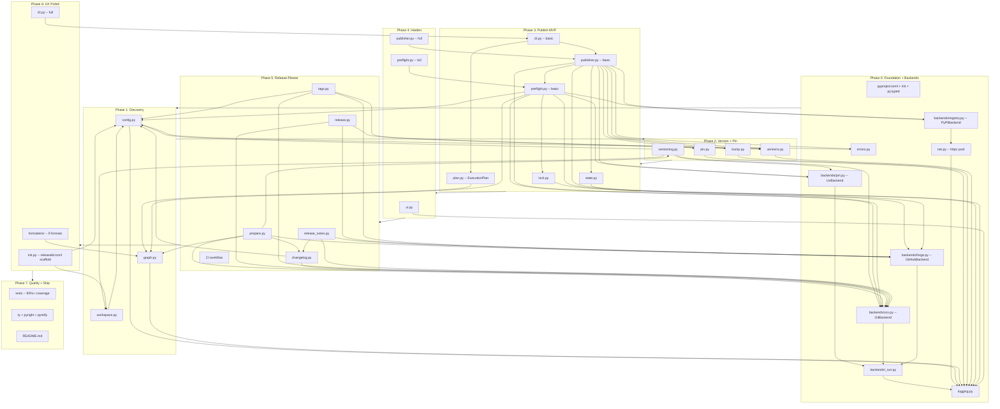

# releasekit Implementation Roadmap

Release orchestration for polyglot monorepos — publish packages in
topological order across uv (Python), pnpm (JavaScript/TypeScript),
and Go ecosystems with dependency-triggered scheduling, ephemeral
version pinning, retry with jitter, and crash-safe file restoration.

**Target location**: `py/tools/releasekit/` in `firebase/genkit`
**Published as**: `releasekit` on PyPI
**Invocation**: `uvx releasekit publish`

---

## Versioning Strategy

`releasekit` supports two versioning models for monorepos, configurable via `synchronize` in `releasekit.toml`.

### 1. Independent Versioning (Default)
`synchronize = false` (default)

Packages are versioned independently based on their own changes, but **propagated transitively**:
1.  **Direct Bumps**: Commits to a package directory trigger semantic version bumps (Major/Minor/Patch).
2.  **Transitive Propagation**: If a package depends on another package that was bumped, it receives a **PATCH bump**.
    - **Rule**: ANY bump in a dependency (Major, Minor, or Patch) triggers a Patch bump in all dependents.
    - **Why**: Ensures lockfiles and pins are updated to point to the new dependency version.
    - **Mental Model**: Releases ripple through the dependency tree. A change in a leaf node (e.g. `genkit`) forces a republication of all consuming nodes.

### 2. Synchronized Versioning (Lockstep)
`synchronize = true`

All packages in the workspace share the same version number.
1.  **Compute Max Bump**: Calculate the highest semantic bump across *all* packages based on commits.
2.  **Apply globally**: Bump *every* package to that new version.
    - Example: `genkit` has a breaking change (Major), so `plugin-vertex-ai` also gets a Major bump, even if unchanged.
    - **Use Case**: Frameworks where components must be installed with matching versions (e.g. `genkit==0.6.0` needs `genkit-plugin-x==0.6.0`).

### 3. Workspace-Sourced Dependency Model

Not all workspace members participate in the same release tree. The
release graph is determined by **workspace-sourced dependencies**, not
merely by co-location in the workspace:

```
┌─────────────────────────────────────────────────────────────────────┐
│                     Workspace Members                              │
│                                                                     │
│  ┌──────────────────────────────┐  ┌───────────────────────────┐   │
│  │ Release Tree 1               │  │ Independent Package       │   │
│  │ (workspace-sourced)          │  │ (pinned to PyPI)          │   │
│  │                              │  │                           │   │
│  │  genkit ──► plugin-a         │  │  app-legacy               │   │
│  │         └─► plugin-b         │  │  deps: genkit==1.0.0      │   │
│  │                              │  │                           │   │
│  │  [tool.uv.sources]           │  │  NOT in [tool.uv.sources] │   │
│  │  genkit = {workspace=true}   │  │  with workspace=true      │   │
│  │  plugin-a = {workspace=true} │  │                           │   │
│  │  plugin-b = {workspace=true} │  │  → Released independently │   │
│  └──────────────────────────────┘  └───────────────────────────┘   │
└─────────────────────────────────────────────────────────────────────┘
```

**How it works:**

1. A dependency is classified as **internal** (part of the release graph)
   only if it satisfies BOTH conditions:
   - Its name matches a workspace member.
   - It has `workspace = true` in `[tool.uv.sources]` of the root
     `pyproject.toml`.

2. If a workspace member depends on another member but uses a **pinned
   PyPI version** (e.g. `genkit==1.0.0`), the dependency edge is
   treated as **external**. The dependent package is excluded from
   version propagation and can be released independently.

3. **No explicit `exclude` configuration needed.** The graph topology
   emerges naturally from `[tool.uv.sources]`. Packages opt out of a
   release tree simply by not having `workspace = true`.

**Why this matters:**

| Scenario | Before | After |
|----------|--------|-------|
| App A pins `genkit==1.0.0` | Force-bumped on genkit 2.0 (broken) | Untouched |
| Plugin uses workspace genkit | Correctly propagated | Same |
| Sample with `Private :: Do Not Upload` | Excluded from publish | Same |

### 4. Independent Release Trees

A single workspace can contain multiple disconnected release trees.
Each tree is a connected component in the dependency graph where
edges are workspace-sourced dependencies.

```
Tree 1 (genkit ecosystem):     Tree 2 (internal tool):
  genkit ──► plugin-a            tool-x ──► tool-y
         └─► plugin-b

Tree 3 (legacy, pinned):       Tree 4 (standalone):
  app-legacy                     sample-demo
  (genkit==1.0.0 from PyPI)      (no internal deps)
```

- `releasekit prepare` processes ALL trees in a single pass.
- Only packages with actual changes (+ transitive dependents) get bumped.
- The Release PR contains all bumped packages from all trees.
- Each tree's version propagation is independent — changes in Tree 1
  cannot affect Tree 2 or Tree 3.

### 5. Cross-Repository Workflow (Plugins)

To support dependent packages in external repositories (e.g. `genkit-community-plugins`):

1.  **Trigger**: The main repo (`firebase/genkit`) fires a `repository_dispatch` event upon successful publish.
2.  **Action**: The dependent repo runs `releasekit prepare`.
3.  **Update**: `prepare` runs `uv lock --upgrade-package genkit` (checking PyPI).
4.  **Result**: If `uv.lock` changes:
    - Creates a `chore(deps): update genkit` bump.
    - Bumps the plugin version (Patch).
    - Opens/Updates a Release PR with the dependency update included.

### 6. Cross-Ecosystem Release Groups

Groups can **span ecosystems**. This is the key design that enables
releasing a pnpm frontend and a uv backend together as a single
coordinated release unit.

#### Two-tier TOML configuration

All releasekit configuration uses **TOML only**. Ecosystem manifests
(`pyproject.toml`, `package.json`, `go.mod`) are never modified for
releasekit config — they are only read/written for version bumps and
dependency declarations (their actual purpose).

1. **Root config** (`releasekit.toml` at monorepo root) —
   workspace-level settings: `synchronize`, `tag_format`, ecosystem
   roots, and global knobs.
2. **Per-package config** (`releasekit.toml` in each package dir) —
   package-level labels: `group`, `publishable` overrides, etc.

##### Root config (`releasekit.toml`)

Flat top-level keys, no `[tool.*]` nesting:

```toml
# releasekit.toml (at the monorepo root)

synchronize = true          # all packages share one version number
tag_format = "v{version}"
publish_from = "ci"

# Ecosystems: declare which workspace roots to scan.
# Each ecosystem maps to a (Workspace, PackageManager, Registry) triple.
[ecosystems.python]
workspace_root = "py/"             # contains pyproject.toml with [tool.uv.workspace]

[ecosystems.js]
workspace_root = "js/"             # contains pnpm-workspace.yaml

[ecosystems.go]
workspace_root = "go/"             # contains go.work
```

##### Per-package config (`releasekit.toml`)

Each package directory can have its own `releasekit.toml` with
package-level settings:

```toml
# py/packages/genkit/releasekit.toml
group = "core"
```

```toml
# py/plugins/vertex-ai/releasekit.toml
group = "plugins"
```

```toml
# js/packages/core/releasekit.toml
group = "core"
```

```toml
# go/genkit/releasekit.toml
group = "core"
```

Packages without a `releasekit.toml` (or without a `group` key)
are included in all unfiltered runs (`releasekit prepare` without
`--group`) but excluded when a specific group is requested.

**Why TOML everywhere?**

- **Consistent format**: One syntax for all ecosystems. No need to
  invent `[tool.releasekit]` (Python), `"releasekit":{}` (JS), or
  `// releasekit:group=` (Go) conventions.
- **No manifest pollution**: Ecosystem manifests stay clean — they
  only contain what their ecosystem tools expect.
- **Ecosystem-agnostic**: `releasekit.toml` works identically
  regardless of whether the package is Python, JS, Go, or Rust.

#### How it works

```
releasekit prepare --group core

  1. Read root releasekit.toml → find ecosystem roots
  2. For each ecosystem:
     a. Instantiate (Workspace, PackageManager, Registry)
     b. Discover all packages (from ecosystem manifests)
     c. Read per-package releasekit.toml → get group label
     d. Filter: keep only packages where group == "core"
  3. Compute version bumps across all filtered packages
  4. Create single Release PR with bumps from all ecosystems

  ┌──────────── Packages labeled group = "core" ───────────────────┐
  │                                                                 │
  │  py/ (uv workspace)                                            │
  │    genkit/releasekit.toml     → group = "core"   → PyPI        │
  │                                                                 │
  │  js/ (pnpm workspace)                                          │
  │    core/releasekit.toml       → group = "core"   → npm         │
  │                                                                 │
  │  go/ (go workspace)                                            │
  │    genkit/releasekit.toml     → group = "core"   → proxy       │
  │                                                                 │
  │  Single Release PR ── single version bump ── single tag         │
  └─────────────────────────────────────────────────────────────────┘
```

#### Key design decisions

- **TOML only**: All releasekit config uses `releasekit.toml` files.
  Ecosystem manifests are never read or written for config —
  only for version bumps and dependency declarations.
- **Labels, not globs**: Group membership is declared per-package
  as a label in its `releasekit.toml`, not via glob patterns at
  the root. No breakage on rename, no silent mis-matches.
- **Standalone root config**: `releasekit.toml` is ecosystem-agnostic.
  No dependency on any ecosystem's manifest for workspace settings.
- **One PR, multiple ecosystems**: The prepare step creates a single
  Release PR with version bumps across all manifests.
- **Ecosystem-specific publishing**: Each ecosystem's packages are
  published using its own backend (`uv publish` → PyPI,
  `pnpm publish` → npm, `git tag` → `proxy.golang.org`).
- **Independent version propagation**: Version rippling stays within
  each ecosystem's dependency graph. A bump to `genkit` (Python)
  does NOT auto-bump `@genkit-ai/core` (JS) — separate graphs.
  But they share the same Release PR and tag.
- **Shared version number**: When `synchronize = true`, ALL packages
  in ALL ecosystems get the same version number.

#### Implementation plan

1. ✅ Add root `releasekit.toml` reader (flat TOML, no `[tool.*]`). — **Done** (`config.py`).
2. ✅ `init.py` scaffolds `releasekit.toml` (root + per-package). — **Done**.
3. Add per-package `releasekit.toml` reader (same flat TOML format,
   discovered during `Workspace.discover()`).
4. Add `group` field to `Package` dataclass.
5. Wire `_create_backends()` to iterate over declared ecosystems.
6. The `prepare` step collects packages from all ecosystems,
   filters by group label, computes bumps, and creates one PR.
7. The `publish` step iterates over ecosystems and publishes each
   using the correct backend.

### 7. Decentralized Release Model (Go Modules)

Go uses a fundamentally different release model from workspace-based
registries. Understanding this is critical for integrating Go into
releasekit.

**How Go releases work:**

```
┌──────────────────────────────────────────────────────────────────┐
│                    Go Module Release Model                       │
│                                                                  │
│  1. Developer pushes a git tag: v1.2.3                           │
│                                                                  │
│  2. Users run: go get github.com/myorg/mymod@v1.2.3              │
│                                                                  │
│  3. proxy.golang.org fetches the tag from GitHub,                │
│     caches it, and serves it to all `go get` requests.           │
│                                                                  │
│  No upload step. No registry API. Just git tags.                 │
└──────────────────────────────────────────────────────────────────┘
```

**Key differences from workspace-based ecosystems:**

| Aspect | uv/pnpm (centralized) | Go (decentralized) |
|--------|----------------------|--------------------|
| Publish | Upload artifact to registry | Push git tag |
| Registry | PyPI / npm (mutable, authenticated) | proxy.golang.org (immutable, no auth) |
| Versioning | In manifest file (`pyproject.toml`, `package.json`) | In git tag only |
| Workspace | `pyproject.toml` / `pnpm-workspace.yaml` | `go.work` (dev only, not published) |
| Multi-module | Workspace members share lockfile | Each module is independent |
| Internal deps | `workspace:*` / `workspace = true` | `replace` directives in `go.work` |
| Build artifact | Wheel / tarball | Source code (via git) |
| Retract | Delete version (PyPI) / unpublish (npm) | `retract` directive in `go.mod` |

**Go workspace (go.work) structure:**

```
monorepo/
├── go.work           # Dev-only workspace (NOT published)
│   go 1.24
│   use (
│       ./genkit
│       ./plugins/google-genai
│       ./plugins/vertex-ai
│   )
├── genkit/
│   ├── go.mod        # module github.com/firebase/genkit/go/genkit
│   └── genkit.go
├── plugins/
│   ├── google-genai/
│   │   ├── go.mod    # module github.com/firebase/genkit/go/plugins/google-genai
│   │   └── plugin.go
│   └── vertex-ai/
│       ├── go.mod    # module github.com/firebase/genkit/go/plugins/vertex-ai
│       └── plugin.go
```

**How releasekit handles Go:**

1. **Workspace discovery**: Parse `go.work` for `use` directives.
   Parse each `go.mod` for `module` path, `require` directives,
   and `replace` directives.
2. **Internal dependency detection**: A dependency is "internal" if
   its module path matches a `use` directive in `go.work` AND
   it has a `replace` directive pointing to a local path (or is
   implicitly replaced by the workspace).
3. **Version bumping**: Write the new `go.mod` version (for the
   `require` directive in consumers) and create the git tag.
   Go modules use **path-prefixed tags**:
   `genkit/v0.6.0`, `plugins/google-genai/v0.6.0`.
4. **Publishing**: Create annotated git tags and push them.
   `proxy.golang.org` fetches the tag automatically. There is
   no upload API.
5. **Verification**: Poll `pkg.go.dev/module@version` or
   `proxy.golang.org/module/@v/version.info` to confirm
   the version is available.

**GoBackend protocol mapping:**

| Protocol Method | Go Implementation |
|----------------|-------------------|
| `build()` | No-op (Go distributes source, not artifacts) |
| `publish()` | `git tag <module/path>/v<version>` + `git push --tags` |
| `lock()` | `go mod tidy` (update) or `go mod verify` (check) |
| `version_bump()` | Edit `go.mod` `require` in consumers, create tag |
| `resolve_check()` | `GOPROXY=proxy.golang.org go list -m <module>@v<version>` |
| `smoke_test()` | `go build <module>/...` in a temp module |

**GoWorkspace protocol mapping:**

| Protocol Method | Go Implementation |
|----------------|-------------------|
| `discover()` | Parse `go.work` `use` directives → `go.mod` per module |
| `rewrite_version()` | Update `require <mod> v<new>` in consumer `go.mod` files |
| `rewrite_dependency_version()` | Update `require` + remove `replace` for publishing |

**GolangProxyRegistry protocol mapping:**

| Protocol Method | Go Implementation |
|----------------|-------------------|
| `check_published()` | `GET proxy.golang.org/<mod>/@v/<ver>.info` → 200 |
| `poll_available()` | Poll above endpoint until 200 or timeout |
| `project_exists()` | `GET proxy.golang.org/<mod>/@v/list` → non-empty |
| `latest_version()` | `GET proxy.golang.org/<mod>/@latest` → `Version` field |
| `verify_checksum()` | `GET sum.golang.org/lookup/<mod>@<ver>` |

**Key challenge — `go.work` is dev-only:**

Unlike `pnpm-workspace.yaml` which is committed, `go.work` is
often `.gitignore`d and used only for local development. The
Genkit Go SDK DOES commit `go.work`, so releasekit can parse it.
But for repos that don't commit `go.work`, releasekit would need
to scan for `go.mod` files recursively to discover modules.

### 6. Multi-Ecosystem Extensibility (Future)

The workspace-sourced dependency model is currently implemented for
**uv** workspaces (`[tool.uv.sources]`). The same concept applies to
other ecosystems, each with its own way of declaring workspace deps.

To support multiple ecosystems, the following **7 protocols** are
needed. Each protocol defines the semantic operations; implementations
own the transport and format details.

```
┌─────────────────────────────────────────────────────────────────────┐
│                      Protocol Abstraction Map                       │
│                                                                     │
│  ┌─────────────┐  ┌─────────────┐  ┌─────────────┐                │
│  │     VCS      │  │    Forge    │  │  Workspace   │               │
│  │ git, hg      │  │ gh, glab,  │  │ uv, pnpm,   │               │
│  │              │  │ bitbucket  │  │ cargo, go    │               │
│  └──────┬───────┘  └──────┬──────┘  └──────┬───────┘               │
│         │                 │                │                        │
│         │    ┌────────────┴────────────┐   │                        │
│         │    │                         │   │                        │
│  ┌──────┴───┴──┐  ┌──────────────┐  ┌─┴───┴────────┐              │
│  │ ManifestParser│  │VersionRewriter│  │PackageManager│              │
│  │ pyproject,   │  │ pyproject,   │  │ uv, pnpm,   │              │
│  │ package.json,│  │ package.json,│  │ cargo        │              │
│  │ Cargo.toml   │  │ Cargo.toml   │  │              │              │
│  └──────────────┘  └──────────────┘  └──────┬───────┘              │
│                                              │                      │
│                                       ┌──────┴───────┐              │
│                                       │   Registry    │              │
│                                       │ pypi, npm,   │              │
│                                       │ crates.io    │              │
│                                       └──────────────┘              │
└─────────────────────────────────────────────────────────────────────┘
```

#### Protocol details

| # | Protocol | Responsibility | Current | Future |
|---|----------|---------------|---------|--------|
| 1 | **`VCS`** | Commit, tag, push, log, branch operations | `GitCLIBackend`, `MercurialBackend` | — |
| 2 | **`Forge`** | PRs, releases, labels, availability check | `GitHubCLIBackend`, `GitLabBackend`, `BitbucketAPIBackend` | — |
| 3 | **`Workspace`** | Discover members, classify deps, rewrite versions | `UvWorkspace`, `PnpmWorkspace` | `GoWorkspace`, `CargoWorkspace`, `PubWorkspace`, `MavenWorkspace`, `GradleWorkspace` |
| 4 | **`PackageManager`** | Lock, build, publish | `UvBackend`, `PnpmBackend` | `GoBackend`, `CargoBackend`, `PubBackend`, `MavenBackend`, `GradleBackend` |
| 5 | **`Registry`** | Check published versions, checksums | `PyPIBackend`, `NpmRegistry` | `GolangProxy`, `CratesIoRegistry`, `PubDevRegistry`, `MavenCentralRegistry` |

> **Design note:** `ManifestParser` and `VersionRewriter` were folded
> into the `Workspace` protocol as `rewrite_version()` and
> `rewrite_dependency_version()` methods, because parsing and rewriting
> are tightly coupled to the manifest format each workspace owns.

#### Ecosystem matrix (all 6 genkit target languages)

| Ecosystem | Workspace Config | Source Mechanism | Manifest File | Registry | Status |
|-----------|-----------------|-----------------|---------------|----------|--------|
| **Python (uv)** | `[tool.uv.workspace]` | `[tool.uv.sources]` `workspace = true` | `pyproject.toml` | PyPI | ✅ Implemented |
| **TypeScript (pnpm)** | `pnpm-workspace.yaml` | `"workspace:*"` protocol in `package.json` | `package.json` | npm | 🔧 Backend done |
| **Go** | `go.work` | `use ./pkg` directives | `go.mod` | proxy.golang.org | ⬜ Designed (see §7) |
| **Java (Maven)** | reactor POM `<modules>` | `<version>${project.version}</version>` | `pom.xml` | Maven Central | ⬜ Future |
| **Java (Gradle)** | `settings.gradle` `include` | `project(':sub')` deps | `build.gradle(.kts)` | Maven Central | ⬜ Future |
| **Dart (pub/melos)** | `melos.yaml` packages | `dependency_overrides` with `path:` | `pubspec.yaml` | pub.dev | ⬜ Future |
| **Rust (Cargo)** | `[workspace]` in `Cargo.toml` | `path = "..."` in `[dependencies]` | `Cargo.toml` | crates.io | ⬜ Future |

#### Migration path

The `Workspace` protocol has been extracted into
`backends/workspace/` with `UvWorkspace` and `PnpmWorkspace`
implementations.
Remaining migration steps:

1. ✅ Extract `Workspace` protocol with `discover()`,
   `rewrite_version()`, `rewrite_dependency_version()` — **done**.
2. ✅ Implement `UvWorkspace` — **done**.
3. ✅ Implement `PnpmWorkspace` — **done** (39 tests).
4. ✅ Implement `PnpmBackend` — **done** (19 tests).
5. ✅ Implement `NpmRegistry` — **done** (tests included).
6. ✅ Migrate config from `pyproject.toml` to `releasekit.toml` — **done** (`config.py`, `init.py`).
7. Wire `Workspace` selection through `_create_backends()` in `cli.py`,
   auto-detected from project structure.
8. Update callers (`prepare.py`, `publish.py`, `cli.py`) to use
   `Workspace` protocol instead of `discover_packages()` and
   `bump_pyproject()`.
9. Add cross-ecosystem group support (see §6).
10. Add Go workspace + proxy.golang.org support (see §7).

---

## Progress

| Phase | Status | Notes |
|-------|--------|-------|
| 0: Foundation + Backends | ✅ Complete | 1,812 lines src, 864 lines tests, 82 tests pass |
| 1: Discovery | ✅ Complete | 3 modules, 65 tests pass, named error codes |
| 2: Version + Pin | ✅ Complete | 4 modules, 64 tests (incl. 6 integration), 211 total tests pass |
| 3: Publish MVP | ✅ Complete | Critical milestone |
| 4: Harden | ✅ Complete | UI, checks, registry verification, observer, interactive controls |
| 4b: Streaming Core | ✅ Complete | scheduler.py, retry, jitter, pause/resume, 27 tests |
| 4c: UI States | ✅ Complete | observer.py, sliding window, keyboard shortcuts, signal handlers |
| 5: Release-Please | ✅ Complete | Orchestrators, CI workflow, workspace-sourced deps |
| 6: UX Polish | ✅ Complete | init, formatters (9), rollback, completion, diagnostics, granular flags, TOML config migration |
| 7: Quality + Ship | 🔶 In progress | 706 tests pass, 16.8K src lines, 12.1K test lines |

### Phase 5 completion status

| Item | Status | Notes |
|------|--------|-------|
| Forge protocol extensions | ✅ Done | `list_prs`, `add_labels`, `remove_labels`, `update_pr` |
| Transitive propagation (BFS) | ✅ Done | Multi-level via `deque`, 4 tests |
| Synchronized versioning | ✅ Done | `synchronize=True` config, 3 tests |
| `GitLabBackend` | ✅ Done | Forge via `glab` CLI, protocol conformance |
| `MercurialBackend` | ✅ Done | VCS via `hg` CLI, protocol conformance |
| `BitbucketBackend` | ✅ Done | Forge via REST API (`httpx`), auth validation |
| Protocol conformance tests | ✅ Done | 41 tests (parametrized across all backends) |
| `prepare.py` | ✅ Done | Prepare step: bump → changelog → Release PR |
| `release.py` | ✅ Done | Tag step: find PR → tag → Release → labels |
| `changelog.py` | ✅ Done | Conventional Commits → grouped Markdown |
| `release_notes.py` | ✅ Done | Umbrella release notes from manifest |
| Workspace-sourced deps | ✅ Done | `[tool.uv.sources]` determines release graph |
| CI workflow | ✅ Done | `.github/workflows/releasekit-uv.yml` |

---

## Engineering Design

### Backend Comparison

#### Forge Backends

| Feature | GitHub (`gh` CLI) | GitLab (`glab` CLI) | Bitbucket (REST API) |
|---------|:-:|:-:|:-:|
| Transport | CLI subprocess | CLI subprocess | `httpx` async HTTP |
| Auth | `GH_TOKEN` / `gh auth` | `GITLAB_TOKEN` / `glab auth` | Bearer token / App password |
| Create PR/MR | ✅ `gh pr create` | ✅ `glab mr create` | ✅ `POST /pullrequests` |
| Update PR/MR | ✅ `gh pr edit` | ✅ `glab mr update` | ✅ `PUT /pullrequests/{id}` |
| Labels on PR | ✅ `--label` | ✅ `--label` | ❌ Not supported (no-op + warning) |
| Draft releases | ✅ `--draft` | ❌ Silently ignored | ❌ No releases (tags only) |
| Prerelease flag | ✅ `--prerelease` | ❌ Silently ignored | ❌ N/A |
| Release assets | ✅ Via `gh release upload` | ✅ Via `glab release upload` | ✅ Via Downloads API |
| Delete release | ✅ `gh release delete` | ✅ `glab release delete` | ✅ `DELETE /downloads` |
| gRPC reflection | N/A | N/A | N/A |

#### VCS Backends

| Feature | Git (`git` CLI) | Mercurial (`hg` CLI) |
|---------|:-:|:-:|
| Transport | CLI subprocess | CLI subprocess |
| Shallow clone detection | ✅ `--is-shallow-repository` | ✅ `hg log -r 'ancestors(.) and not ancestors(p1(min(all())))'` |
| Branch operations | ✅ `checkout -b` | ✅ `hg branch` |
| Tag creation | ✅ `git tag -a` | ✅ `hg tag` |
| Tag existence check | ✅ `git tag -l` | ✅ `hg tags` |
| Remote push | ✅ `git push` | ✅ `hg push` |
| Log since tag | ✅ `git log TAG..HEAD` | ✅ `hg log -r 'TAG::.'` |
| Current SHA | ✅ `git rev-parse HEAD` | ✅ `hg id -i` |

#### Protocol Design Rationale

- **Transport-agnostic**: Each backend owns its transport (CLI subprocess,
  HTTP, SDK). The protocol only defines the semantic operations.
- **Auth as constructor concern**: Credentials are resolved at
  construction time, never leaked into method signatures.
- **Graceful degradation**: Unsupported features (e.g. labels on
  Bitbucket) log a warning and return success, never fail.
- **Idempotent operations**: Re-running any step is safe — existing
  tags are skipped, already-published versions are detected.

### Release Pipeline Architecture

```
┌──────────────────────────────────────────────────────────────────────┐
│                    releasekit prepare (on push to main)             │
│                                                                      │
│  1. discover_packages()  ─► workspace members                       │
│  2. build_graph()        ─► workspace-sourced dep edges only        │
│  3. compute_bumps()      ─► Conventional Commits → semver bumps     │
│  4. propagate (BFS)      ─► transitive PATCH bumps within trees     │
│  5. bump_pyproject()     ─► rewrite versions in pyproject.toml      │
│  6. pm.lock()            ─► update uv.lock                          │
│  7. generate_changelog() ─► per-package Markdown changelogs         │
│  8. vcs.commit + push    ─► release branch                          │
│  9. forge.create_pr()    ─► Release PR with embedded manifest       │
└───────────────────────────────────┬──────────────────────────────────┘
                                    │ merge
┌───────────────────────────────────▼──────────────────────────────────┐
│                    releasekit release (on PR merge)                  │
│                                                                      │
│  1. forge.list_prs()     ─► find PR with "autorelease: pending"     │
│  2. extract_manifest()   ─► parse embedded JSON from PR body        │
│  3. create_tags()        ─► per-package + umbrella tags              │
│  4. forge.create_release ─► GitHub/GitLab Release with notes        │
│  5. forge.add_labels()   ─► "autorelease: tagged"                   │
└───────────────────────────────────┬──────────────────────────────────┘
                                    │
┌───────────────────────────────────▼──────────────────────────────────┐
│                    releasekit publish (after tagging)                │
│                                                                      │
│  1. topo_sort()          ─► topological publish order                │
│  2. pin_dependencies()   ─► ephemeral version pinning               │
│  3. uv build             ─► sdist + wheel per package               │
│  4. uv publish           ─► upload to PyPI with retry + jitter      │
│  5. restore_pyproject()  ─► undo ephemeral pins                     │
│  6. repository_dispatch  ─► notify downstream repos                 │
└─────────────────────────────────────────────────────────────────────┘
```

---

## Why This Tool Exists

The genkit Python SDK is a uv workspace with 21+ packages that have
inter-dependencies. Publishing them to PyPI requires dependency-ordered
builds with ephemeral version pinning -- and no existing tool does this.

**Why not use an existing tool?**

| Tool | Why it doesn't work for us |
|------|---------------------------|
| **python-semantic-release** | Monorepo support has been the [#1 most requested feature](https://github.com/python-semantic-release/python-semantic-release/issues/168) since **Feb 2020** -- still unresolved. No workspace discovery, no dependency graph, no topological publish, no ephemeral pinning. |
| **changesets** | npm only. No topological ordering. [No --dry-run for publish](https://github.com/changesets/changesets/issues/614) (open since 2021). Suffers from [unexpected major version bumps](https://github.com/changesets/changesets/issues/1011) (62 upvotes) from transitive deps. |
| **lerna** | npm only. [Lock file not updated](https://github.com/lerna/lerna/issues/1171) after internal dep version bumps (40 upvotes, open since **Dec 2017**). [No --dry-run](https://github.com/lerna/lerna/issues/51) (open since **Feb 2016**). |
| **cargo-release** | Rust only. [Can't exclude unchanged crates](https://github.com/crate-ci/cargo-release/issues/298) by default (open since 2021). Not portable to Python. |
| **Bash scripts** | Current approach. No dependency ordering, no resume, no safety, untestable. |

These tools have had critical gaps open for years. Rather than wait,
releasekit solves these problems natively for Python/uv workspaces.

**Problems we avoid by design** (learned from their issue trackers):

- **Lock file staleness**: `uv lock --upgrade-package` after version bump,
  included in the version commit. (lerna #1171, open since 2017)
- **Prerelease changelog empty on full release**: rollup mode merges
  prerelease entries into the final release. (PSR #555, open since 2023)
- **Unchanged packages published needlessly**: skip packages with no commits
  since last tag. (cargo-release #298, open since 2021)
- **Concurrent release race conditions**: advisory lock + CI concurrency
  key guidance. (PSR #168 comments)
- **No dry run**: `--dry-run` and `plan` alias from day one.
  (lerna #51, open since 2016; changesets #614, open since 2021)
- **Protected branch conflicts**: `--publish-from=ci` creates a PR, never
  pushes directly. (lerna #1957, cargo-release #119)

---

## Major Design Issues Addressed

Issues found through cross-verification with `uv` docs, PSR, cargo-release,
changesets, and lerna issue trackers.

| ID | Sev. | Issue | Solution | Phase |
|----|------|-------|---------|-------|
| D-1 | Crit | **Version commit missing from pipeline.** Both PSR and cargo-release do: version bump -> commit -> tag -> publish. Without a commit step, git tags point to a commit with the *old* version. | Add commit step after version bump: `versioning.py` -> `uv lock --upgrade-package` -> `git commit` -> `git tag` -> publish. | 2 |
| D-2 | Crit | **`uv.lock` stale after version bump.** Same bug open on [lerna since 2017](https://github.com/lerna/lerna/issues/1171) (40 upvotes). PSR [documents the fix](https://python-semantic-release.readthedocs.io/en/stable/configuration/configuration-guides/uv_integration.html). | Run `uv lock --upgrade-package <pkg>` for each bumped package, `git add uv.lock` before version commit. | 2 |
| D-3 | Crit | **`uv build --no-sources` required.** [uv docs](https://docs.astral.sh/uv/guides/package/) recommend `--no-sources` for publishing to verify the package builds without workspace source overrides. | Use `uv build --no-sources` in `publisher.py`. | 3 |
| D-4 | High | **Prerelease changelog empty on full release.** [PSR #555](https://github.com/python-semantic-release/python-semantic-release/issues/555) (open since 2023). Promoting rc1 to stable produces empty changelog. | `changelog_prerelease_mode = "rollup"` (default): merge prerelease entries into full release. | 5 |
| D-5 | High | **Unchanged packages published needlessly.** [cargo-release #298](https://github.com/crate-ci/cargo-release/issues/298) (open since 2021). | Skip packages with no commits since last tag. `--force-unchanged` to override. | 2, 3 |
| D-6 | High | **Concurrent CI release race condition.** [PSR #168](https://github.com/python-semantic-release/python-semantic-release/issues/168) comments. | Advisory lock locally. `concurrency: release` in CI. Detect in-progress draft releases in preflight. | 3 |
| D-7 | High | **`uv publish` has native retry flags.** `--check-url` and `--skip-existing` handle partial upload retries. | Use `uv publish --check-url` instead of custom 409 handling. | 3 |
| D-8 | Med | **Attestation support.** `uv publish` auto-discovers `.publish.attestation` files. | Document support. Don't interfere with attestation files. Passthrough `--no-attestations`. | 4 |
| D-9 | Med | **`resolve_check` uses wrong tool.** Plan said `pip install --dry-run`. | Use `uv pip install --dry-run` for consistency. | 3 |
| D-10 | Med | **`gh` CLI not installed.** | Graceful degradation: skip GitHub Releases with warning. Core publish works without `gh`. | 3, 5 |
| D-11 | Med | **Transitive major bump propagation.** [changesets #1011](https://github.com/changesets/changesets/issues/1011) (62 upvotes). | Transitive propagation as **PATCH bumps only** (not matching the original bump type). Avoids the changesets problem where a transitive dep causes an unexpected Major bump. Configurable via `synchronize` (lockstep) vs independent (default). | 2 |
| D-12 | Med | **`uv version` command overlap.** `uv version --bump` already handles PEP 440. | Evaluate delegating version writing to `uv version --frozen` during Phase 2. | 2 |

### Corrected Pipeline (Release-Please Model)

The pipeline is split into 3 independent commands, each triggered by a
different CI event. All external tool calls go through the backend shim
layer (see Phase 0).

`vcs.*` = VCS/GitBackend, `pm.*` = PackageManager/UvBackend,
`forge.*` = Forge/GitHubBackend, `registry.*` = Registry/PyPIBackend.

```
 ── STEP 1: releasekit prepare (on push to main) ──────────────────────
  0. preflight       vcs.is_clean(), pm.lock() --check, forge.is_available() (D-10),
                     forge.list_releases() concurrent detection (D-6),
                     vcs.is_shallow(), OSS file checks
  1. versioning      vcs.log(paths=[pkg.path]) -> compute semver (skip unchanged D-5)
  2. propagate       graph.reverse_deps() -> PATCH bump for dependents (D-11)
  3. bump            bump.bump_pyproject() for each bumped package
  4. lock update     pm.lock(upgrade_package=<pkg>) for each bumped package (D-2)
  5. changelog       vcs.log() + prerelease rollup mode (D-4)
  6. commit + push   vcs.commit() on release branch, vcs.push() (D-1)
  7. Release PR      forge.create_pr() or forge.update_pr() with embedded manifest
                     forge.add_labels("autorelease: pending")

 ── STEP 2: releasekit tag (on Release PR merge) ──────────────────────
  0. find PR         forge.list_prs(label="autorelease: pending", state="merged")
  1. parse manifest  extract embedded manifest from PR body
  2. tag             vcs.tag() per-package tags + umbrella tag on merge commit
  3. GitHub Release  forge.create_release() (graceful skip, D-10)
  4. label           forge.remove_labels("pending"), forge.add_labels("tagged")

 ── STEP 3: releasekit publish (on GitHub Release creation) ───────────
  0. checkout        vcs.checkout(tag)
  1. for each topo level:
       pin ──► pm.build(no_sources=True) (D-3) ──► verify ──► checksum
           ──► pm.publish(check_url=...) (D-7) ──► pm.resolve_check() (D-9)
           ──► registry.poll_available() ──► registry.verify_checksum()
           ──► pm.smoke_test() ──► restore
  2. label           forge.add_labels("autorelease: published")
  3. dispatch        forge.repository_dispatch() to downstream repos
```

---

## Module Dependency Graph

### ASCII (viewable in any editor / terminal / git diff)

```
Phase 0: Foundation  ✅ COMPLETE
┌─────────────────────────────────────────────────────────┐
│  scaffold (releasekit.toml, __init__.py, py.typed)      │
│  errors.py (diagnostic lib, RK-NAMED-KEY codes)             │
│  logging.py (structlog + Rich)                          │
│                                                         │
│  backends/ (Protocol-based shim layer):                 │
│    _run.py ──► logging.py (subprocess abstraction)      │
│    pm.py ──► _run.py (PackageManager + UvBackend)       │
│    vcs.py ──► _run.py (VCS + GitBackend)                │
│    forge.py ──► _run.py (Forge + GitHubBackend, async)  │
│    registry.py ──► net.py (Registry + PyPIBackend,async)│
│  net.py ──► logging.py (httpx connection pool, retry)   │
└──────────────────────────┬──────────────────────────────┘
                           │
Phase 1: Discovery         ▼
┌─────────────────────────────────────────────────────────┐
│  config.py ──► errors.py, logging.py                    │
│  workspace.py ──► config.py                             │
│  graph.py ──► logging.py                                │
│                                                         │
│  ✓ releasekit discover                                 │
│  ✓ releasekit graph                                    │
│  ✓ releasekit check-cycles                             │
└──────────────────────────┬──────────────────────────────┘
                           │
Phase 2: Version + Pin     ▼
┌─────────────────────────────────────────────────────────┐
│  versioning.py ──► config.py, workspace.py              │
│    + skip unchanged packages (D-5)                      │
│    + uv lock --upgrade-package (D-2)                    │
│    + git commit version bump (D-1)                      │
│  pin.py ──► logging.py                                  │
│  bump.py ──► logging.py                                 │
│  versions.py ──► logging.py                             │
│                                                         │
│  ✓ releasekit version (skips unchanged)                │
│  ✓ releasekit pin --apply                              │
│  ✓ Version commit includes uv.lock                      │
└──────────────────────────┬──────────────────────────────┘
                           │
Phase 3: Publish MVP ★     ▼    ← CRITICAL MILESTONE ✅ COMPLETE
┌─────────────────────────────────────────────────────────┐
│  lock.py ──► logging.py                                 │
│  state.py ──► logging.py                                │
│  plan.py ──► graph.py (ExecutionPlan + table/JSON/CSV)  │
│  preflight.py (basic) ──► lock, graph, config, backends │
│    + forge.is_available() check (D-10, graceful)        │
│    + concurrent release detection (D-6)                 │
│  publisher.py (basic) ──► pin, state, preflight,        │
│                           versions, bump, errors,       │
│                           backends (pm, vcs, forge, reg)│
│    + pm.build(no_sources=True) (D-3)                    │
│    + pm.publish(check_url=...) (D-7)                    │
│    + pm.resolve_check() (D-9)                           │
│  cli.py (basic) ──► publisher, plan                     │
│    + --force-unchanged (D-5)                            │
│                                                         │
│  ★ releasekit publish --publish-from=local             │
│  ★ Corrected: preflight → version → uv lock → commit   │
│    → tag → [pin → build → publish → poll → smoke →     │
│    restore] per level → push                            │
│  ✓ Dry run validated: 60 packages, 4 levels, 0 errors  │
└──────────────────────────┬──────────────────────────────┘
                           │
Phase 4: Harden            ▼    ✅ COMPLETE
┌─────────────────────────────────────────────────────────┐
│  observer.py ──► PublishStage, SchedulerState, Observer │
│  ui.py ──► observer.py, logging.py                      │
│  checks.py ──► graph.py, preflight.py, workspace.py     │
│    + 10 standalone health checks (replaces check-cycles)│
│  preflight.py (full) ──► + pip-audit,                   │
│                            metadata validation          │
│  publisher.py (full) ──► + staging, manifest, Test PyPI,│
│                            resume-from-registry,        │
│                            attestation passthrough (D-8)│
│                                                         │
│  ✓ Rich progress table (PR #4558)                       │
│  ✓ releasekit check (PR #4563)                          │
│  ✓ --stage, --index=testpypi, --resume-from-registry    │
│  ✓ observer.py: extracted enums/protocol, sliding window│
│  ✓ keyboard shortcuts + SIGUSR1/2 signal handlers       │
└──────────────────────────┬──────────────────────────────┘
                           │
Phase 4b: Streaming Core   ▼    ✅ COMPLETE
┌───────────────────────────────────────────────────────────┐
│  scheduler.py ──▶ graph.py, workspace.py                  │
│    + asyncio.Queue-based dependency-triggered dispatch    │
│    + Per-package dep counters, not level-based lockstep   │
│    + Retry with exponential backoff + full jitter         │
│    + Suspend/resume (pause/resume methods)                │
│    + Cancellation safety (Ctrl+C → partial results)       │
│    + Duplicate completion guard (idempotent mark_done)    │
│    + already_published for resume-after-crash             │
│  publisher.py refactor ──▶ scheduler.py                   │
│    + Workers consume from queue, not level iteration      │
│    + _publish_one unchanged, only dispatch loop changes   │
│                                                           │
│  ✓ 27 tests, dry-run validated with 60 packages           │
│  ★ Streaming-ready for CI pipelines + dynamic feeds       │
└───────────────────────────┬───────────────────────────────┘
                           │
Phase 4c: UI States        ▼    ✅ COMPLETE
┌───────────────────────────────────────────────────────────┐
│  observer.py ──▶ PublishStage, SchedulerState, Observer   │
│    + Extracted enums + protocol from ui.py                │
│    + Clean dependency graph (no circular imports)         │
│  ui.py refactor ──▶ observer.py                           │
│    + Sliding window for large workspaces (>30 packages)   │
│    + RETRYING / BLOCKED per-package stage indicators      │
│    + PAUSED / CANCELLED scheduler-level banners           │
│    + Keyboard shortcuts (p=pause, r=resume, q=cancel)     │
│    + ETA estimate in footer                               │
│    + Control hint in footer (key shortcuts + PID)         │
│  scheduler.py ──▶ observer.py                             │
│    + SIGUSR1/SIGUSR2 signal handlers for external control │
│    + Async key listener with select()-based polling       │
│    + _block_dependents: recursive transitive blocking     │
│    + Observer callbacks for retry/blocked/state changes   │
│                                                           │
│  ✓ 243 tests pass                                         │
│  ★ Interactive terminal + CI-friendly log output          │
└───────────────────────────┬───────────────────────────────┘
                           │
Future: Dynamic Scheduler  ▼    ✅ COMPLETE
┌───────────────────────────────────────────────────────────┐
│  scheduler.py ──▶ add_package() / remove_package() API   │
│    + Live node insertion with dependency wiring           │
│    + Immediate enqueue if remaining_deps == 0             │
│    + _cancelled set for deferred removal on dequeue       │
│    + block_dependents option on remove                    │
│    + Update _total counter dynamically                    │
│                                                           │
│  Use case: HTTP server process, watch-mode, plugin feeds, │
│  dynamic package discovery during CI                      │
│                                                           │
│  ✓ 13 tests (7 add + 6 remove)                            │
│  ★ Scheduler is fully dynamic — ready for HTTP server     │
└───────────────────────────┬───────────────────────────────┘
                           │
Phase 5: Release-Please    ▼
┌─────────────────────────────────────────────────────────┐
│  prepare.py ──► versioning, graph, changelog, forge     │
│    (Release PR with embedded manifest)                  │
│  release.py ──► versions, vcs, forge                    │
│    (tag merge commit, create GitHub Release)            │
│  tags.py ──► config, versions, vcs, forge               │
│  changelog.py ──► config, vcs (prerelease rollup, D-4) │
│  release_notes.py ──► changelog, vcs, forge             │
│  .github/workflows/releasekit-uv.yml (3-job pipeline)   │
│                                                         │
│  ✓ releasekit prepare (Release PR)                     │
│  ✓ releasekit tag (tag + GitHub Release)               │
│  ✓ releasekit publish (build + upload to PyPI)         │
└──────────────────────────┬──────────────────────────────┘
                           │
Phase 6: UX Polish         ▼    ✅ COMPLETE
┌─────────────────────────────────────────────────────────┐
│  init.py ──► config, workspace (scaffolds releasekit.toml)│
│  formatters/ (9 formats) ──► graph                      │
│  config.py ──► releasekit.toml reader (flat TOML)       │
│  cli.py (full) ──► + rollback, completion, --explain,   │
│                      --no-tag, --no-push, --version-only│
│                                                         │
│  ✓ releasekit init (generates releasekit.toml)         │
│  ✓ releasekit graph --format dot|mermaid|ascii|d2|json │
│  ✓ releasekit rollback                                 │
│  ✓ releasekit completion bash|zsh|fish                 │
│  ✓ Migrated config from pyproject.toml to releasekit.toml│
└──────────────────────────┬──────────────────────────────┘
                           │
Phase 7: Quality + Ship    ▼    🔶 IN PROGRESS
┌─────────────────────────────────────────────────────────┐
│  tests (706 tests, 12.1K lines)                         │
│  type checking (ty, pyright, pyrefly -- zero errors)    │
│  README.md (21 sections, mermaid diagrams)              │
│  workspace config (releasekit init on genkit repo)     │
│                                                         │
│  ✓ Ship v0.1.0 to PyPI                                  │
└─────────────────────────────────────────────────────────┘
```

### Mermaid (renders on GitHub / docs)



---

## Phase Details

### Phase 0: Foundation + Backends  ✅ Complete

| Module | Description | Est. Lines | Actual | Status |
|--------|-------------|-----------|--------|--------|
| `pyproject.toml` | Package scaffold with `[project.scripts]`, hatchling build, 8 deps | ~40 | 68 | ✅ |
| `__init__.py` | `__version__` only | ~3 | 32 | ✅ |
| `py.typed` | PEP 561 marker | 0 | 0 | ✅ |
| `README.md` | Quick-start usage and project description | ~30 | 34 | ✅ |
| `errors.py` | Structured error system with `RK-NAMED-KEY` codes, `StrEnum`, `ErrorInfo`, error catalog, `explain()`. | ~150 | 261 | ✅ |
| `logging.py` | `structlog` configuration. Rich console when TTY, JSON for machines. `--verbose` / `--quiet`. | ~60 | 128 | ✅ |
| `backends/_run.py` | Central `run_command()` subprocess abstraction. Dry-run, structured logging, timeout. | ~60 | 192 | ✅ |
| `backends/pm.py` | `PackageManager` Protocol + `UvBackend`. `build()`, `publish()`, `lock()`, `version_bump()`, `resolve_check()`, `smoke_test()`. | ~120 | 281 | ✅ |
| `backends/vcs.py` | `VCS` Protocol + `GitBackend`. `is_clean()`, `is_shallow()`, `log()`, `commit()`, `tag()`, `push()`, etc. | ~100 | 278 | ✅ |
| `backends/forge.py` | `Forge` Protocol + `GitHubBackend`. `is_available()`, `create_release()`, `list_releases()`, `create_pr()`, etc. Graceful degradation. | ~120 | 307 | ✅ |
| `backends/registry.py` | `Registry` Protocol + `PyPIBackend`. `check_published()`, `poll_available()`, `project_exists()`, `latest_version()`. Async HTTP. | ~80 | 192 | ✅ |
| `net.py` | HTTP utilities: connection pooling, retry with exponential backoff, structured logging. | ~60 | 173 | ✅ |
| **Tests** | 82 tests across 8 test files. Protocol conformance, dry-run, integration (git, PyPI). | — | 864 | ✅ |

**Totals**: 1,812 lines source (estimated ~750), 864 lines tests.

**Done when**: `import releasekit` works, errors render with Rich formatting,
structlog outputs to stderr. All 4 backend protocols defined with default
implementations. `run_command()` logs and supports dry-run.

**Milestone**: Project skeleton passes `uv build`. Backends are injectable and mockable.

### Phase 1: Discovery  ✅ Complete

| Module | Description | Est. Lines | Actual | Status |
|--------|-------------|-----------|--------|--------|
| `config.py` | Read `releasekit.toml` from workspace root (flat TOML, no `[tool.*]` nesting). `ReleaseConfig` dataclass. Config validation with fuzzy suggestions for typos (`difflib.get_close_matches`). Value type checking. Group integrity validation. Returns defaults when file is absent. | ~120 | 319 | ✅ |
| `workspace.py` | Discover packages from `[tool.uv.workspace].members` globs. Parse each member's `pyproject.toml`. Classify internal vs external deps. Return `list[Package]`. | ~100 | 248 | ✅ |
| `graph.py` | `DependencyGraph` dataclass, `build_graph()`, `detect_cycles()` (DFS), `topo_sort()` (Kahn's returning levels), `reverse_deps()` (BFS), `forward_deps()` (transitive closure), `filter_graph()` (dependency-aware: auto-include deps, group/package/exclude filters). | ~200 | 310 | ✅ |
| **Tests** | 65 tests across 3 test files: config_test.py (16), workspace_test.py (15), graph_test.py (34). Named error codes (RK-NAMED-KEY format). | — | 435 | ✅ |

**Done when**: `releasekit discover` prints JSON package list,
`releasekit graph` prints topological levels,
`releasekit check-cycles` exits 0 on acyclic graph.

**Milestone**: Can discover and visualize the genkit workspace.

**Smoke test results** (against real genkit workspace):
- Discovered 60 packages, 4 topological levels.
- Caught a real bug: `genkit-plugin-flask` lists itself as a dependency.
- Level 0: `genkit`, Level 1: 19 plugins, Level 2: 34 samples/plugins, Level 3: 5 packages.

### Phase 2: Version + Pin  ✅ Complete

| Module | Description | Est. Lines | Actual | Status |
|--------|-------------|-----------|--------|--------|
| `versioning.py` | Parse Conventional Commits via `vcs.log(paths=[pkg.path])`, compute per-package semver bumps. Monorepo-aware scoping. Configurable `tag_format`. PEP 440 compliance. Skip unchanged packages (D-5). Transitive PATCH propagation to dependents via dependency graph (D-11). Supports `synchronize` (lockstep) mode. `--prerelease`, `--force-unchanged`. | ~220 | 361 | ✅ |
| `pin.py` | Ephemeral `tomlkit`-based pinning. Context manager with triple-layer crash safety (atexit + SIG_DFL/os.kill + `.bak` backup). `shutil.move` atomic restore. SHA-256 verification. `packaging.Requirement` for PEP 508 dep parsing. | ~120 | 279 | ✅ |
| `bump.py` | Version string rewriting in `pyproject.toml` (tomlkit, comment-preserving) and arbitrary files (`__init__.py`, constants). Regex-based with `BumpTarget(path, pattern)` config. | ~80 | 195 | ✅ |
| `versions.py` | JSON version manifest. `ReleaseManifest` + `PackageVersion` dataclasses. Fail-fast on missing required fields. `bumped`/`skipped` filter properties. | ~80 | 188 | ✅ |
| **Tests** | 64 tests across 4 test files: rk_versioning_test.py (33 incl. 6 integration with FakeVCS), rk_bump_test.py (12), rk_pin_test.py (9), rk_versions_test.py (10). | — | ~550 | ✅ |

**Totals**: 1,023 lines source (estimated ~500), ~550 lines tests.

**Done when**: `releasekit version` shows computed bumps (skipping unchanged),
`releasekit pin --apply` modifies and restores pyproject.toml correctly,
version commit includes updated `uv.lock`.

**Milestone**: Version computation, ephemeral pinning, and version commit work
end-to-end.

**Key review learnings (PR #4555)**:
- Per-package commit scoping via `vcs.log(paths=...)` (not global fetch + diff_files mapping)
- Signal handlers use `SIG_DFL + os.kill`, not `default_int_handler`
- `shutil.move` for atomic restore (not `copy2 + unlink`)
- `packaging.Requirement` for robust dep parsing (not chained `.split()`)
- Fail-fast `KeyError → ValueError` on required manifest fields
- Integration tests with `FakeVCS` catch scoping bugs unit tests miss

### Phase 3: Publish MVP (Critical Path) ✅ COMPLETE

This is the most important milestone. Everything before it is a prerequisite;
everything after it is enhancement.

| Module | Description | Est. Lines | Status |
|--------|-------------|-----------|--------|
| `lock.py` | Advisory lock file (`.releasekit.lock`). PID/hostname/timestamp. Stale detection. `atexit` cleanup. | ~60 | ✅ |
| `state.py` | `RunState` dataclass. Per-package status tracking. Atomic save via `tempfile` + `os.replace`. Resume support with git SHA validation. | ~100 | ✅ |
| `plan.py` | `ExecutionPlan` dataclass. Per-package rows: order, level, name, current version, next version, status, reason. Output as Rich table (with emoji status), JSON, or CSV. Shared between `plan` and `publish` subcommands. Status values: `included`, `skipped`, `excluded`, `already_published`, `dependency_only`. | ~80 | ✅ |
| `preflight.py` (basic) | Receives `vcs: VCS`, `pm: PackageManager`, `forge: Forge`, `registry: Registry` via DI. Lock acquisition, `vcs.is_clean()`, `pm.lock()` check, cycle detection, `registry.latest_version()` validation, `vcs.is_shallow()` detection, `forge.is_available()` check (D-10), concurrent release detection via `forge.list_releases()` (D-6). | ~150 | ✅ |
| `publisher.py` (basic) | Receives all 4 backends via DI. Async level-by-level orchestration. Atomic step: `pin -> pm.build(no_sources=True) (D-3) -> verify -> checksum -> pm.publish(check_url=...) (D-7) -> pm.resolve_check() (D-9) -> registry.poll_available() -> pm.smoke_test() -> restore`. Semaphore concurrency, retry, fail-fast. | ~350 | ✅ |
| `cli.py` (basic) | Constructs backends, injects into modules. argparse with `publish`, `plan` (ExecutionPlan table/JSON/CSV output), `discover`, `graph`, `check`. `--dry-run`, `--force/-y`, `--force-unchanged`, `--publish-from=local`. TTY-aware confirmation. | ~220 | ✅ |

**Done when**: `releasekit publish --publish-from=local` executes the full
corrected pipeline via backend shims. `releasekit plan` outputs an
ExecutionPlan table with status/emoji/reason for each package, and `--format=json`
outputs machine-readable JSON.

**Milestone**: Can release the genkit Python SDK to PyPI with a single command.

**Dry run validated**: `releasekit publish --dry-run --force` successfully
processed all 60 packages across 4 topological levels (pin → build →
publish → poll → verify) with zero failures.

### Phase 4: Harden

| Module | Description | Est. Lines | Status |
|--------|-------------|-----------|--------|
| `observer.py` | **Observer protocol and enums** extracted from `ui.py`. `PublishStage` (11 stages incl. `RETRYING`, `BLOCKED`), `SchedulerState` (`RUNNING`/`PAUSED`/`CANCELLED`), `PublishObserver` ABC. Clean dependency graph — both `scheduler.py` and `ui.py` import from here. | ~110 | ✅ Done |
| `ui.py` | **Rich Live progress table** with sliding window for large workspaces (>30 packages). Imports types from `observer.py`. `PAUSED`/`CANCELLED` banners with colored borders. Keyboard shortcut hints and ETA in footer. `LogProgressUI` emits `scheduler_state` events. | ~520 | ✅ Done |
| `checks.py` | **Standalone workspace health checks** (`releasekit check`) with `CheckBackend` protocol. 6 universal checks + 4 language-specific via `PythonCheckBackend`. Found flask self-dep bug (#4562). | ~420 | ✅ Done (PR #4563) |
| `preflight.py` (full) | Added: `dist_clean` (stale dist/ detection, blocking), `trusted_publisher` (OIDC check, advisory). Remaining: `pip-audit` vulnerability scan, metadata validation. | +80 | 🔶 Partial |
| `registry.py` (full) | Added: `verify_checksum()` — downloads SHA-256 from PyPI JSON API and compares against locally-computed checksums. `ChecksumResult` dataclass. | +100 | ✅ Done |
| `publisher.py` (full) | Added: post-publish SHA-256 checksum verification, `verify_checksums` config flag. Remaining: `--stage` two-phase, manifest mode, rate limiting, attestation passthrough (D-8). | +30 | 🔶 Partial |
| `scheduler.py` (controls) | **Interactive controls**: async key listener (`p`/`r`/`q`) with `select()`-based polling, `SIGUSR1`/`SIGUSR2` signal handlers for external pause/resume, `_block_dependents` for recursive transitive blocking, observer callbacks. | +100 | ✅ Done |

**`ui.py` — Rich Live Progress Table (Detailed Spec)**:

Visual mockup (TTY mode):

```
 ╭──────────────────────────────────────────────────────────────────────────╮
 │ releasekit publish ─ 12 packages across 4 levels (concurrency: 5)       │
 ╰──────────────────────────────────────────────────────────────────────────╯

 Level  Package                       Stage           Progress     Duration
 ─────  ────────────────────────────  ──────────────  ───────────  ────────
 0      genkit                        ✅ published    ██████████    12.3s
 0      genkit-plugin-checks          ✅ published    ██████████     8.7s
 0      genkit-plugin-ollama          📤 publishing   ██████░░░░     6.1s
 0      genkit-plugin-compat-oai      🔨 building     ████░░░░░░     4.2s
 0      genkit-plugin-pinecone        🔧 pinning      ██░░░░░░░░     1.8s
 1      genkit-plugin-google-genai    ⏳ waiting       ░░░░░░░░░░       —
 1      genkit-plugin-vertex-ai       ⏳ waiting       ░░░░░░░░░░       —
 2      genkit-plugin-firebase        ⏳ waiting       ░░░░░░░░░░       —
 3      web-endpoints-hello           ⏭️  skipped       ──────────       —

 ── Summary ────────────────────────────────────────────────────────────────
 Published: 2/12  │  Building: 2  │  Publishing: 1  │  Waiting: 4  │  Skipped: 1
 Elapsed: 14.2s   │  ETA: ~45s
```

Stage indicators (pipeline order):

| Stage       | Icon | Description                          |
|-------------|------|--------------------------------------|
| waiting     | ⏳   | Blocked by previous level            |
| pinning     | 🔧   | Pinning internal deps to exact versions |
| building    | 🔨   | Running `uv build --no-sources`      |
| publishing  | 📤   | Running `uv publish`                 |
| polling     | 🔍   | Waiting for PyPI indexing            |
| verifying   | 🧪   | Running smoke test                   |
| retrying    | 🔄   | Retrying after transient failure     |
| published   | ✅   | Successfully published               |
| failed      | ❌   | Failed (error shown below table)     |
| skipped     | ⏭️    | No changes / excluded                |
| blocked     | 🚫   | Dependency failed, cannot proceed    |

Implementation notes:

- Uses `rich.live.Live` with a `rich.table.Table` that refreshes on every state transition
- Progress bars use block characters (`█` filled, `░` empty)
- Duration tracked via `time.monotonic()` per package
- ETA estimated from average per-package duration × remaining
- Non-TTY (CI) mode: falls back to one structured log line per state transition
- Observer protocol: `PublishObserver` ABC (in `observer.py`) with `on_stage`, `on_error`, `on_complete`, `on_level_start`, `on_scheduler_state`
- Three implementations: `RichProgressUI` (TTY), `LogProgressUI` (CI), `NullProgressUI` (tests)
- Error details for failed packages shown below table in a `rich.panel.Panel`
- Sliding window: for >30 packages, shows active + recently completed + failed; collapses rest
- Interactive controls: `p`=pause, `r`=resume, `q`=cancel (async key listener with `select()`)
- Signal handlers: `SIGUSR1`=pause, `SIGUSR2`=resume (from another terminal via `kill -USR1 <pid>`)
- Scheduler state banner: yellow border + "⏸ PAUSED" when paused, red + "✖ CANCELLED" when cancelled

**Done when**: Rich progress UI shows real-time status during publish. Staging
workflow completes both phases. Pre-flight catches common mistakes.
`releasekit check` validates workspace health standalone.

**Milestone**: Production-hardened publish with rich UI and safety checks.

### Phase 4b: Streaming Publisher Core  ✅ Complete

Refactored the publisher from level-based lockstep dispatch to a
dependency-triggered streaming queue. This is a foundational change
that makes the core efficient for future expansion (CI pipelines,
distributed builds, dynamic package feeds).

**Why**: The level-based approach had a fundamental inefficiency —
if one package in level N was slow, all level N+1 packages waited even
if their specific dependencies were already done. With 60 packages
across 4 levels, this wasted significant time.

**Architecture**:

```
Current (level-based lockstep):

  Level 0: [A, B, C]  ─── all must finish ───▶  Level 1: [D, E, F]
                                                  ↑
                                        D waits for C even though
                                        D only depends on A

Proposed (dependency-triggered queue):

  A completes ──▶ D starts immediately (A is D's only dep)
  B completes ──▶ E starts immediately (B is E's only dep)
  C completes ──▶ F starts immediately (A + C are F's deps)
```

| Component | Description | Est. Lines |
|-----------|-------------|-----------|
| `scheduler.py` | **Dependency-aware task scheduler**. `asyncio.Queue`-based workers with semaphore concurrency. Per-package dep counters trigger dependents on completion. Retry with exponential backoff + full jitter. Suspend/resume. Cancellation safety. Duplicate guard. `already_published` for resume-after-crash. | 541 | ✅ |
| `publisher.py` refactor | Replace level iteration with `Scheduler.run()`. `_publish_one` unchanged, only dispatch loop changes. | ±100 | ✅ |
| **Tests** | 27 tests: from_graph, mark_done, run (single/chain/diamond/parallel), failure blocking, cancellation, duplicates, pause/resume, already_published, retry (transient/exhaustion/default/dependent). | ~640 | ✅ |

**Key design**:

```python
@dataclass
class PackageNode:
    """A node in the dependency-aware scheduler."""
    name: str
    remaining_deps: int          # Starts at len(internal_deps)
    dependents: list[str]        # Packages that depend on this one

class Scheduler:
    """Dependency-triggered task scheduler.

    Enqueues packages as their dependencies complete, rather than
    waiting for an entire topological level to finish.
    """
    _queue: asyncio.Queue[PackageNode]
    _nodes: dict[str, PackageNode]
    _semaphore: asyncio.Semaphore

    def mark_done(self, name: str) -> None:
        """Mark a package as published and enqueue ready dependents."""
        for dep_name in self._nodes[name].dependents:
            node = self._nodes[dep_name]
            node.remaining_deps -= 1
            if node.remaining_deps == 0:
                self._queue.put_nowait(node)

    async def run(self, publish_fn) -> PublishResult:
        """Consume from queue until all packages are published."""
        # Seed: enqueue all packages with zero deps.
        for node in self._nodes.values():
            if node.remaining_deps == 0:
                self._queue.put_nowait(node)

        # Worker pool consumes from queue.
        async def worker():
            while True:
                node = await self._queue.get()
                async with self._semaphore:
                    await publish_fn(node.name)
                    self.mark_done(node.name)
                self._queue.task_done()

        workers = [asyncio.create_task(worker())
                   for _ in range(concurrency)]
        await self._queue.join()
        # Cancel workers, collect results...
```

**Benefits**:

- **Retry**: Configurable `max_retries` with exponential backoff + full jitter (`random.uniform(0, base * 2^attempt)`, capped at 60s)
- **Suspend/Resume**: `pause()` clears `asyncio.Event` gate; `resume()` sets it. Workers finish current package but don't start new ones.
- **Cancellation**: `Ctrl+C` → `CancelledError` → workers cancelled → partial `SchedulerResult` returned
- **Duplicate guard**: `_done` set prevents double-completion in `mark_done()`
- **Resume-after-crash**: `already_published` parameter in `from_graph()` excludes packages and pre-unlocks dependents
- **Thread safety**: Single-event-loop safe (cooperative scheduling). Not thread-safe across loops. Multiple event loops intentionally not supported.

**Done**: `releasekit publish --dry-run` produces identical results but
packages start as soon as deps complete (visible in timestamp ordering).
27 tests cover all features.

**Milestone**: Core scheduler is streaming-ready for future expansion.

### Future: Dynamic Scheduler (Complete)

The scheduler now supports **live node insertion and removal** during
a running publish pipeline via `add_package()` and `remove_package()`.

| Method | Description |
|--------|-------------|
| `add_package(name, deps, level)` | Inserts a new node. Wires up dependents on existing nodes. Enqueues immediately if all deps are already completed. Unknown deps silently ignored. |
| `remove_package(name, block_dependents)` | Marks a node for cancellation. Workers skip it on dequeue (`_cancelled` set pattern). Optionally blocks transitive dependents. |

**Thread safety**: All mutations happen on the single asyncio event
loop, so no locks are needed. `add_package()` is safe to call from
within `publish_fn` (i.e., a worker can dynamically add new packages).

**Use case**: An HTTP server process accepts new packages at runtime
and feeds them into the running scheduler. A watch-mode CI pipeline
discovers new packages and adds them dynamically.

**Tests**: 7 add + 6 remove = 13 tests covering all edge cases
(no deps, pending deps, done deps, unknown deps, duplicate rejection,
live scheduler integration, dequeue skip, block dependents, etc.).

### Phase 5: Post-Pipeline + CI

| Module | Description | Est. Lines |
|--------|-------------|-----------|
| `tags.py` | Git tag creation via `vcs.tag()` + `vcs.push()`. GitHub Release via `forge.create_release()` / `forge.promote_release()` (graceful skip via `forge.is_available()`, D-10). Configurable `tag_format` / `umbrella_tag_format`. Dual-mode: CI (draft + manifest + workflow trigger) and local (tags after publish). Tag-exists handling. Rate limit awareness. | ~180 |
| `changelog.py` | Structured changelog grouped by Conventional Commits type (Breaking Changes, Features, Bug Fixes, etc.). Commit data via `vcs.log()`. Exclusion patterns. PR references preserved. Prerelease-to-release rollup mode (D-4). | ~100 |
| `release_notes.py` | Umbrella release notes. Data collection via `vcs.log()`, `forge.pr_data()`, `vcs.diff_files()`, `vcs.tag_exists()`. Jinja2 template rendering (default + custom). AI drafting stub (off by default, future). | ~220 |
| `commitback.py` | Post-release PR to bump to next dev version. Branch creation via `vcs.commit()` + `vcs.push()`, PR creation via `forge.create_pr()`. Uses `bump.py` + `tomlkit`. | ~150 |
| CI workflow | `.github/workflows/publish_python_v2.yml`: download manifest from draft release, `uvx releasekit publish --publish-from=local --manifest=...`, promote release. | ~50 |

**Done when**: `releasekit publish --publish-from=ci` creates tags + draft
release + manifest, triggers CI workflow, CI publishes and promotes release.
Structured changelog and rich release notes appear in GitHub Release body.

**Milestone**: Full CI-driven release pipeline with GitHub Releases.

### Phase 6: UX Polish  ✅ Complete

| Module | Description | Est. Lines |
|--------|-------------|-----------|
| `init.py` | Workspace-aware config scaffolding. Auto-detect groups from directory structure. Generate `releasekit.toml` (flat TOML, no `[tool.*]`). Update `.gitignore`. Show diff, prompt on TTY. Idempotent. | ~120 |
| `config.py` (migration) | Migrated from `[tool.releasekit]` in `pyproject.toml` to standalone `releasekit.toml` at workspace root. Flat top-level keys. Returns defaults when file absent. | ~319 |
| `formatters/` | 9 graph output formats: `dot.py` (Graphviz), `json_fmt.py`, `levels.py`, `ascii_art.py`, `mermaid.py`, `d2.py`, `csv_fmt.py`, `table.py`, `registry.py`. All are pure functions: `graph -> str`. | ~300 |
| `cli.py` (full) | Add: `rollback` subcommand, `init` subcommand, `completion` subcommand, `--explain RK-NAMED-KEY`, granular flags (`--no-tag`, `--no-push`, `--no-release`, `--version-only`), `--rdeps`/`--deps` on graph, `rich-argparse` formatter, `argcomplete` shell completion. All `load_config` calls updated to new `releasekit.toml` signature. | +150 |

**Done when**: `releasekit init` scaffolds config for the genkit workspace.
All 9 graph formats produce correct output. Rollback automates tag/release
deletion. Shell completion works in bash/zsh/fish.

**Milestone**: Developer experience is polished and discoverable.

**Status**: ✅ Complete. Implemented:
- `init.py` — scaffolds `releasekit.toml` (not `pyproject.toml`), auto-detect groups, `.gitignore` update, dry-run
- `config.py` — migrated to `releasekit.toml` reader (flat TOML, no `[tool.*]` nesting)
- `cli.py` — all `load_config` calls updated from `load_config(workspace_root / 'pyproject.toml')` to `load_config(workspace_root)`
- `formatters/` — 9 output formats: `ascii`, `d2`, `dot`, `json`, `levels`, `mermaid`, `csv`, `table`, `registry`
- `cli.py` — `init` and `rollback` subcommands, `rich-argparse` colored help, `--format` expansion
- `errors.py` — `render_error()` and `render_warning()` Rust-compiler-style diagnostics with Rich
- 51+ new tests: formatters (30), init (15), config (26), render diagnostics (14)
- `scripts/dump_diagnostics.py` — diagnostic formatting gallery script

### Phase 7: Quality + Ship

| Item | Description | Est. Lines |
|------|-------------|-----------|
| Tests | 90%+ line coverage across all 30 modules. Mocked subprocess calls via `run_command()` abstraction. Snapshot tests for formatters. Integration tests with `--dry-run`. | ~2000 |
| Type checking | Zero errors from `ty`, `pyright`, and `pyrefly` in strict mode. | config |
| `README.md` | 21 sections with Mermaid workflow diagrams, CLI reference, config reference, testing workflow, vulnerability scanning, migration guide. | ~800 |
| Workspace config | Run `releasekit init` on the genkit repo. Review auto-detected groups. Commit generated config. | config |

**Done when**: `pytest --cov-fail-under=90` passes, all three type checkers
report zero errors, README is complete.

**Milestone**: Ship `releasekit` v0.1.0 to PyPI.

---

## Critical Path

The critical path runs through the modules that block the first usable release:

```
scaffold ──► errors.py ──► logging.py ──► config.py ──► workspace.py
    │                                         │
    │                                         ▼
    │                                     graph.py
    │                                         │
    ▼                                         ▼
versioning.py ──► uv lock ──► git commit ──► git tag
                                                │
                                                ▼
               pin.py ──► publisher.py ──► cli.py
                                │
                     ┌──────────┼──────────┐
                     ▼          ▼          ▼
                  net.py    state.py   preflight.py
```

**Phase 3 is the gate**: once `publisher.py` and `cli.py` (basic) are done,
the tool can publish packages with the corrected pipeline (D-1 through D-7).
Everything else (UI, changelog, release notes, init, formatters, rollback,
shell completion) is enhancement.

---

## Estimated Effort

| Phase | Modules | Est. Lines | Actual Lines | Status |
|-------|---------|-----------|-------------|--------|
| 0: Foundation + Backends | 8 (+scaffolding) | ~750 | 1,812 src + 864 tests | ✅ Complete |
| 1: Discovery | 3 (+tests) | ~420 | 783 src + 435 tests | ✅ Complete |
| 2: Version + Pin | 4 (+tests) | ~500 | 1,023 src + ~550 tests | ✅ Complete |
| 3: Publish MVP | 6 | ~960 | ~1,660 src | ✅ Complete |
| 4: Harden | 5 (extended) | ~450 | ~973 src | ✅ Complete |
| 4b: Streaming Publisher | 2 (+tests) | ~250 | 541 src + ~640 tests | ✅ Complete |
| 5: Post-Pipeline + CI | 5 (+CI workflow) | ~700 | prepare, release, tags, changelog, release_notes | ✅ Complete |
| 6: UX Polish | 3 (+ 9 formatters) | ~570 | init + formatters + config migration | ✅ Complete |
| 7: Quality + Ship | tests + docs | ~2800 | 706 tests pass | 🔶 In progress |

**Current totals**: 16,783 lines source, 12,105 lines tests, 706 tests pass.
All three type checkers (ty, pyrefly, pyright) report zero errors.

---

## Dependencies (pyproject.toml)

```toml
[project]
name = "releasekit"
version = "0.1.0"
description = "Release orchestration for uv workspaces"
requires-python = ">=3.10"
license = "Apache-2.0"
dependencies = [
  "tomlkit>=0.13.0",       # Style-preserving TOML manipulation
  "structlog>=25.1.0",     # Structured logging
  "rich>=13.0.0",          # Rich terminal UI + progress
  "rich-argparse>=1.6.0",  # Colorful CLI help
  "argcomplete>=3.0.0",    # Shell tab completion
  "jinja2>=3.1.0",         # Release notes templates
  "diagnostic>=3.0.0",     # Rust-style error rendering
  "httpx>=0.27.0",         # Async HTTP with connection pooling (PyPIBackend)
]

[project.scripts]
releasekit = "releasekit.cli:main"
uvx-releasekit = "releasekit.cli:main"  # backward-compat shim

[build-system]
requires = ["hatchling"]
build-backend = "hatchling.build"
```

8 runtime dependencies, ~6MB total installed size.

---

## Scalability

releasekit is designed to scale from a handful of packages (genkit today) to
hundreds (releasekit v2 vision):

- **Async-first pipeline**: `publisher.py` uses `asyncio.Semaphore` for
  controlled parallelism within each topological level. `Forge` and `Registry`
  protocols are `async def` from day one, avoiding a sync-to-async migration
  later.

- **Connection pooling**: `net.py` provides a shared `httpx.AsyncClient` with
  configurable pool size (`http_pool_size = 10` in `releasekit.toml`). Reused
  across all PyPI API calls within a run.

- **Batch operations**: `vcs.push()` pushes all tags in a single `git push`
  call. `forge.create_release()` can be batched with `asyncio.gather()` per
  level.

- **Graph efficiency**: Kahn's algorithm in `graph.py` is O(V+E), already
  efficient for hundreds of nodes. Level-based processing avoids redundant
  traversals.

- **UI at scale**: `ui.py` uses Rich Live with virtual scrolling. Only visible
  rows are rendered, capped at terminal height. Summary footer shows
  aggregated counts. Works for 500+ packages without lag.

- **Memory management**: Streaming git log parsing (no full history in memory).
  Wheel verification reads in chunks. State file is per-package append-only.

---

## Growth Path to releasekit v2

The Protocol-based backend shim layer makes releasekit v1 a foundation for v2:

| What stays (v1 → v2) | What changes |
|------------------------|-------------|
| `PackageManager` protocol + `UvBackend`, `PnpmBackend` | Add `GoBackend`, `CargoBackend` |
| `VCS` protocol + `GitBackend`, `MercurialBackend` | Unchanged (git + hg cover all cases) |
| `Forge` protocol + `GitHubBackend`, `GitLabBackend`, `BitbucketBackend` | Already complete |
| `Registry` protocol + `PyPIBackend`, `NpmRegistry` | Add `GolangProxy`, `CratesBackend` |
| `Workspace` protocol + `UvWorkspace`, `PnpmWorkspace` | Add `GoWorkspace`, `CargoWorkspace` |
| Graph algorithms | Unchanged (language-agnostic) |
| Error system (RK-NAMED-KEY) | Expand code categories |
| Rich UI, structured logging | Unchanged |
| CLI structure | Add language auto-detection |
| `releasekit.toml` config format | Stable — ecosystem-agnostic by design |

**Migration path**: No breaking changes. v2 adds new backends and a
`language` field to package config. Existing `releasekit.toml` configs
continue to work. The `uvx-releasekit` shim ensures old invocations keep
working.

---

## File Tree

```
py/tools/releasekit/
  pyproject.toml
  README.md
  roadmap.md                          ← this file
  src/
    releasekit/
      __init__.py
      py.typed
      errors.py                       ← diagnostic lib, RK-NAMED-KEY codes
      logging.py                      ← structlog + Rich
      backends/                       ← Protocol-based shim layer
        __init__.py                   ← re-exports all protocols + defaults
        _run.py                       ← run_command() subprocess abstraction
        pm.py                         ← PackageManager protocol + UvBackend
        vcs.py                        ← VCS protocol + GitBackend
        forge.py                      ← Forge protocol + GitHubBackend (async)
        registry.py                   ← Registry protocol + PyPIBackend (async)
      net.py                          ← httpx connection pool, retry, rate limit
      cli.py                          ← argparse + rich-argparse + argcomplete
      config.py                       ← releasekit.toml reader + validator
      workspace.py                    ← uv workspace discovery
      graph.py                        ← dep graph, topo sort, filter
      plan.py                         ← ExecutionPlan dataclass + table/JSON/CSV
      formatters/
        __init__.py
        dot.py                        ← Graphviz DOT
        json_fmt.py                   ← JSON adjacency list
        levels.py                     ← human-readable levels
        ascii_art.py                  ← box-drawing diagram
        mermaid.py                    ← Mermaid syntax
        d2.py                         ← D2 syntax
      init.py                         ← workspace config scaffolding
      versioning.py                   ← Conventional Commits -> semver
      pin.py                          ← ephemeral version pinning
      bump.py                         ← version string rewriting
      versions.py                     ← JSON manifest + ReleaseManifest
      lock.py                         ← advisory lock file
      state.py                        ← run state + resume
      preflight.py                    ← safety checks + pip-audit
      publisher.py                    ← level-by-level orchestration
      prepare.py                      ← Release PR creation (release-please step 1)
      release.py                      ← Tag + GitHub Release (release-please step 2)
      tags.py                         ← git tags + GitHub Releases
      changelog.py                    ← structured changelog
      release_notes.py                ← umbrella release notes (Jinja2)
      ui.py                           ← Rich Live progress table
      templates/
        release_notes.md.j2           ← default release notes template
  tests/
    conftest.py
    errors_test.py
    logging_test.py
    backends/
      run_test.py
      pm_test.py
      vcs_test.py
      forge_test.py
      registry_test.py
    net_test.py
    plan_test.py
    cli_test.py
    config_test.py
    workspace_test.py
    graph_test.py
    formatters/
      dot_test.py
      json_fmt_test.py
      levels_test.py
      ascii_art_test.py
      mermaid_test.py
      d2_test.py
    init_test.py
    versioning_test.py
    pin_test.py
    bump_test.py
    versions_test.py
    lock_test.py
    state_test.py
    preflight_test.py
    publisher_test.py
    tags_test.py
    changelog_test.py
    release_notes_test.py
    rk_prepare_test.py
    rk_release_test.py
    ui_test.py
```

---

## What This Replaces

The existing release process uses:

| Current tool | What it does | Problem |
|-------------|-------------|---------|
| `py/bin/publish_pypi.sh` | Single-package publish | No dependency ordering |
| `py/bin/build_dists` | Build all packages | No topological order |
| `py/bin/bump_version` | Bump all to same version | No per-package semver |
| `.github/workflows/publish_python.yml` | Matrix publish | No level gating |


`releasekit` replaces all four with: `uvx releasekit publish`

---

## Architecture & Data Flow

### 1. Dependency Tree Propagation (Independent Mode)

When a core package updates, the change propagates down the dependency tree to ensure all consumers are tested and pinned against the new version.

```text
       [genkit]  v0.5.0 → v0.6.0  (Minor Bump: "feat: core update")
          │
          ▼
   [genkit-plugin-vertex-ai]
   Depends on: genkit
   Action: v0.5.0 → v0.5.1  (Patch Bump)
   Reason: "dependency genkit bumped"
          │
          ▼
     [sample-app]
     Depends on: genkit-plugin-vertex-ai
     Action: v0.1.0 → v0.1.1  (Patch Bump)
     Reason: "dependency genkit-plugin-vertex-ai bumped"
```

### 2. Release Lifecycle

The 3-stage process separates planning, tagging, and publishing.

```text
   Developer
      │
      │ pushes to main
      ▼
 ┌───────────────────────────────────────────────────────────────┐
 │ STEP 1: PREPARE (releasekit prepare)                          │
 │                                                               │
 │ 1. Scan commits per package                                   │
 │ 2. Compute bumps + Propagate to dependents                    │
 │ 3. Update pyproject.toml & uv.lock                            │
 │ 4. Generate Changelogs                                        │
 │ 5. Create/Update "Release PR" (autorelease: pending)          │
 └───────────────────────────────────────────────────────────────┘
      │
      │ merges Release PR
      ▼
 ┌───────────────────────────────────────────────────────────────┐
 │ STEP 2: TAG (releasekit tag)                                  │
 │                                                               │
 │ 1. Find merged PR with "autorelease: pending"                 │
 │ 2. Parse Manifest from PR Body                                │
 │ 3. Tag Merge Commit (pkg-v1.0 + py-v1.0)                      │
 │ 4. Create GitHub Release                                      │
 │ 5. Label PR "autorelease: tagged"                             │
 └───────────────────────────────────────────────────────────────┘
      │
      │ triggered by Release creation
      ▼
 ┌───────────────────────────────────────────────────────────────┐
 │ STEP 3: PUBLISH (releasekit publish)                          │
 │                                                               │
 │ 1. Checkout Tag                                               │
 │ 2. Rewrite deps in pyproject.toml (Ephemeral Pinning)         │
 │ 3. Build Wheels/Sdists                                        │
 │ 4. Upload to PyPI                                             │
 │ 5. Label PR "autorelease: published"                          │
 │ 6. Dispatch "repository_dispatch" to Plugins Repos            │
 └───────────────────────────────────────────────────────────────┘
```

## Upstream & External Tasks

Tasks that depend on external projects or processes outside this repo.

### Register `Framework :: Genkit` Trove Classifier

**Status:** Not started
**Upstream:** [pypa/trove-classifiers](https://github.com/pypa/trove-classifiers)

PyPI classifiers are a curated registry maintained by PyPA. To add
`Framework :: Genkit` (and versioned variants like `Framework :: Genkit :: 1`),
a PR must be submitted to the `trove-classifiers` repo.

**Prerequisites:**
- Genkit Python SDK should be publicly released on PyPI
- There should be a meaningful number of packages using Genkit (the
  PyPA reviewers look for ecosystem adoption)

**Proposed classifiers:**
```
Framework :: Genkit
Framework :: Genkit :: 1
```

**Workaround:** Until the classifier is registered, use the `keywords`
field (`"genkit"`, `"ai"`, `"llm"`) for PyPI discoverability.

